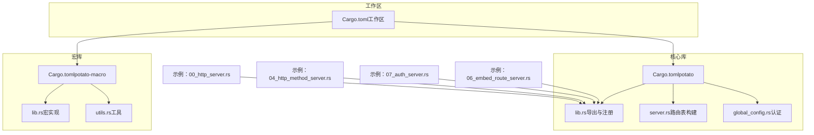
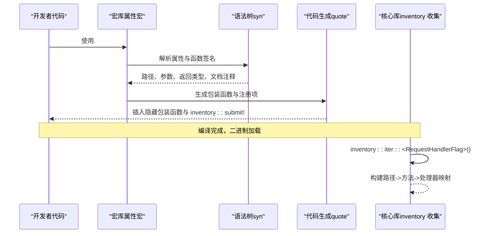
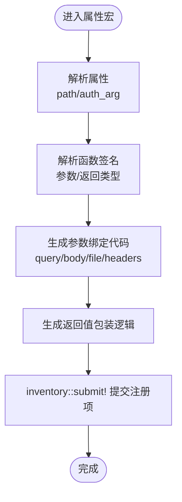
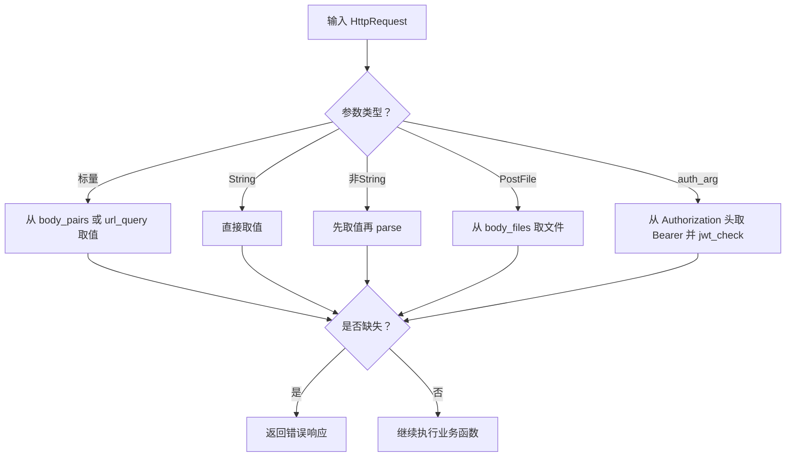
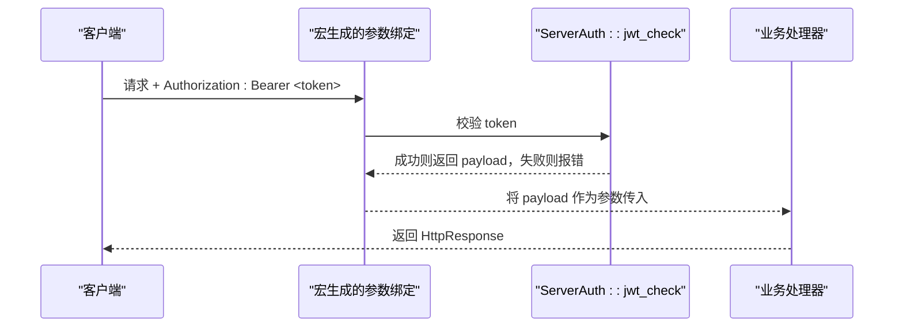
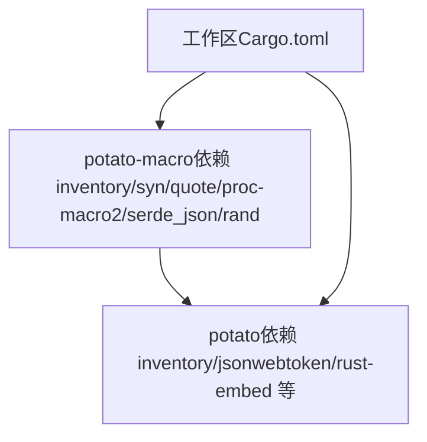

# 宏系统原理

<cite>
**本文引用的文件**
- [Cargo.toml（工作区）](file://Cargo.toml)
- [Cargo.toml（potato）](file://potato/Cargo.toml)
- [Cargo.toml（potato-macro）](file://potato-macro/Cargo.toml)
- [宏入口与实现（lib.rs）](file://potato-macro/src/lib.rs)
- [工具函数（utils.rs）](file://potato-macro/src/utils.rs)
- [库导出与运行时注册（lib.rs）](file://potato/src/lib.rs)
- [服务器路由表构建（server.rs）](file://potato/src/server.rs)
- [示例：HTTP 路由（00_http_server.rs）](file://examples/server/00_http_server.rs)
- [示例：HTTP 方法（04_http_method_server.rs）](file://examples/server/04_http_method_server.rs)
- [示例：认证与 JWT（07_auth_server.rs）](file://examples/server/07_auth_server.rs)
- [示例：嵌入资源（06_embed_route_server.rs）](file://examples/server/06_embed_route_server.rs)
- [全局配置与认证（global_config.rs）](file://potato/src/global_config.rs)
</cite>

## 目录
1. [引言](#引言)
2. [项目结构](#项目结构)
3. [核心组件](#核心组件)
4. [架构总览](#架构总览)
5. [组件详解](#组件详解)
6. [依赖关系分析](#依赖关系分析)
7. [性能考量](#性能考量)
8. [故障排查指南](#故障排查指南)
9. [结论](#结论)
10. [附录](#附录)

## 引言
本文件深入解析 Potato 框架的宏系统工作原理与实现机制，重点覆盖：
- 编译时代码生成流程：宏展开、符号注册与运行时发现
- inventory crate 在运行时注册中的作用
- 如何通过宏系统实现声明式路由定义
- http_get、http_post 等宏属性的实现原理：参数提取、类型推断与错误处理
- 宏系统的性能优势与内存安全保证
- 扩展与自定义宏开发的最佳实践与常见陷阱

## 项目结构
仓库采用双 crate 工作区组织：核心库 potato 与宏库 potato-macro。宏库负责编译期生成代码并注册路由信息；核心库负责运行时收集注册项并建立路由表。

图表来源
- [Cargo.toml（工作区）](file://Cargo.toml#L1-L4)
- [Cargo.toml（potato-macro）](file://potato-macro/Cargo.toml#L1-L24)
- [Cargo.toml（potato）](file://potato/Cargo.toml#L1-L76)
- [宏入口与实现（lib.rs）](file://potato-macro/src/lib.rs#L1-L399)
- [工具函数（utils.rs）](file://potato-macro/src/utils.rs#L1-L19)
- [库导出与运行时注册（lib.rs）](file://potato/src/lib.rs#L1-L200)
- [服务器路由表构建（server.rs）](file://potato/src/server.rs#L1-L120)
- [示例：HTTP 路由（00_http_server.rs）](file://examples/server/00_http_server.rs#L1-L12)
- [示例：HTTP 方法（04_http_method_server.rs）](file://examples/server/04_http_method_server.rs#L1-L42)
- [示例：认证与 JWT（07_auth_server.rs）](file://examples/server/07_auth_server.rs#L1-L24)
- [示例：嵌入资源（06_embed_route_server.rs）](file://examples/server/06_embed_route_server.rs#L1-L11)

章节来源
- [Cargo.toml（工作区）](file://Cargo.toml#L1-L4)
- [Cargo.toml（potato-macro）](file://potato-macro/Cargo.toml#L1-L24)
- [Cargo.toml（potato）](file://potato/Cargo.toml#L1-L76)

## 核心组件
- 宏库（potato-macro）
  - 提供 http_get、http_post、http_put、http_delete、http_options、http_head 等属性宏
  - 提供 derive 标准头宏与资源嵌入宏
  - 使用 syn/quote/proc-macro2 进行语法树解析与代码生成
  - 通过 inventory::submit! 注册路由到全局注册表
- 核心库（potato）
  - 导出宏库并重用 inventory 收集注册项
  - 定义 RequestHandlerFlag、HttpMethod、HttpRequest 等核心类型
  - 运行时构建路由表，支持 OpenAPI 文档生成
  - 提供认证与 JWT 工具

章节来源
- [宏入口与实现（lib.rs）](file://potato-macro/src/lib.rs#L1-L399)
- [库导出与运行时注册（lib.rs）](file://potato/src/lib.rs#L1-L200)
- [服务器路由表构建（server.rs）](file://potato/src/server.rs#L1-L120)

## 架构总览
下图展示从“声明式路由宏”到“运行时路由表”的完整链路：编译期宏展开生成包装函数并提交注册项，运行期通过 inventory 收集，最终构建路由映射。

图表来源
- [宏入口与实现（lib.rs）](file://potato-macro/src/lib.rs#L26-L300)
- [库导出与运行时注册（lib.rs）](file://potato/src/lib.rs#L175-L175)
- [服务器路由表构建（server.rs）](file://potato/src/server.rs#L28-L38)

## 组件详解

### 1) 宏系统总体流程
- 属性宏入口：http_get/http_post/http_put/http_delete/http_options/http_head
- 共用实现：http_handler_macro
- 关键步骤：
  - 解析属性：支持 path 与 auth_arg
  - 解析函数签名：提取参数类型、名称、返回类型
  - 参数绑定：从 HttpRequest 中抽取 query/body/header/file，并进行类型转换
  - 返回值包装：根据返回类型统一包装为 HttpResponse
  - 注册：通过 inventory::submit! 提交 RequestHandlerFlag

图表来源
- [宏入口与实现（lib.rs）](file://potato-macro/src/lib.rs#L26-L300)

章节来源
- [宏入口与实现（lib.rs）](file://potato-macro/src/lib.rs#L26-L300)

### 2) inventory crate 的运行时注册机制
- 宏库在编译期生成隐藏包装函数与注册项
- 核心库在启动时使用 inventory::collect! 声明收集目标类型
- 运行时通过 inventory::iter 遍历所有已注册的 RequestHandlerFlag
- 服务器模块据此构建 HashMap<&'static str, HashMap<HttpMethod, &'static RequestHandlerFlag>>

图表来源
- [库导出与运行时注册（lib.rs）](file://potato/src/lib.rs#L175-L175)
- [服务器路由表构建（server.rs）](file://potato/src/server.rs#L28-L38)

章节来源
- [库导出与运行时注册（lib.rs）](file://potato/src/lib.rs#L175-L175)
- [服务器路由表构建（server.rs）](file://potato/src/server.rs#L28-L38)

### 3) 声明式路由定义与宏属性
- 示例：在示例中直接使用 #[http_get]、#[http_post] 等属性宏标注异步函数
- 属性支持：
  - path：必填，必须以 “/” 开头
  - auth_arg：可选，用于声明该参数承载 JWT 载荷
- 宏会：
  - 校验 path 合法性
  - 解析文档注释生成 OpenAPI 文档元数据
  - 生成参数绑定与类型转换代码
  - 生成返回值包装逻辑
  - 提交注册项

章节来源
- [宏入口与实现（lib.rs）](file://potato-macro/src/lib.rs#L26-L300)
- [示例：HTTP 路由（00_http_server.rs）](file://examples/server/00_http_server.rs#L1-L12)
- [示例：HTTP 方法（04_http_method_server.rs）](file://examples/server/04_http_method_server.rs#L1-L42)

### 4) http_get、http_post 等宏属性的实现原理
- 共用实现：http_handler_macro
- 参数提取与类型推断：
  - 支持基础标量类型集合（如 u8/u32/u64/usize/i8/i16/i32/i64/isize、f32/f64、String、PostFile）
  - 非 String 类型自动尝试 parse
  - PostFile 从 multipart 表单文件域提取
  - auth_arg 指定的参数从 Authorization 头 Bearer 中解析 JWT 并校验
- 错误处理：
  - 缺少必要参数或类型不匹配时返回 HttpResponse::error
  - JWT 缺失或校验失败时返回错误响应
- 返回值包装：
  - 支持 ()、Result<(), E>、Result<HttpResponse, E>、HttpResponse
  - 自动统一包装为 HttpResponse

图表来源
- [宏入口与实现（lib.rs）](file://potato-macro/src/lib.rs#L106-L191)
- [宏入口与实现（lib.rs）](file://potato-macro/src/lib.rs#L199-L274)

章节来源
- [宏入口与实现（lib.rs）](file://potato-macro/src/lib.rs#L106-L191)
- [宏入口与实现（lib.rs）](file://potato-macro/src/lib.rs#L199-L274)

### 5) 认证与 JWT 实现
- 宏侧：
  - auth_arg 指定参数名，且必须为 String
  - 自动从 Authorization 头 Bearer 中提取令牌并调用 jwt_check
- 运行时：
  - ServerAuth::jwt_issue/jwt_check 基于 jsonwebtoken
  - ServerConfig 提供设置/读取 JWT 秘钥与 WebSocket 心跳间隔

图表来源
- [宏入口与实现（lib.rs）](file://potato-macro/src/lib.rs#L130-L155)
- [全局配置与认证（global_config.rs）](file://potato/src/global_config.rs#L37-L63)
- [示例：认证与 JWT（07_auth_server.rs）](file://examples/server/07_auth_server.rs#L1-L24)

章节来源
- [宏入口与实现（lib.rs）](file://potato-macro/src/lib.rs#L130-L155)
- [全局配置与认证（global_config.rs）](file://potato/src/global_config.rs#L37-L63)
- [示例：认证与 JWT（07_auth_server.rs）](file://examples/server/07_auth_server.rs#L1-L24)

### 6) OpenAPI 文档与注册项元数据
- 宏在编译期收集：
  - 文档注释（summary/description）
  - 是否显示在文档（doc(hidden)）
  - 是否需要鉴权（auth_arg）
  - 参数列表（name/type）
- 运行时：
  - inventory::iter 遍历注册项
  - 生成 OpenAPI JSON（包含 tags、paths、parameters 等）

章节来源
- [宏入口与实现（lib.rs）](file://potato-macro/src/lib.rs#L67-L102)
- [服务器路由表构建（server.rs）](file://potato/src/server.rs#L134-L205)

### 7) 资源嵌入与路由
- 宏：embed_dir! 将目录转为实现了 rust_embed::Embed 的结构体，并调用 load_embed
- 核心库：load_embed 将资源转为 HashMap<String, Cow<'static, [u8]>>，便于 use_embedded_route 使用

章节来源
- [宏入口与实现（lib.rs）](file://potato-macro/src/lib.rs#L332-L343)
- [库导出与运行时注册（lib.rs）](file://potato/src/lib.rs#L1204-L1219)
- [示例：嵌入资源（06_embed_route_server.rs）](file://examples/server/06_embed_route_server.rs#L1-L11)

### 8) 标准头 derive 宏
- 将枚举变体转换为标准头名称（下划线转连字符），并生成：
  - try_from_str/value.to_str
  - Headers 枚举与 apply_header 实现

章节来源
- [宏入口与实现（lib.rs）](file://potato-macro/src/lib.rs#L345-L399)

## 依赖关系分析
- 工作区：workspace.members 包含两个成员 crate
- 宏库：依赖 inventory、syn、quote、proc-macro2、serde_json、rand
- 核心库：依赖 inventory、potato-macro、jsonwebtoken、rust-embed 等

图表来源
- [Cargo.toml（工作区）](file://Cargo.toml#L1-L4)
- [Cargo.toml（potato-macro）](file://potato-macro/Cargo.toml#L14-L24)
- [Cargo.toml（potato）](file://potato/Cargo.toml#L16-L42)

章节来源
- [Cargo.toml（工作区）](file://Cargo.toml#L1-L4)
- [Cargo.toml（potato-macro）](file://potato-macro/Cargo.toml#L14-L24)
- [Cargo.toml（potato）](file://potato/Cargo.toml#L16-L42)

## 性能考量
- 编译期生成：宏在编译期完成参数绑定与类型转换代码生成，运行时仅执行少量分发逻辑
- 运行时注册：inventory::collect! 在初始化阶段一次性构建路由映射，后续查找为 O(1) 哈希表访问
- 内存安全：
  - 使用静态生命周期 &'static str 存储路径与元数据，避免运行期分配
  - 使用 hipstr::LocalHipStr/LocalHipByt 等零拷贝字符串与字节容器
  - 所有共享状态使用 Arc/Mutex 等并发安全容器
- 类型安全：
  - syn/quote 确保生成代码的语法正确性
  - 返回值包装统一为 HttpResponse，减少分支判断

[本节为通用性能讨论，无需特定文件引用]

## 故障排查指南
- 常见错误与定位
  - 缺少 path 属性或 path 不以 “/” 开头：宏展开时 panic
  - auth_arg 指向不存在参数：宏展开时 panic
  - auth_arg 类型非 String：宏展开时 panic
  - 缺少必需参数或类型转换失败：返回 HttpResponse::error
  - Authorization 头缺失或无效：返回错误响应
- 排查建议
  - 检查宏属性是否正确书写（path/auth_arg）
  - 检查函数签名与参数类型是否在支持集合内
  - 使用 OpenAPI 文档页面确认路由注册情况
  - 查看运行时日志与错误响应体

章节来源
- [宏入口与实现（lib.rs）](file://potato-macro/src/lib.rs#L28-L65)
- [宏入口与实现（lib.rs）](file://potato-macro/src/lib.rs#L130-L191)
- [宏入口与实现（lib.rs）](file://potato-macro/src/lib.rs#L158-L178)

## 结论
Potato 的宏系统通过“编译期生成 + 运行时收集”的组合，实现了声明式路由定义与强大的类型安全、内存安全保证。宏库负责将业务函数包装为统一的处理器并注册到全局表，核心库在运行时构建高效路由映射并支持 OpenAPI 文档生成。该设计兼顾易用性与高性能，适合构建高并发的 HTTP 服务。

[本节为总结性内容，无需特定文件引用]

## 附录

### A. 宏系统扩展与自定义宏开发实践
- 最佳实践
  - 明确区分“编译期”与“运行期”职责：编译期只做静态检查与代码生成
  - 使用 syn::meta.parser 解析复杂属性，确保错误信息清晰
  - 通过 quote 生成稳定、可读的代码，便于调试
  - 对外暴露的注册项尽量使用静态生命周期，减少运行期分配
- 常见陷阱
  - 在宏中进行昂贵的动态计算：应移至编译期生成
  - 忽略错误处理：对缺失参数、类型不匹配等情况返回明确错误
  - 未遵循 inventory 的生命周期约束：导致运行期悬挂引用
  - 过度使用动态特性：牺牲性能换取灵活性

[本节为通用指导，无需特定文件引用]