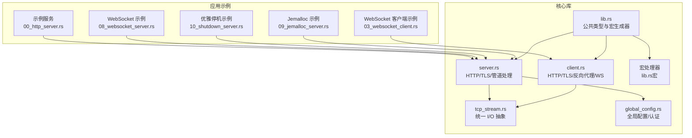
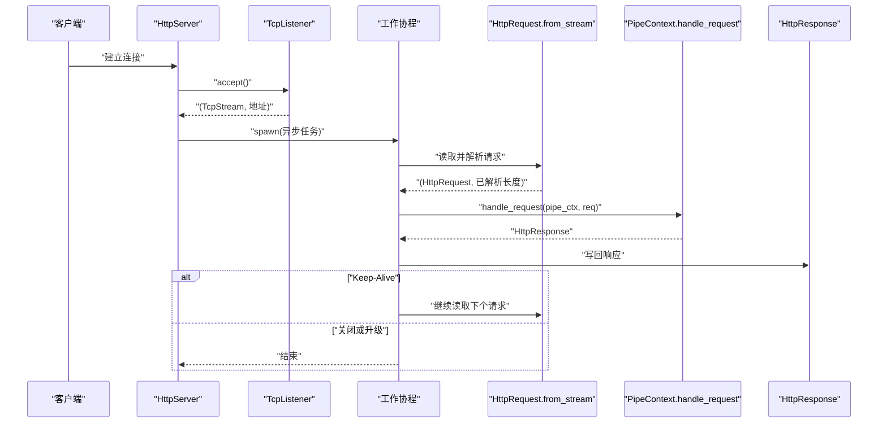
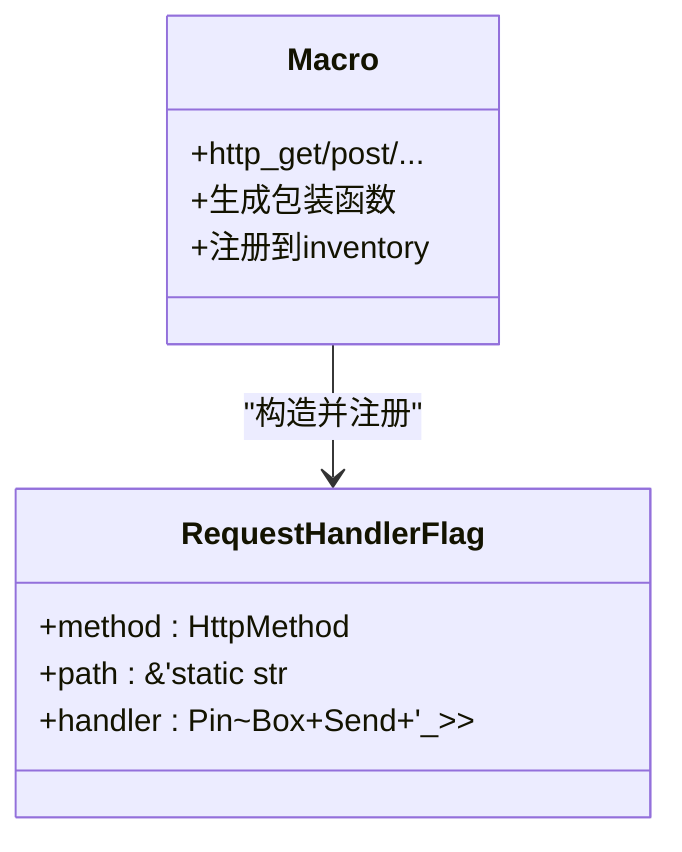
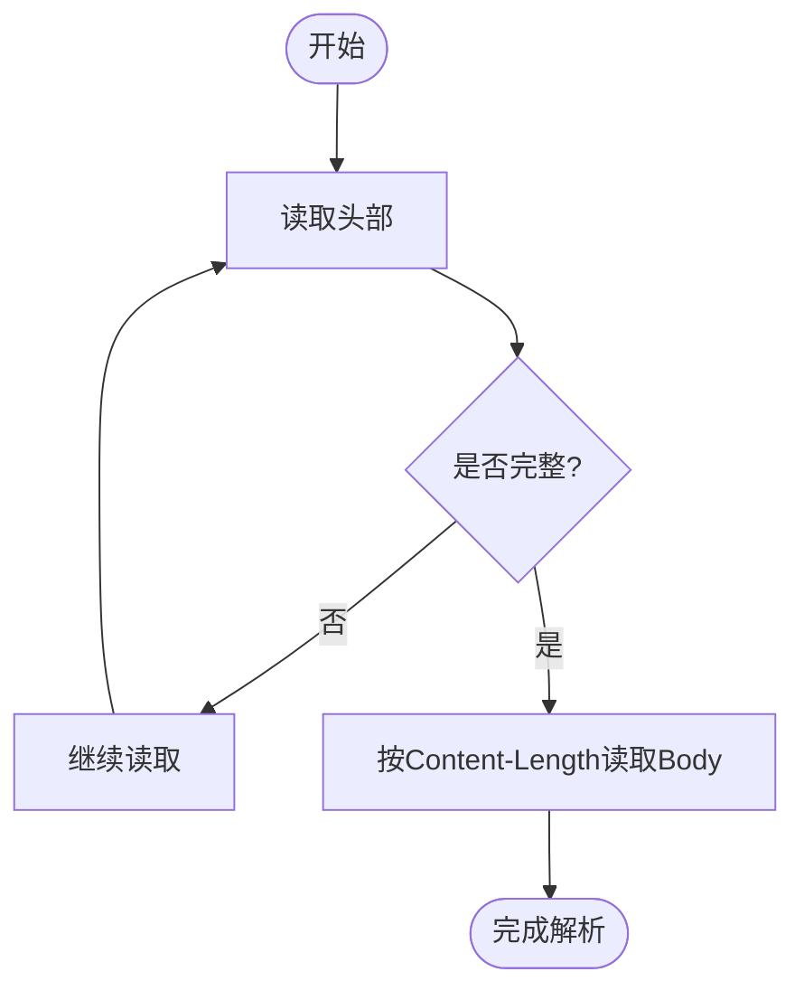
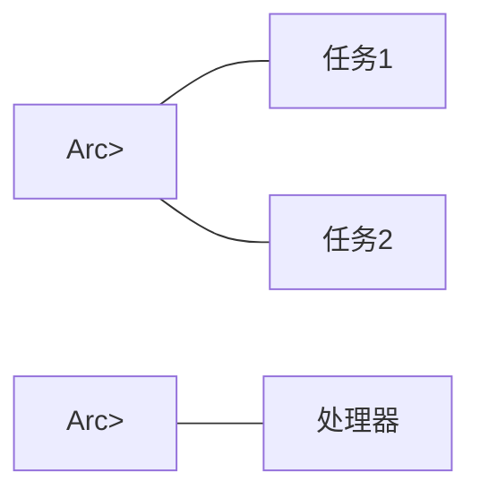
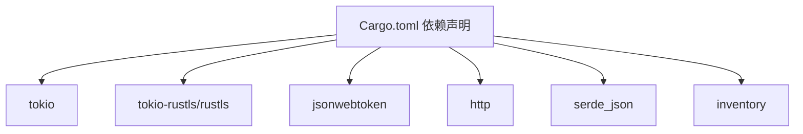

# 异步架构设计

<cite>
**本文引用的文件**
- [Cargo.toml](file://potato/Cargo.toml)
- [lib.rs](file://potato/src/lib.rs)
- [server.rs](file://potato/src/server.rs)
- [client.rs](file://potato/src/client.rs)
- [tcp_stream.rs](file://potato/src/utils/tcp_stream.rs)
- [global_config.rs](file://potato/src/global_config.rs)
- [lib.rs（宏）](file://potato-macro/src/lib.rs)
- [main.rs](file://examples/server/00_http_server.rs)
- [08_websocket_server.rs](file://examples/server/08_websocket_server.rs)
- [03_websocket_client.rs](file://examples/client/03_websocket_client.rs)
- [10_shutdown_server.rs](file://examples/server/10_shutdown_server.rs)
- [09_jemalloc_server.rs](file://examples/server/09_jemalloc_server.rs)
</cite>

## 目录
1. [引言](#引言)
2. [项目结构](#项目结构)
3. [核心组件](#核心组件)
4. [架构总览](#架构总览)
5. [详细组件分析](#详细组件分析)
6. [依赖关系分析](#依赖关系分析)
7. [性能考量](#性能考量)
8. [故障排查指南](#故障排查指南)
9. [结论](#结论)
10. [附录](#附录)

## 引言
本文件系统性阐述 Potato 框架在 Rust 异步生态中的架构设计与实现要点，重点覆盖 Tokio 运行时集成、任务调度与并发模型、内存管理策略；Future 与 Pin<Box<dyn Future>> 的使用模式及生命周期管理；异步 I/O（TCP、HTTP、WebSocket）实现；Arc<Mutex<T>> 在并发访问中的作用与线程安全保障；以及异步编程最佳实践（错误处理、超时管理、资源清理）。

## 项目结构
Potato 将异步能力通过 Tokio 集成到 HTTP/TLS/WebSocket 等场景中，采用“宏驱动注册 + 管道式中间件”的组织方式，既保持了易用性，又提供了灵活的扩展点。

图表来源
- [server.rs](file://potato/src/server.rs#L1-L120)
- [client.rs](file://potato/src/client.rs#L1-L120)
- [tcp_stream.rs](file://potato/src/utils/tcp_stream.rs#L1-L75)
- [global_config.rs](file://potato/src/global_config.rs#L1-L35)
- [lib.rs（宏）](file://potato-macro/src/lib.rs#L26-L300)
- [00_http_server.rs](file://examples/server/00_http_server.rs#L1-L12)
- [08_websocket_server.rs](file://examples/server/08_websocket_server.rs#L1-L43)
- [03_websocket_client.rs](file://examples/client/03_websocket_client.rs#L1-L11)
- [10_shutdown_server.rs](file://examples/server/10_shutdown_server.rs#L1-L22)
- [09_jemalloc_server.rs](file://examples/server/09_jemalloc_server.rs#L1-L16)

章节来源
- [Cargo.toml](file://potato/Cargo.toml#L16-L76)
- [lib.rs](file://potato/src/lib.rs#L1-L60)
- [server.rs](file://potato/src/server.rs#L1-L120)
- [client.rs](file://potato/src/client.rs#L1-L120)

## 核心组件
- Tokio 运行时与任务模型
  - 使用 tokio::main 宏启动事件循环，基于多线程工作窃取的异步运行时，支持高并发 I/O 与任务协作。
  - 关键依赖：tokio = { version = "1.49.0", features = ["full"] }，启用 full 特性以获得网络、同步、进程等完整能力。
- 请求处理管线
  - PipeContext 维护处理步骤序列（路由、静态资源、嵌入资源、自定义回调、反向代理、WebDAV 等），按顺序匹配并执行。
  - 处理函数类型为 Pin<Box<dyn Future<Output = HttpResponse> + Send + '_>>，由宏生成器包装为静态分发。
- 异步 I/O 抽象
  - HttpStream 统一封装 TcpStream、可选 TLS（客户端/服务端）、DuplexStream，提供统一的 read/write 接口。
- 并发与共享状态
  - Arc<Mutex<...>> 用于跨任务共享可变状态（如会话、流、配置），确保线程安全。
- 宏驱动注册
  - 通过 #[http_get/post/...] 属性宏收集路由信息，生成包装函数并注册到全局索引，简化用户开发。

章节来源
- [Cargo.toml](file://potato/Cargo.toml#L39-L40)
- [lib.rs（宏）](file://potato-macro/src/lib.rs#L26-L300)
- [lib.rs](file://potato/src/lib.rs#L124-L175)
- [tcp_stream.rs](file://potato/src/utils/tcp_stream.rs#L11-L73)
- [server.rs](file://potato/src/server.rs#L22-L56)

## 架构总览
下图展示从请求接入到响应返回的关键异步流程，包括 HTTP/TLS 接受、请求解析、管线处理、WebSocket 升级与转发、以及优雅停机信号。

图表来源
- [server.rs](file://potato/src/server.rs#L826-L871)
- [lib.rs](file://potato/src/lib.rs#L588-L699)
- [server.rs](file://potato/src/server.rs#L362-L767)

## 详细组件分析

### 1) Tokio 运行时与任务调度
- 启动入口
  - 示例程序通过 #[tokio::main] 启动运行时，随后创建 HttpServer 并进入事件循环。
- 任务派发
  - 每次 accept 新连接后，使用 spawn 创建独立任务处理该连接的完整生命周期，避免阻塞监听器。
- 选择与取消
  - 提供 shutdown_signal 机制，结合 tokio::select! 实现“处理请求”与“接收停机信号”的竞态控制。

章节来源
- [00_http_server.rs](file://examples/server/00_http_server.rs#L6-L11)
- [server.rs](file://potato/src/server.rs#L800-L810)
- [server.rs](file://potato/src/server.rs#L826-L871)

### 2) Future 与 Pin<Box<dyn Future>> 的使用模式
- 函数签名
  - RequestHandlerFlag.handler 类型为 Pin<Box<dyn Future<Output = HttpResponse> + Send + '_>>，允许匿名异步闭包作为处理器。
- 宏生成器
  - 宏将用户函数包装为静态分发的异步函数，并通过 Box::pin 收敛为 Future，注入 inventory 注册表。
- 生命周期与所有权
  - 闭包捕获生命周期限定为 '&'_，确保不持有外部可变引用；Pin 保证 Future 在内存中的稳定性，避免被移动导致悬挂指针。

图表来源
- [lib.rs](file://potato/src/lib.rs#L124-L175)
- [lib.rs（宏）](file://potato-macro/src/lib.rs#L26-L300)

章节来源
- [lib.rs](file://potato/src/lib.rs#L124-L175)
- [lib.rs（宏）](file://potato-macro/src/lib.rs#L26-L300)

### 3) 异步 I/O：TCP、HTTP、WebSocket
- TCP 与 TLS
  - HttpStream 统一封装 TcpStream、可选 TLS（客户端/服务端），并在 read/write 中分发到底层实现。
- HTTP 请求解析
  - HttpRequest::from_stream 基于异步 I/O 循环读取字节，直到解析出完整头部；随后根据 Content-Length 读取请求体。
- WebSocket
  - 客户端：Websocket::connect 发起升级握手，随后收发帧并内置心跳与超时。
  - 服务端：HttpRequest::upgrade_websocket 升级为 WebSocket 流，配合 Ping/Pong 维持健康检查。
  - 反向代理：TransferSession::transfer_websocket 在代理场景下桥接两端 WebSocket。

图表来源
- [lib.rs](file://potato/src/lib.rs#L588-L699)
- [tcp_stream.rs](file://potato/src/utils/tcp_stream.rs#L40-L73)

章节来源
- [tcp_stream.rs](file://potato/src/utils/tcp_stream.rs#L11-L73)
- [lib.rs](file://potato/src/lib.rs#L588-L699)
- [client.rs](file://potato/src/client.rs#L203-L592)
- [08_websocket_server.rs](file://examples/server/08_websocket_server.rs#L25-L35)

### 4) 并发模型与 Arc<Mutex<T>> 的线程安全
- 共享状态
  - 连接流 HttpStream 被封装为 Arc<Mutex<HttpStream>>，在多任务间传递，避免数据竞争。
- 配置与认证
  - 全局配置（如 JWT 密钥、WebSocket 心跳周期）使用 LazyLock<RwLock<T>> 管理，支持并发读写。
- 管线处理
  - PipeContext::handle_request 以 Arc 共享上下文，各阶段按序执行，避免共享可变状态的直接竞争。

图表来源
- [server.rs](file://potato/src/server.rs#L838-L869)
- [global_config.rs](file://potato/src/global_config.rs#L7-L35)

章节来源
- [server.rs](file://potato/src/server.rs#L838-L869)
- [global_config.rs](file://potato/src/global_config.rs#L7-L35)

### 5) 管线处理与路由注册
- 路由注册
  - 宏将用户函数包装为静态分发器，注册到 inventory::collect! 收集的 RequestHandlerFlag 列表。
- 管线匹配
  - PipeContext::handle_request 依次尝试 Handlers、LocationRoute、EmbeddedRoute、Custom、ReverseProxy、Webdav 等项，命中即返回结果。
- CORS 与 OPTIONS
  - 当未匹配到具体处理器且方法为 OPTIONS 时，自动返回 Allow 与可选的 CORS 头部。

章节来源
- [lib.rs（宏）](file://potato-macro/src/lib.rs#L26-L300)
- [lib.rs](file://potato/src/lib.rs#L175-L176)
- [server.rs](file://potato/src/server.rs#L362-L407)

### 6) TLS 与 HTTPS
- 客户端 TLS
  - SessionImpl::new 在启用 TLS 时创建 TlsConnector 并连接目标主机，返回 HttpStream::ClientTls。
- 服务端 TLS
  - HttpServer::serve_https 使用 TlsAcceptor 加载证书与私钥，接受 TLS 握手后封装为 HttpStream::ServerTls。
- 功能开关
  - 通过 Cargo features 控制 TLS 支持，未启用时禁止非 TLS 构建下的 TLS 行为。

章节来源
- [client.rs](file://potato/src/client.rs#L68-L99)
- [server.rs](file://potato/src/server.rs#L874-L931)
- [Cargo.toml](file://potato/Cargo.toml#L40-L41)

### 7) 错误处理、超时与资源清理
- 错误处理
  - 统一使用 anyhow::Result 返回错误，便于链路传播；在宏生成器中将业务错误映射为 HttpResponse。
- 超时管理
  - WebSocket 接收侧使用 tokio::time::timeout 对 ping/pong 进行超时控制，超时则发送 Ping 或提前退出。
- 资源清理
  - 连接关闭或 Keep-Alive 结束时，及时中断循环并释放资源；优雅停机通过 oneshot 通道通知主循环退出。

章节来源
- [lib.rs](file://potato/src/lib.rs#L208-L359)
- [server.rs](file://potato/src/server.rs#L800-L810)
- [10_shutdown_server.rs](file://examples/server/10_shutdown_server.rs#L1-L22)

## 依赖关系分析
- 外部依赖
  - tokio、tokio-rustls、jsonwebtoken、http、serde_json、inventory 等。
- 内部模块
  - lib.rs 暴露公共 API；server.rs 实现 HTTP/TLS/WS；client.rs 实现客户端与反向代理；tcp_stream.rs 提供 I/O 抽象；global_config.rs 提供全局配置；宏处理器负责代码生成与注册。

图表来源
- [Cargo.toml](file://potato/Cargo.toml#L16-L76)

章节来源
- [Cargo.toml](file://potato/Cargo.toml#L16-L76)

## 性能考量
- 事件循环与任务调度
  - 使用 Tokio 的多线程运行时，充分利用多核并行；通过 spawn 分离长连接处理，避免阻塞监听器。
- I/O 抽象与零拷贝
  - HttpStream 统一接口减少分支判断开销；请求体解析按需读取，避免一次性加载大对象。
- TLS 优化
  - 复用 TLS 会话与连接池（conns 哈希表）降低握手成本；在反向代理场景中复用底层连接。
- 内存与分配
  - 使用小容量预分配缓冲区（Vec<u8> with_capacity）减少频繁扩容；jemalloc 相关特性可用于性能分析与调优。

## 故障排查指南
- 连接异常
  - 若出现“connection closed”，检查对端是否提前断开或缓冲区读取失败。
- WebSocket 握手失败
  - 确认 Upgrade/Connection/Sec-WebSocket-* 头是否正确设置；服务端升级逻辑要求严格匹配。
- TLS 握手失败
  - 检查证书与私钥路径、域名与 SAN 匹配、根证书可用性。
- 优雅停机无效
  - 确保在 main 中正确获取并保存 shutdown_signal，且仅设置一次。
- 超时与心跳
  - 若 WebSocket 频繁断连，适当调整 ServerConfig::set_ws_ping_duration。

章节来源
- [lib.rs](file://potato/src/lib.rs#L208-L359)
- [server.rs](file://potato/src/server.rs#L800-L810)
- [global_config.rs](file://potato/src/global_config.rs#L28-L34)
- [10_shutdown_server.rs](file://examples/server/10_shutdown_server.rs#L1-L22)

## 结论
Potato 通过宏驱动注册、统一 I/O 抽象与管道化处理，将 Tokio 的异步能力无缝融入 HTTP/TLS/WebSocket 场景。借助 Pin<Box<dyn Future>> 与 Arc<Mutex<T>>，在保证线程安全的同时实现了灵活的扩展与高性能的并发处理。结合超时、错误处理与优雅停机机制，整体架构具备良好的工程可用性与可维护性。

## 附录
- 示例入口
  - HTTP 服务：examples/server/00_http_server.rs
  - WebSocket 服务：examples/server/08_websocket_server.rs
  - WebSocket 客户端：examples/client/03_websocket_client.rs
  - 优雅停机：examples/server/10_shutdown_server.rs
  - Jemalloc：examples/server/09_jemalloc_server.rs