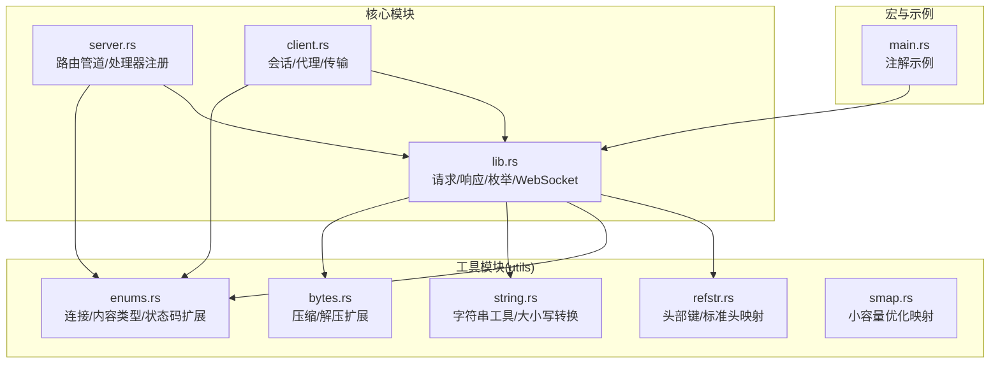
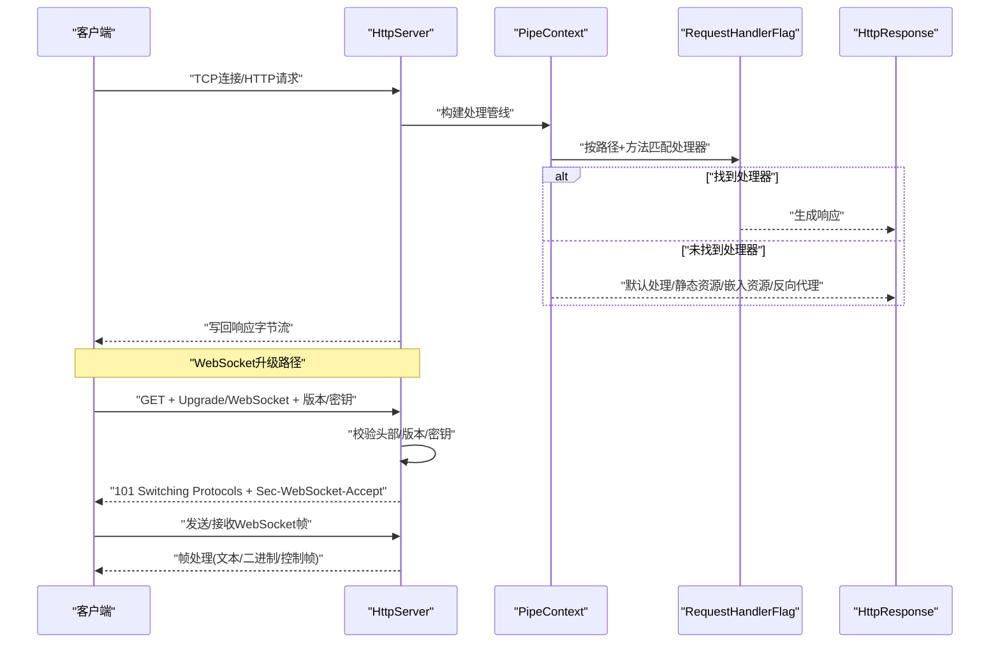
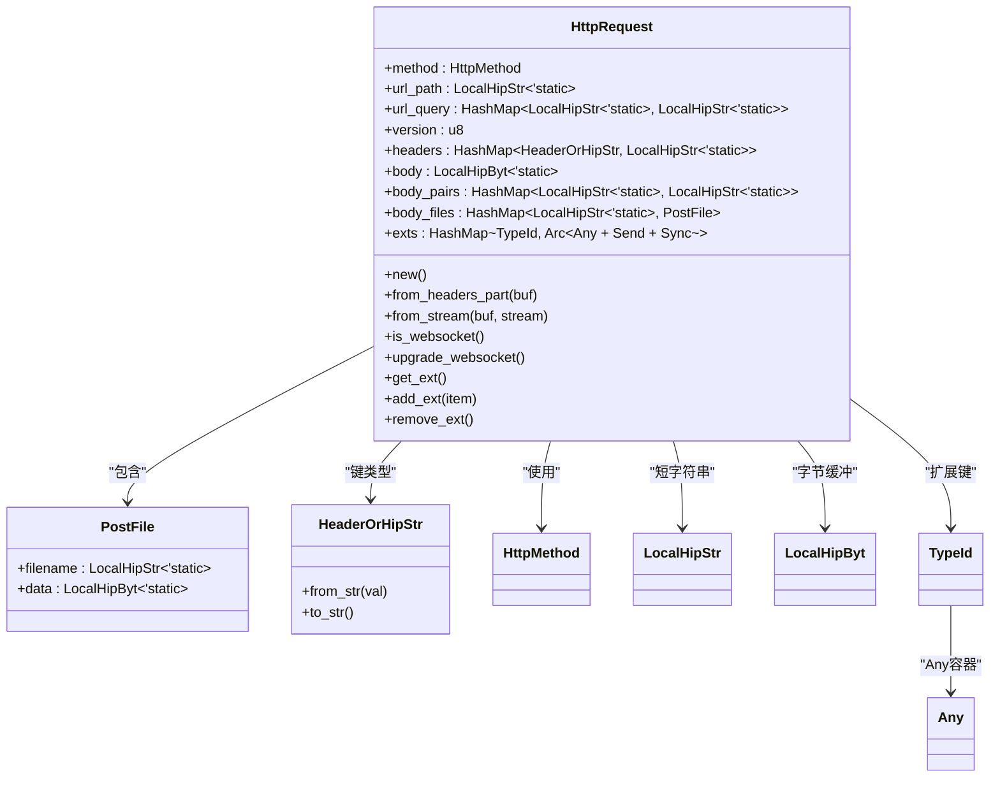
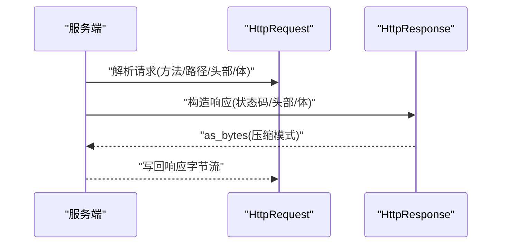
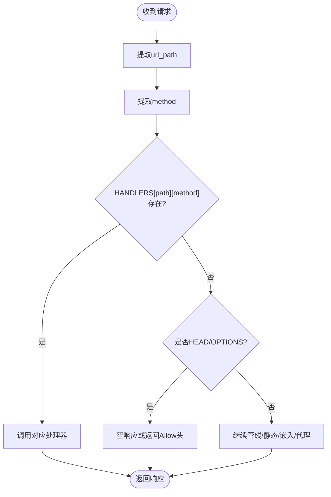
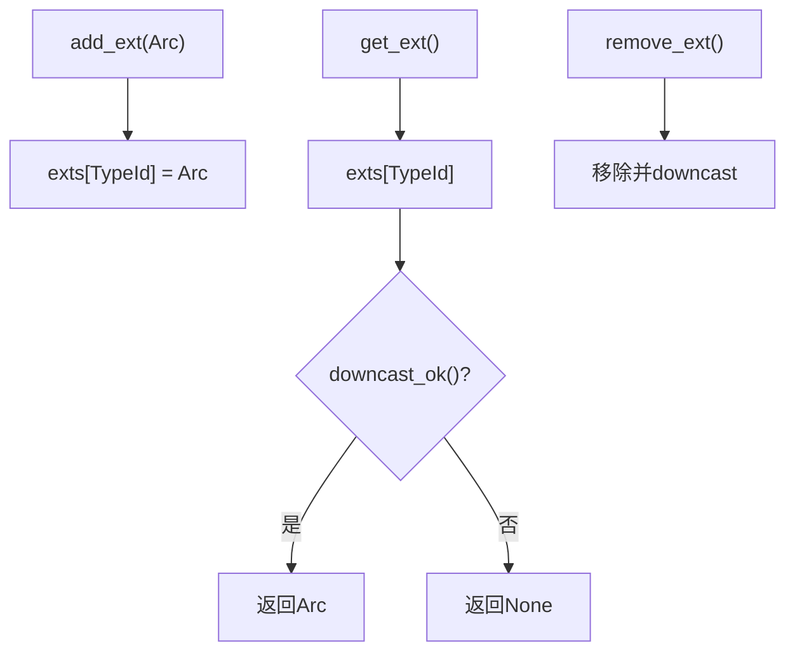
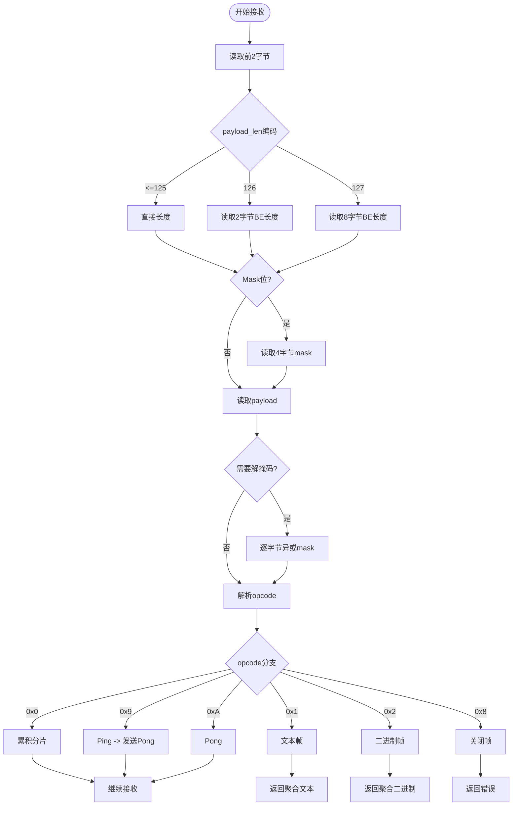
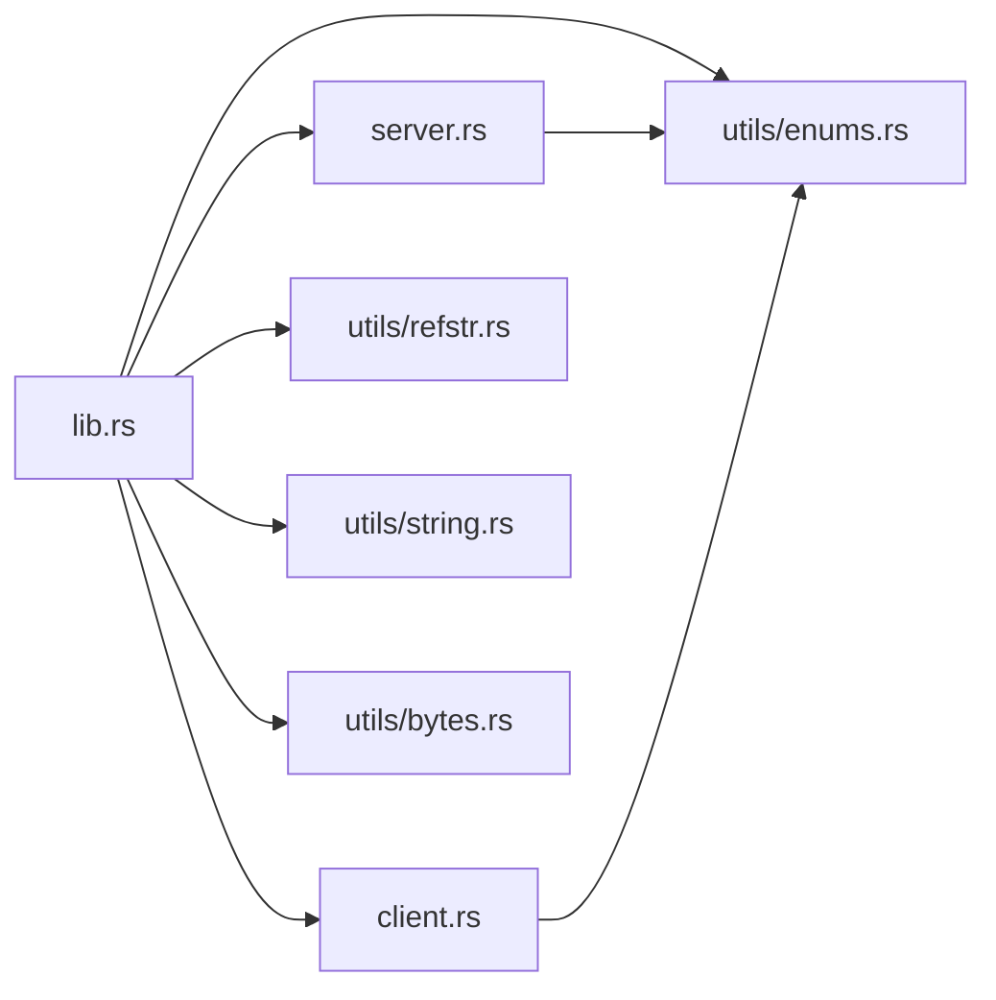

# 数据模型设计

<cite>
**本文引用的文件**
- [lib.rs](file://potato/src/lib.rs)
- [server.rs](file://potato/src/server.rs)
- [client.rs](file://potato/src/client.rs)
- [refstr.rs](file://potato/src/utils/refstr.rs)
- [enums.rs](file://potato/src/utils/enums.rs)
- [string.rs](file://potato/src/utils/string.rs)
- [bytes.rs](file://potato/src/utils/bytes.rs)
- [smap.rs](file://potato/src/utils/smap.rs)
- [main.rs](file://potato/src/main.rs)
</cite>

## 目录
1. [引言](#引言)
2. [项目结构](#项目结构)
3. [核心组件](#核心组件)
4. [架构总览](#架构总览)
5. [详细组件分析](#详细组件分析)
6. [依赖关系分析](#依赖关系分析)
7. [性能考量](#性能考量)
8. [故障排查指南](#故障排查指南)
9. [结论](#结论)
10. [附录](#附录)

## 引言
本文件聚焦于Potato框架的核心数据模型设计与实现原理，围绕以下主题展开：HttpRequest、HttpResponse、HttpMethod等关键类型的字段定义、数据类型选择与内存布局优化；hipstr库中LocalHipStr与LocalHipByt在内存效率上的优势；HashMap容量预分配策略与键值类型设计；TypeId在扩展系统中的作用及Any trait的安全转换机制；WebSocket帧结构设计（opcode定义、payload长度编码、掩码处理）；以及数据模型扩展与自定义的最佳实践。

## 项目结构
Potato采用模块化组织，核心逻辑集中在lib.rs中，服务器与客户端处理分别位于server.rs与client.rs，通用工具位于utils子模块。宏与注解由potato-macro提供支持，示例代码位于examples目录。

**图表来源**
- [lib.rs](file://potato/src/lib.rs#L1-L1220)
- [server.rs](file://potato/src/server.rs#L1-L933)
- [client.rs](file://potato/src/client.rs#L1-L615)
- [refstr.rs](file://potato/src/utils/refstr.rs#L1-L138)
- [enums.rs](file://potato/src/utils/enums.rs#L1-L41)
- [string.rs](file://potato/src/utils/string.rs#L1-L107)
- [bytes.rs](file://potato/src/utils/bytes.rs#L1-L33)
- [smap.rs](file://potato/src/utils/smap.rs#L1-L147)
- [main.rs](file://potato/src/main.rs#L1-L10)

**章节来源**
- [lib.rs](file://potato/src/lib.rs#L1-L1220)
- [server.rs](file://potato/src/server.rs#L1-L933)
- [client.rs](file://potato/src/client.rs#L1-L615)
- [refstr.rs](file://potato/src/utils/refstr.rs#L1-L138)
- [enums.rs](file://potato/src/utils/enums.rs#L1-L41)
- [string.rs](file://potato/src/utils/string.rs#L1-L107)
- [bytes.rs](file://potato/src/utils/bytes.rs#L1-L33)
- [smap.rs](file://potato/src/utils/smap.rs#L1-L147)
- [main.rs](file://potato/src/main.rs#L1-L10)

## 核心组件
- HttpRequest：承载一次HTTP请求的所有信息，包含方法、路径、查询参数、版本、头部、原始请求体、解析后的表单键值对、文件上传信息以及扩展容器。
- HttpResponse：承载一次HTTP响应的所有信息，包含版本、状态码、头部、响应体，并提供从字节流解析与序列化为字节的能力。
- HttpMethod：枚举所有支持的HTTP方法，覆盖常用方法与扩展方法。
- WebSocket：基于底层HttpStream实现的双向帧收发，支持文本、二进制、控制帧与分片聚合。
- 扩展系统：通过TypeId+Any实现类型安全的扩展存储与检索。

**章节来源**
- [lib.rs](file://potato/src/lib.rs#L177-L195)
- [lib.rs](file://potato/src/lib.rs#L384-L398)
- [lib.rs](file://potato/src/lib.rs#L879-L1202)
- [lib.rs](file://potato/src/lib.rs#L203-L374)

## 架构总览
下图展示了请求从接收、解析到处理与响应的端到端流程，以及WebSocket升级与收发的关键节点。

**图表来源**
- [server.rs](file://potato/src/server.rs#L28-L767)
- [lib.rs](file://potato/src/lib.rs#L560-L579)
- [lib.rs](file://potato/src/lib.rs#L1042-L1066)

## 详细组件分析

### HttpRequest 数据模型与内存布局
- 字段概览
  - method：HttpMethod，表示请求方法。
  - url_path：LocalHipStr<'static>，短路径常驻内存，减少堆分配。
  - url_query：HashMap<LocalHipStr<'static>, LocalHipStr<'static>>，查询参数键值对，容量预分配为16。
  - version：u8，HTTP版本主次位组合。
  - headers：HashMap<HeaderOrHipStr, LocalHipStr<'static>>，头部键统一为HeaderOrHipStr，值为LocalHipStr。
  - body：LocalHipByt<'static>，原始请求体字节缓冲。
  - body_pairs：HashMap<LocalHipStr<'static>, LocalHipStr<'static>>，解析后的表单键值对，容量预分配为16。
  - body_files：HashMap<LocalHipStr<'static>, PostFile>，多部分表单文件集合，容量预分配为4。
  - exts：HashMap<TypeId, Arc<dyn Any + Send + Sync>>，扩展容器，用于跨层传递上下文。
- 内存优化要点
  - 使用LocalHipStr/LocalHipByt替代String/Vec<u8>，在短字符串场景避免堆分配，提升缓存局部性。
  - HashMap容量预分配降低扩容成本，提升高频请求下的插入性能。
  - HeaderOrHipStr统一头部键类型，兼顾标准头枚举与动态键的高效查找。
- 关键方法
  - new：初始化各字段，设置默认值与容量。
  - from_headers_part：基于httparse解析请求行与头部，返回完整HttpRequest与头部长度。
  - from_stream：从流中读取完整请求，解析Content-Type并填充body_pairs/body_files。
  - is_websocket/upgrade_websocket：判断并完成WebSocket升级。
  - get_ext/add_ext/remove_ext：基于TypeId的Any安全转换与生命周期管理。

**图表来源**
- [lib.rs](file://potato/src/lib.rs#L384-L398)
- [lib.rs](file://potato/src/lib.rs#L376-L380)
- [refstr.rs](file://potato/src/utils/refstr.rs#L7-L24)
- [lib.rs](file://potato/src/lib.rs#L27-L27)

**章节来源**
- [lib.rs](file://potato/src/lib.rs#L384-L398)
- [lib.rs](file://potato/src/lib.rs#L400-L586)
- [lib.rs](file://potato/src/lib.rs#L701-L759)
- [lib.rs](file://potato/src/lib.rs#L588-L699)
- [refstr.rs](file://potato/src/utils/refstr.rs#L7-L24)

### HttpResponse 数据模型与序列化
- 字段概览
  - version：String，如"HTTP/1.1"。
  - http_code：u16，HTTP状态码。
  - headers：HashMap<String, String>，标准化头部名称。
  - body：LocalHipByt<'static>，响应体字节缓冲。
- 关键能力
  - from_headers_part：从字节流解析响应头。
  - from_stream：从流中读取完整响应，解析响应体。
  - as_bytes：将响应序列化为字节流，支持压缩模式。
  - from_websocket：生成WebSocket握手响应。
- 与HttpRequest的协作
  - 在WebSocket升级时，服务端根据Sec-WebSocket-Key生成Sec-WebSocket-Accept并返回101状态码。

**图表来源**
- [lib.rs](file://potato/src/lib.rs#L879-L1202)
- [lib.rs](file://potato/src/lib.rs#L1042-L1066)

**章节来源**
- [lib.rs](file://potato/src/lib.rs#L879-L1202)
- [lib.rs](file://potato/src/lib.rs#L1042-L1066)

### HttpMethod 枚举与路由匹配
- HttpMethod枚举覆盖常见HTTP方法与扩展方法，便于在路由表中进行O(1)匹配。
- 服务器侧通过inventory收集RequestHandlerFlag，按路径与方法建立映射，实现快速路由分发。

**图表来源**
- [lib.rs](file://potato/src/lib.rs#L152-L175)
- [server.rs](file://potato/src/server.rs#L28-L767)

**章节来源**
- [lib.rs](file://potato/src/lib.rs#L177-L195)
- [server.rs](file://potato/src/server.rs#L28-L767)

### hipstr 库的内存效率优势
- LocalHipStr
  - 针对短字符串的零分配策略，内部可能持有栈上或小容量缓冲，避免频繁堆分配。
  - 在HeaderOrHipStr中作为动态键使用，既保证性能又保持灵活性。
- LocalHipByt
  - 对字节缓冲进行类似优化，适合请求体与响应体的高效存储与传递。
- 实践建议
  - 优先使用LocalHipStr/LocalHipByt替代String/Vec<u8>，特别是在高频路径与大量小对象场景。
  - 对于长字符串或外部来源数据，可考虑转移所有权至堆以避免栈溢出风险。

**章节来源**
- [refstr.rs](file://potato/src/utils/refstr.rs#L7-L24)
- [lib.rs](file://potato/src/lib.rs#L384-L398)

### HashMap 容量预分配与键值类型设计
- 预分配策略
  - url_query/headers/body_pairs：with_capacity(16)，降低扩容次数。
  - body_files：with_capacity(4)，满足典型表单上传场景。
  - HANDLERS：with_capacity(16)，路由表按路径与方法建立二级映射。
- 键值类型设计
  - HeaderOrHipStr统一头部键，结合标准头枚举与动态键，兼顾性能与兼容性。
  - TypeId作为扩展容器的键，确保类型唯一性与安全转换。
- 复杂度与性能
  - 平均O(1)查找与插入，预分配显著降低摊还开销。
  - 对于大流量场景，建议根据实际负载调整初始容量。

**章节来源**
- [lib.rs](file://potato/src/lib.rs#L405-L411)
- [server.rs](file://potato/src/server.rs#L28-L38)
- [refstr.rs](file://potato/src/utils/refstr.rs#L7-L24)
- [lib.rs](file://potato/src/lib.rs#L27-L27)

### TypeId 与 Any 的扩展系统
- 设计目标
  - 提供类型安全的上下文扩展容器，允许在不修改核心结构的情况下注入任意类型数据。
- 关键机制
  - add_ext<T>/get_ext<T>/remove_ext<T>：基于TypeId绑定与Arc<dyn Any + Send + Sync>实现安全转换。
  - downcast：在运行时进行类型检查与转换，失败则返回None。
- 使用场景
  - 存储SocketAddr、HttpStream等与底层I/O相关的上下文。
  - 跨中间件传递业务上下文（需确保Send+Sync）。

**图表来源**
- [lib.rs](file://potato/src/lib.rs#L427-L442)
- [lib.rs](file://potato/src/lib.rs#L27-L27)

**章节来源**
- [lib.rs](file://potato/src/lib.rs#L427-L442)
- [lib.rs](file://potato/src/lib.rs#L27-L27)

### WebSocket 帧结构设计
- 帧格式
  - 前两字节：FIN+Opcode，Mask+Payload长度编码。
  - Payload长度支持三档：直接(<=125)、16位扩展(126)、64位扩展(127)。
  - 掩码：若设置了Mask位，则后续4字节为掩码，对payload逐字节异或。
- 支持的opcode
  - 0x0：Continuation Frame（分片延续）
  - 0x1：Text Frame
  - 0x2：Binary Frame
  - 0x8：Close
  - 0x9：Ping
  - 0xA：Pong
- 收发流程
  - recv：循环读取帧，聚合分片，处理Ping/Pong心跳，遇到Close返回错误。
  - send：根据帧类型与长度编码，写入头部与payload，必要时应用掩码。

**图表来源**
- [lib.rs](file://potato/src/lib.rs#L234-L283)
- [lib.rs](file://potato/src/lib.rs#L285-L308)
- [lib.rs](file://potato/src/lib.rs#L310-L335)
- [lib.rs](file://potato/src/lib.rs#L341-L359)

**章节来源**
- [lib.rs](file://potato/src/lib.rs#L234-L359)

### 数据模型扩展与自定义实践
- 扩展容器
  - 使用add_ext<T>注入自定义上下文，如认证令牌、用户会话、统计指标等。
  - 通过get_ext<T>/remove_ext<T>在不同阶段安全访问与清理。
- 自定义头部与内容类型
  - HeaderOrHipStr支持标准头枚举与动态键，便于扩展自定义头部。
  - HttpContentType支持JSON、表单与多部分表单，边界字符串使用LocalHipStr优化。
- 工具函数与宏
  - StringExt提供HTTP标准大小写转换与URL解码。
  - ssformat宏用于小字符串格式化，减少堆分配。
- 管线化与路由
  - PipeContext支持Handlers、LocationRoute、EmbeddedRoute、Custom、ReverseProxy等多种处理项，便于构建复杂路由与中间件链路。

**章节来源**
- [lib.rs](file://potato/src/lib.rs#L427-L442)
- [refstr.rs](file://potato/src/utils/refstr.rs#L32-L131)
- [enums.rs](file://potato/src/utils/enums.rs#L20-L40)
- [string.rs](file://potato/src/utils/string.rs#L96-L106)
- [server.rs](file://potato/src/server.rs#L40-L132)

## 依赖关系分析
- 模块耦合
  - lib.rs为核心，被server.rs与client.rs广泛依赖。
  - utils子模块提供独立的工具能力，被lib.rs与server.rs复用。
- 外部依赖
  - httparse：高性能HTTP解析。
  - http/uri：标准HTTP URI构建与解析。
  - serde_json：JSON解析与序列化。
  - flate2：Gzip压缩/解压。
  - tokio：异步网络与任务调度。
- 可能的循环依赖
  - 通过mod声明与pub use避免直接循环导入，整体结构清晰。

**图表来源**
- [lib.rs](file://potato/src/lib.rs#L1-L44)
- [server.rs](file://potato/src/server.rs#L1-L26)
- [client.rs](file://potato/src/client.rs#L1-L8)

**章节来源**
- [lib.rs](file://potato/src/lib.rs#L1-L44)
- [server.rs](file://potato/src/server.rs#L1-L26)
- [client.rs](file://potato/src/client.rs#L1-L8)

## 性能考量
- 内存优化
  - 优先使用LocalHipStr/LocalHipByt，减少堆分配与拷贝。
  - HashMap预分配降低扩容成本，提升高并发下的插入性能。
- CPU与I/O
  - httparse解析器在解析阶段避免不必要的字符串分配。
  - WebSocket帧处理采用就地读取与掩码异或，尽量减少中间缓冲。
- 建议
  - 对热点路径（路由匹配、头部解析、内容类型判定）进行基准测试。
  - 根据实际负载调整HashMap初始容量与WebSocket心跳间隔。

## 故障排查指南
- 请求解析失败
  - 检查from_headers_part返回的Partial状态，确认缓冲区是否足够。
  - 确认Content-Length与实际body长度一致，避免阻塞读取。
- WebSocket升级失败
  - 校验头部：Connection必须为Upgrade，Upgrade必须为websocket，Sec-WebSocket-Version必须为13。
  - 校验Sec-WebSocket-Key非空且长度有效。
- 类型扩展问题
  - 确保add_ext传入的类型与get_ext<T>一致，避免downcast失败。
  - 注意Arc<dyn Any + Send + Sync>的生命周期与共享所有权。

**章节来源**
- [lib.rs](file://potato/src/lib.rs#L701-L759)
- [lib.rs](file://potato/src/lib.rs#L588-L699)
- [lib.rs](file://potato/src/lib.rs#L532-L558)
- [lib.rs](file://potato/src/lib.rs#L427-L442)

## 结论
Potato框架通过精心设计的数据模型与工具库，实现了高性能、低分配的HTTP与WebSocket处理能力。HttpRequest/HttpResponse以LocalHipStr/LocalHipByt为核心优化点，配合HashMap容量预分配与TypeId+Any扩展机制，既保证了易用性也兼顾了性能。WebSocket帧结构遵循RFC规范，提供了稳健的心跳与分片聚合能力。在实际工程中，建议结合业务负载对初始容量与内存策略进行调优，并充分利用工具模块与宏来简化开发。

## 附录
- 示例入口
  - 使用#[potato::http_get]宏定义简单路由，展示注解与处理器的结合方式。

**章节来源**
- [main.rs](file://potato/src/main.rs#L1-L10)