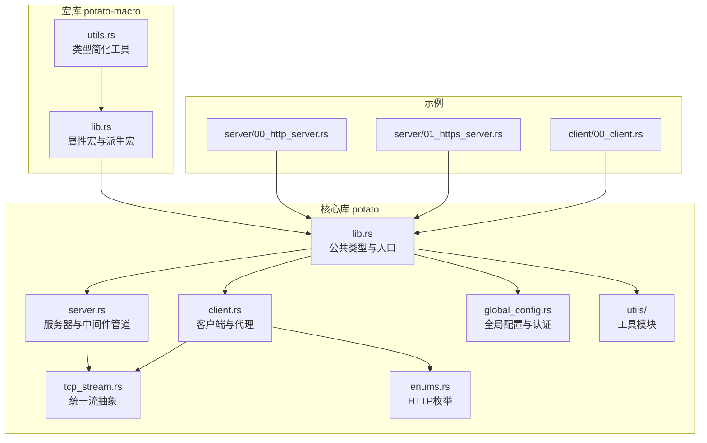
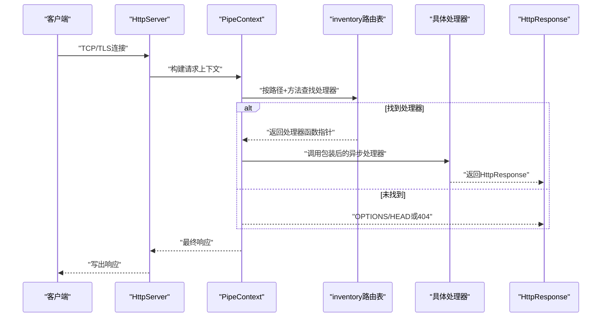
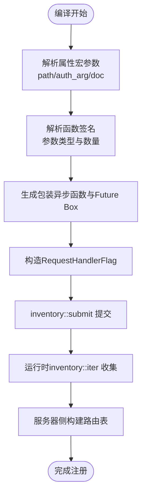
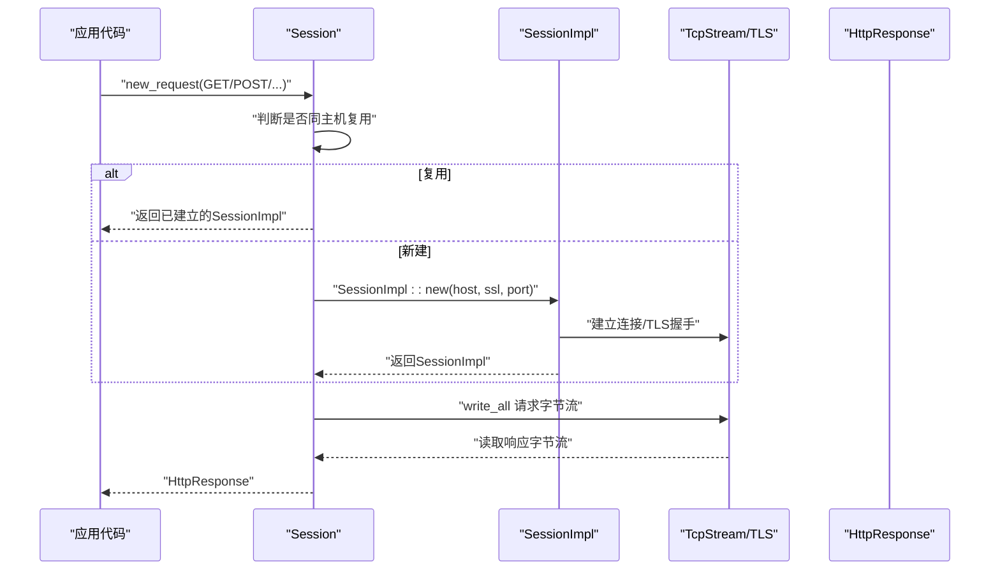
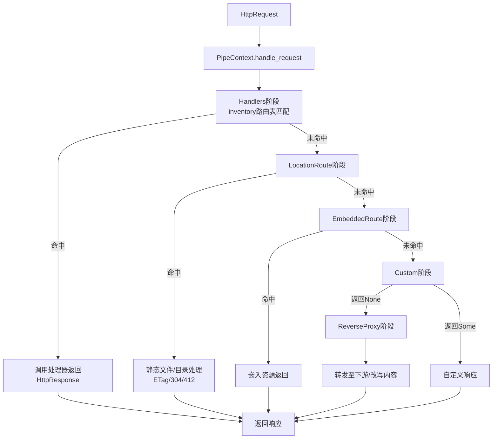
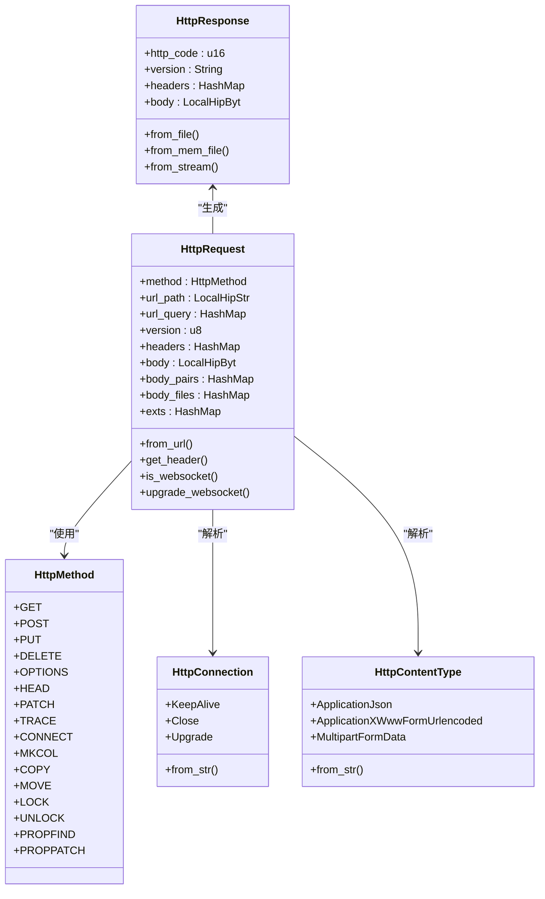
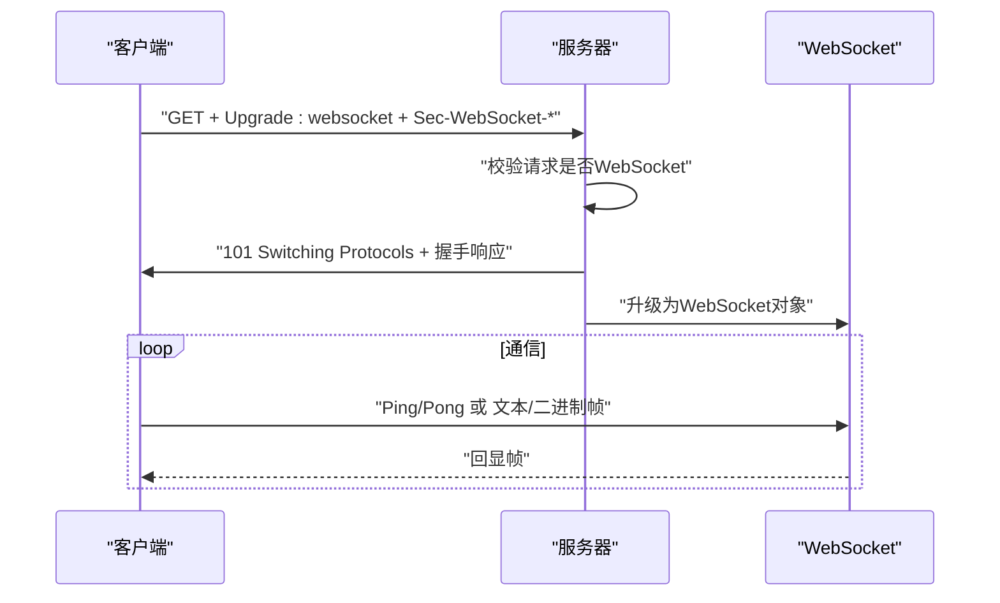
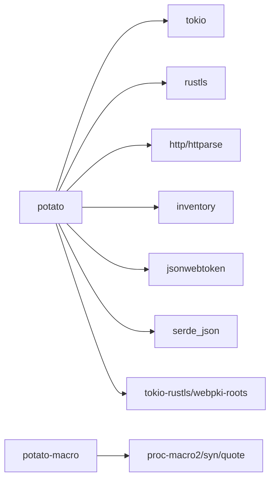

# 核心概念

<cite>
**本文引用的文件**
- [Cargo.toml](file://potato/Cargo.toml)
- [Cargo.toml](file://potato-macro/Cargo.toml)
- [lib.rs](file://potato/src/lib.rs)
- [lib.rs](file://potato-macro/src/lib.rs)
- [utils.rs](file://potato-macro/src/utils.rs)
- [client.rs](file://potato/src/client.rs)
- [server.rs](file://potato/src/server.rs)
- [global_config.rs](file://potato/src/global_config.rs)
- [main.rs](file://potato/src/main.rs)
- [tcp_stream.rs](file://potato/src/utils/tcp_stream.rs)
- [enums.rs](file://potato/src/utils/enums.rs)
- [00_http_server.rs](file://examples/server/00_http_server.rs)
- [01_https_server.rs](file://examples/server/01_https_server.rs)
- [00_client.rs](file://examples/client/00_client.rs)
</cite>

## 目录
1. [简介](#简介)
2. [项目结构](#项目结构)
3. [核心组件](#核心组件)
4. [架构总览](#架构总览)
5. [详细组件分析](#详细组件分析)
6. [依赖关系分析](#依赖关系分析)
7. [性能考量](#性能考量)
8. [故障排查指南](#故障排查指南)
9. [结论](#结论)
10. [附录：Rust所有权与生命周期入门](#附录rust所有权与生命周期入门)

## 简介
本文件面向初学者与进阶用户，系统性解析Potato框架的核心概念与架构设计，重点覆盖以下主题：
- 宏处理器与编译时代码生成、运行时注册机制
- HTTP客户端与服务器的设计模式（会话管理、连接池、中间件管道）
- Rust异步编程模型在框架中的应用（任务调度、内存安全）
- 数据结构设计（HttpRequest、HttpResponse、HttpMethod等）
- WebSocket支持、TLS加密、OpenAPI文档生成等高级特性
- 初学者必备的Rust所有权系统与生命周期背景知识

## 项目结构
仓库采用“核心库+宏库”的双模块组织方式，配合示例工程演示典型用法。

图表来源
- [lib.rs](file://potato/src/lib.rs#L1-L120)
- [server.rs](file://potato/src/server.rs#L1-L120)
- [client.rs](file://potato/src/client.rs#L1-L120)
- [global_config.rs](file://potato/src/global_config.rs#L1-L64)
- [tcp_stream.rs](file://potato/src/utils/tcp_stream.rs#L1-L73)
- [enums.rs](file://potato/src/utils/enums.rs#L1-L41)
- [lib.rs](file://potato-macro/src/lib.rs#L1-L60)
- [utils.rs](file://potato-macro/src/utils.rs#L1-L19)
- [00_http_server.rs](file://examples/server/00_http_server.rs#L1-L12)
- [01_https_server.rs](file://examples/server/01_https_server.rs#L1-L12)
- [00_client.rs](file://examples/client/00_client.rs#L1-L7)

章节来源
- [Cargo.toml](file://potato/Cargo.toml#L1-L76)
- [Cargo.toml](file://potato-macro/Cargo.toml#L1-L24)

## 核心组件
- 宏处理器与编译时注册
  - 属性宏将路由路径、方法、参数类型与处理器包装为静态注册项，并通过inventory在运行时收集，形成路由表。
- HTTP客户端
  - Session负责连接复用与TLS握手；提供多种便捷方法；支持正向/反向代理与SSH跳板。
- HTTP服务器
  - 中间件管道PipeContext串联多类处理阶段（内置处理器、静态资源、嵌入资源、自定义回调、反向代理、OpenAPI、WebDAV等）。
- 数据结构
  - HttpRequest/HttpResponse封装请求响应；HttpMethod、HttpConnection、HttpContentType等枚举支撑协议细节。
- 高级特性
  - WebSocket、TLS、OpenAPI文档生成、条件预检（ETag/If-*）。

章节来源
- [lib.rs](file://potato/src/lib.rs#L124-L175)
- [lib.rs](file://potato/src/lib.rs#L177-L195)
- [lib.rs](file://potato/src/lib.rs#L384-L586)
- [server.rs](file://potato/src/server.rs#L28-L767)
- [client.rs](file://potato/src/client.rs#L101-L157)
- [global_config.rs](file://potato/src/global_config.rs#L18-L63)

## 架构总览
下图展示从请求进入服务器到响应返回的关键流程，以及宏注册与中间件管道的协作关系。

图表来源
- [server.rs](file://potato/src/server.rs#L28-L767)
- [lib.rs](file://potato/src/lib.rs#L124-L175)

## 详细组件分析

### 宏处理器与编译时代码生成
- 工作原理
  - 属性宏（http_get/post/...）解析函数签名，提取参数名与类型，生成包装异步函数与Future Box；同时构造RequestHandlerFlag并通过inventory提交。
  - 派生宏StandardHeader根据枚举变体生成HeaderItem与apply_header逻辑。
  - 类型简化工具用于生成更清晰的文档参数描述。
- 运行时注册
  - inventory::collect!在编译期收集所有提交的RequestHandlerFlag，运行时由服务器侧构建哈希表进行快速查找。
- 关键实现位置
  - 属性宏与包装逻辑：[lib.rs](file://potato-macro/src/lib.rs#L26-L299)
  - 派生宏与Header生成：[lib.rs](file://potato-macro/src/lib.rs#L345-L399)
  - 类型简化工具：[utils.rs](file://potato-macro/src/utils.rs#L1-L19)
  - 运行时收集与注册：[lib.rs](file://potato/src/lib.rs#L175-L175)

图表来源
- [lib.rs](file://potato-macro/src/lib.rs#L26-L299)
- [lib.rs](file://potato/src/lib.rs#L175-L175)

章节来源
- [lib.rs](file://potato-macro/src/lib.rs#L26-L299)
- [lib.rs](file://potato-macro/src/lib.rs#L345-L399)
- [utils.rs](file://potato-macro/src/utils.rs#L1-L19)
- [lib.rs](file://potato/src/lib.rs#L175-L175)

### HTTP客户端与会话管理
- 会话与连接复用
  - Session维护当前唯一主机信息与底层HttpStream；若目标不同则新建连接；支持明文与TLS两种模式。
- 请求发送与响应解析
  - 通过SessionImpl写入请求字节流，再从同一流中解析HttpResponse。
- 代理与跳板
  - TransferSession支持反向代理、内容改写、WebSocket透传；可选SSH跳板隧道。
- 关键实现位置
  - 会话与请求构造：[client.rs](file://potato/src/client.rs#L101-L157)
  - TLS握手与连接创建：[client.rs](file://potato/src/client.rs#L67-L99)
  - 反向代理与内容改写：[client.rs](file://potato/src/client.rs#L275-L473)
  - WebSocket透传：[client.rs](file://potato/src/client.rs#L475-L591)

图表来源
- [client.rs](file://potato/src/client.rs#L101-L157)
- [client.rs](file://potato/src/client.rs#L67-L99)

章节来源
- [client.rs](file://potato/src/client.rs#L101-L157)
- [client.rs](file://potato/src/client.rs#L67-L99)
- [client.rs](file://potato/src/client.rs#L275-L473)
- [client.rs](file://potato/src/client.rs#L475-L591)

### HTTP服务器与中间件管道
- 管道阶段
  - Handlers：内置处理器匹配与执行
  - LocationRoute：本地文件系统映射
  - EmbeddedRoute：嵌入资源（如OpenAPI静态文件）
  - Custom：自定义回调
  - ReverseProxy：反向代理
  - OpenAPI：自动生成并托管Swagger UI
  - WebDAV：WebDAV服务（可选）
- 条件预检与缓存
  - 服务器对静态资源与嵌入资源计算ETag，支持If-None-Match/If-Modified-Since等头，返回304/412等状态。
- 关键实现位置
  - 管道阶段与处理逻辑：[server.rs](file://potato/src/server.rs#L54-L767)
  - OpenAPI索引与文档托管：[server.rs](file://potato/src/server.rs#L133-L331)
  - 条件预检与ETag生成：[server.rs](file://potato/src/server.rs#L408-L567)

图表来源
- [server.rs](file://potato/src/server.rs#L54-L767)

章节来源
- [server.rs](file://potato/src/server.rs#L54-L767)
- [server.rs](file://potato/src/server.rs#L133-L331)

### 数据结构设计
- HttpMethod
  - 覆盖常用HTTP方法，便于路由表索引与OPTIONS自动聚合。
- HttpRequest
  - 封装方法、路径、查询参数、头部、请求体及解析出的键值对与文件字段；提供从URL解析、头部访问、WebSocket升级等能力。
- HttpResponse
  - 与HttpRequest对应，支持从文件、内存、流等来源构建响应，包含版本、状态码、头部与正文。
- HttpConnection/HttpContentType
  - 对Connection与Content-Type进行标准化解析，辅助条件预检与请求体解析。
- 关键实现位置
  - 枚举与解析：[enums.rs](file://potato/src/utils/enums.rs#L3-L41)
  - 请求结构与解析：[lib.rs](file://potato/src/lib.rs#L384-L759)
  - 响应结构与生成：[lib.rs](file://potato/src/lib.rs#L760-L933)

图表来源
- [lib.rs](file://potato/src/lib.rs#L177-L195)
- [lib.rs](file://potato/src/lib.rs#L384-L759)
- [lib.rs](file://potato/src/lib.rs#L760-L933)
- [enums.rs](file://potato/src/utils/enums.rs#L3-L41)

章节来源
- [lib.rs](file://potato/src/lib.rs#L177-L195)
- [lib.rs](file://potato/src/lib.rs#L384-L759)
- [enums.rs](file://potato/src/utils/enums.rs#L3-L41)

### WebSocket支持
- 客户端
  - 通过标准WebSocket握手头发起升级，成功后维持长连接，支持二进制/文本帧收发与心跳Ping/Pong。
- 服务器
  - 在请求中识别WebSocket升级，完成握手后将底层流提升为WebSocket对象，支持与上游WebSocket透传。
- 关键实现位置
  - 客户端WebSocket连接与收发：[lib.rs](file://potato/src/lib.rs#L203-L359)
  - 服务器WebSocket升级与握手：[lib.rs](file://potato/src/lib.rs#L560-L579)
  - 反向代理WebSocket透传：[client.rs](file://potato/src/client.rs#L475-L591)

图表来源
- [lib.rs](file://potato/src/lib.rs#L203-L359)
- [lib.rs](file://potato/src/lib.rs#L560-L579)
- [client.rs](file://potato/src/client.rs#L475-L591)

章节来源
- [lib.rs](file://potato/src/lib.rs#L203-L359)
- [lib.rs](file://potato/src/lib.rs#L560-L579)
- [client.rs](file://potato/src/client.rs#L475-L591)

### TLS加密
- 客户端
  - 使用rustls配置根证书与无客户端认证的TLS连接，按目标主机与端口建立TLS会话。
- 服务器
  - 使用rustls加载证书与私钥，基于Tokio的TlsAcceptor提供HTTPS监听。
- 关键实现位置
  - 客户端TLS握手：[client.rs](file://potato/src/client.rs#L67-L99)
  - 服务器HTTPS启动：[server.rs](file://potato/src/server.rs#L799-L850)

章节来源
- [client.rs](file://potato/src/client.rs#L67-L99)
- [server.rs](file://potato/src/server.rs#L799-L850)

### OpenAPI文档生成
- 自动生成
  - 遍历inventory中的RequestHandlerFlag，提取方法、路径、参数、鉴权需求，生成OpenAPI JSON与Swagger UI静态资源。
- 托管与访问
  - 将index.json与UI资源嵌入到EmbeddedRoute中，统一由管道处理。
- 关键实现位置
  - OpenAPI索引生成：[server.rs](file://potato/src/server.rs#L133-L273)
  - 文档托管：[server.rs](file://potato/src/server.rs#L275-L331)

章节来源
- [server.rs](file://potato/src/server.rs#L133-L273)
- [server.rs](file://potato/src/server.rs#L275-L331)

### Rust异步编程模型与内存安全
- 异步运行时
  - 以Tokio为默认运行时，提供高性能I/O与并发调度。
- 内存安全
  - 通过Rust所有权与生命周期确保共享状态安全；例如Arc<Mutex<...>>保护跨任务共享的流与配置。
  - 统一的HttpStream抽象屏蔽TCP/TLS/Duplex差异，保证Send/Sync语义。
- 关键实现位置
  - 流抽象与读写：[tcp_stream.rs](file://potato/src/utils/tcp_stream.rs#L11-L73)
  - 全局配置与JWT：[global_config.rs](file://potato/src/global_config.rs#L7-L63)

章节来源
- [tcp_stream.rs](file://potato/src/utils/tcp_stream.rs#L11-L73)
- [global_config.rs](file://potato/src/global_config.rs#L7-L63)

## 依赖关系分析
- 特性开关
  - 通过features控制TLS、OpenAPI、jemalloc、SSH、WebDAV等可选功能，避免不必要的依赖。
- 外部依赖
  - Tokio、rustls、http、httparse、inventory、jsonwebtoken、serde_json、tokio-rustls、webpki-roots等。
- 关键实现位置
  - 依赖与特性定义：[Cargo.toml](file://potato/Cargo.toml#L16-L76)
  - 宏库依赖：[Cargo.toml](file://potato-macro/Cargo.toml#L14-L24)

图表来源
- [Cargo.toml](file://potato/Cargo.toml#L16-L76)
- [Cargo.toml](file://potato-macro/Cargo.toml#L14-L24)

章节来源
- [Cargo.toml](file://potato/Cargo.toml#L16-L76)
- [Cargo.toml](file://potato-macro/Cargo.toml#L14-L24)

## 性能考量
- 连接复用
  - 客户端按(host, ssl, port)维度复用连接，减少握手开销。
- 零拷贝与压缩
  - 使用hipstr等零分配/低分配策略；支持gzip压缩与解压。
- 异步I/O
  - 基于Tokio的异步读写与选择器，提高吞吐量。
- 缓存与条件请求
  - ETag与If-*头减少重复传输。
- 可选优化
  - jemalloc特性用于内存剖析与统计（需启用相应feature）。

## 故障排查指南
- 宏注册问题
  - 确认路由路径以“/”开头且函数签名合法；auth_arg必须指向String类型参数。
- TLS握手失败
  - 检查证书链与域名匹配；非TLS构建无法启用TLS功能。
- WebSocket升级失败
  - 校验Upgrade/Connection/Sec-WebSocket-*头是否齐全且符合规范。
- OpenAPI未显示
  - 确认启用openapi特性并正确挂载use_openapi。
- 权限与路径穿越
  - 服务器在LocationRoute中对路径规范化与越界检测，遇到“url path over directory”错误请检查映射路径。

章节来源
- [lib.rs](file://potato-macro/src/lib.rs#L26-L65)
- [client.rs](file://potato/src/client.rs#L67-L99)
- [lib.rs](file://potato/src/lib.rs#L532-L579)
- [server.rs](file://potato/src/server.rs#L408-L462)

## 结论
Potato以“宏驱动注册 + 中间件管道 + 统一流抽象”的设计，在保持简洁的同时提供了高性能与丰富的扩展能力。通过Rust的异步与所有权模型，框架在易用性与安全性之间取得良好平衡；结合TLS、WebSocket、OpenAPI等特性，能够满足从简单Web服务到复杂企业场景的需求。

## 附录：Rust所有权与生命周期入门
- 所有权（Ownership）
  - 每个值只有一个所有者；当所有者离开作用域时，值被释放。所有权可在函数间转移。
- 引用与借用（References & Borrowing）
  - &T提供不可变借用；&mut T提供可变借用；借用规则确保内存安全。
- 生命周期（Lifetime）
  - 用于约束引用的有效期，防止悬垂引用；在泛型与函数签名中常见。
- 与Potato的关系
  - Arc/Mutex用于跨任务共享与同步；HttpStream统一封装不同传输层；宏生成的包装函数避免借用冲突并保证Future生命周期正确。