# Web开发示例

<cite>
**本文引用的文件**
- [README.md](file://README.md)
- [Cargo.toml](file://Cargo.toml)
- [examples/server/00_http_server.rs](file://examples/server/00_http_server.rs)
- [examples/server/01_https_server.rs](file://examples/server/01_https_server.rs)
- [examples/server/02_openapi_server.rs](file://examples/server/02_openapi_server.rs)
- [examples/server/03_handler_args_server.rs](file://examples/server/03_handler_args_server.rs)
- [examples/server/04_http_method_server.rs](file://examples/server/04_http_method_server.rs)
- [examples/server/05_location_route_server.rs](file://examples/server/05_location_route_server.rs)
- [examples/server/06_embed_route_server.rs](file://examples/server/06_embed_route_server.rs)
- [examples/server/07_auth_server.rs](file://examples/server/07_auth_server.rs)
- [examples/server/08_websocket_server.rs](file://examples/server/08_websocket_server.rs)
- [examples/server/10_shutdown_server.rs](file://examples/server/10_shutdown_server.rs)
- [examples/server/11_webdav_server.rs](file://examples/server/11_webdav_server.rs)
- [examples/server/12_custom_server.rs](file://examples/server/12_custom_server.rs)
- [examples/server/13_reverse_proxy_server.rs](file://examples/server/13_reverse_proxy_server.rs)
- [potato/Cargo.toml](file://potato/Cargo.toml)
</cite>

## 目录
1. [简介](#简介)
2. [项目结构](#项目结构)
3. [核心组件](#核心组件)
4. [架构总览](#架构总览)
5. [详细组件分析](#详细组件分析)
6. [依赖分析](#依赖分析)
7. [性能考虑](#性能考虑)
8. [故障排查指南](#故障排查指南)
9. [结论](#结论)
10. [附录](#附录)

## 简介
本文件围绕Potato框架在Web开发中的综合示例进行系统化说明，覆盖以下主题：
- RESTful API设计与实现：GET/POST/PUT/DELETE/OPTIONS/HEAD等HTTP方法的使用场景与示例
- 参数处理：路由参数、查询参数、请求体与上传文件
- 错误处理与返回规范
- OpenAPI文档自动生成与访问
- 认证与授权：基于JWT的签发与校验
- 静态文件服务：本地目录映射与资源嵌入
- 中间件与自定义处理器：自定义路由与反向代理
- 关闭与优雅停机
- WebSocket与WebDAV扩展能力

通过并行运行多个示例，读者可以快速掌握Potato在实际Web项目中的用法，并结合最佳实践进行二次开发。

## 项目结构
仓库采用多包工作区组织，核心库为potato与宏模块potato-macro；examples目录提供丰富的服务器端示例，涵盖HTTP、HTTPS、OpenAPI、认证、静态文件、WebSocket、WebDAV、反向代理、自定义路由与优雅停机等场景。

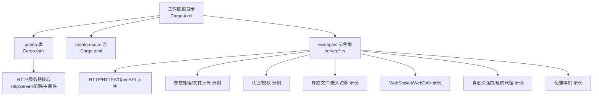

图表来源
- [Cargo.toml](file://Cargo.toml#L1-L4)
- [potato/Cargo.toml](file://potato/Cargo.toml#L1-L76)

章节来源
- [Cargo.toml](file://Cargo.toml#L1-L4)
- [README.md](file://README.md#L1-L57)

## 核心组件
- HttpServer：统一的HTTP/HTTPS服务器入口，支持配置中间件、路由、静态文件、OpenAPI、WebDAV、反向代理等
- ServerAuth：提供JWT签发与解析能力，用于认证与授权
- HttpRequest/HttpResponse：请求与响应抽象，支持客户端地址、WebSocket升级、文件上传等
- 配置上下文：通过configure闭包设置use_handlers、use_openapi、use_location_route、use_embedded_route、use_webdav_localfs/memfs、use_reverse_proxy、use_custom等

章节来源
- [examples/server/00_http_server.rs](file://examples/server/00_http_server.rs#L1-L12)
- [examples/server/02_openapi_server.rs](file://examples/server/02_openapi_server.rs#L1-L16)
- [examples/server/07_auth_server.rs](file://examples/server/07_auth_server.rs#L1-L24)
- [examples/server/05_location_route_server.rs](file://examples/server/05_location_route_server.rs#L1-L11)
- [examples/server/06_embed_route_server.rs](file://examples/server/06_embed_route_server.rs#L1-L11)
- [examples/server/13_reverse_proxy_server.rs](file://examples/server/13_reverse_proxy_server.rs#L1-L10)
- [examples/server/12_custom_server.rs](file://examples/server/12_custom_server.rs#L1-L17)

## 架构总览
下图展示了Potato服务器从启动到处理请求的整体流程，以及OpenAPI、静态文件、WebSocket、WebDAV、反向代理等扩展点的集成方式。

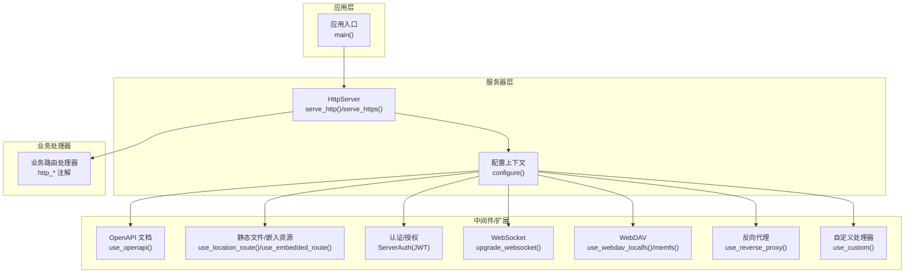

图表来源
- [examples/server/02_openapi_server.rs](file://examples/server/02_openapi_server.rs#L6-L15)
- [examples/server/05_location_route_server.rs](file://examples/server/05_location_route_server.rs#L4-L7)
- [examples/server/06_embed_route_server.rs](file://examples/server/06_embed_route_server.rs#L4-L7)
- [examples/server/07_auth_server.rs](file://examples/server/07_auth_server.rs#L14-L22)
- [examples/server/08_websocket_server.rs](file://examples/server/08_websocket_server.rs#L25-L35)
- [examples/server/11_webdav_server.rs](file://examples/server/11_webdav_server.rs#L10-L14)
- [examples/server/13_reverse_proxy_server.rs](file://examples/server/13_reverse_proxy_server.rs#L3-L6)
- [examples/server/12_custom_server.rs](file://examples/server/12_custom_server.rs#L9-L13)

## 详细组件分析

### HTTP与HTTPS服务器
- HTTP服务器：通过注解声明路由，启动后监听指定端口
- HTTPS服务器：在HTTP基础上启用TLS证书与私钥

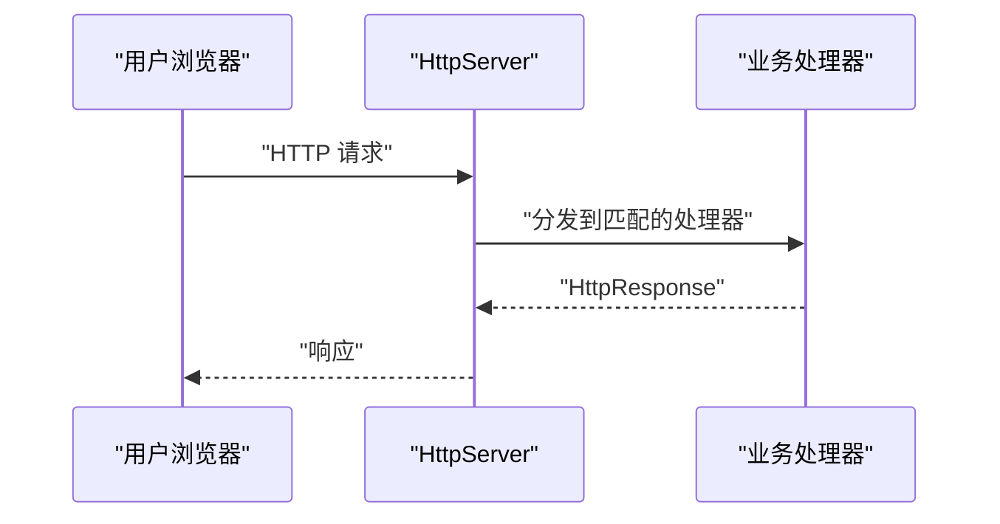

图表来源
- [examples/server/00_http_server.rs](file://examples/server/00_http_server.rs#L6-L11)
- [examples/server/01_https_server.rs](file://examples/server/01_https_server.rs#L6-L11)

章节来源
- [examples/server/00_http_server.rs](file://examples/server/00_http_server.rs#L1-L12)
- [examples/server/01_https_server.rs](file://examples/server/01_https_server.rs#L1-L12)

### OpenAPI文档自动生成与访问
- 在配置中启用OpenAPI文档路径，自动暴露Swagger UI
- 可与业务处理器共存，便于联调与测试

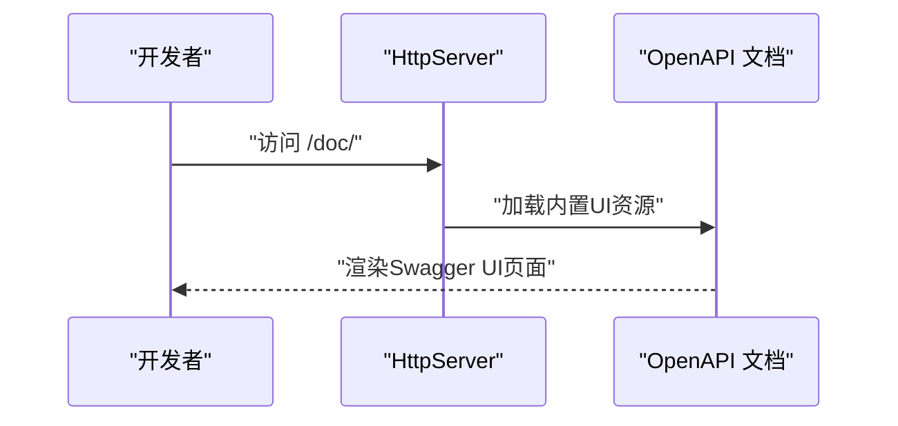

图表来源
- [examples/server/02_openapi_server.rs](file://examples/server/02_openapi_server.rs#L8-L14)

章节来源
- [examples/server/02_openapi_server.rs](file://examples/server/02_openapi_server.rs#L1-L16)

### 路由参数、查询参数与请求体处理
- 路由参数：通过处理器函数签名接收路径段参数
- 查询参数：通过函数签名接收查询字符串参数（示例以字符串参数形式体现）
- 请求体与上传文件：PostFile类型用于接收multipart/form-data文件字段

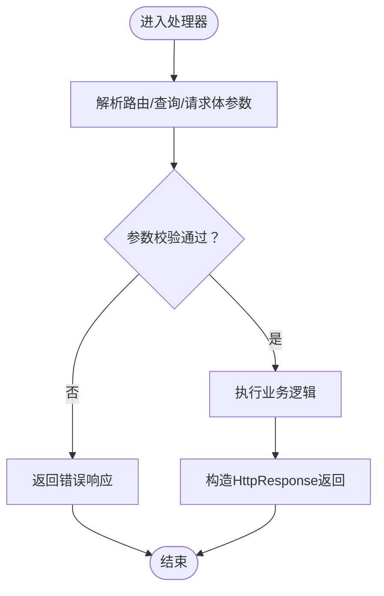

图表来源
- [examples/server/03_handler_args_server.rs](file://examples/server/03_handler_args_server.rs#L2-L20)

章节来源
- [examples/server/03_handler_args_server.rs](file://examples/server/03_handler_args_server.rs#L1-L32)

### 不同HTTP方法的使用场景
- GET：读取资源
- POST：创建资源
- PUT：更新资源
- DELETE：删除资源
- OPTIONS/HEAD：辅助性方法，常用于CORS预检或轻量探测

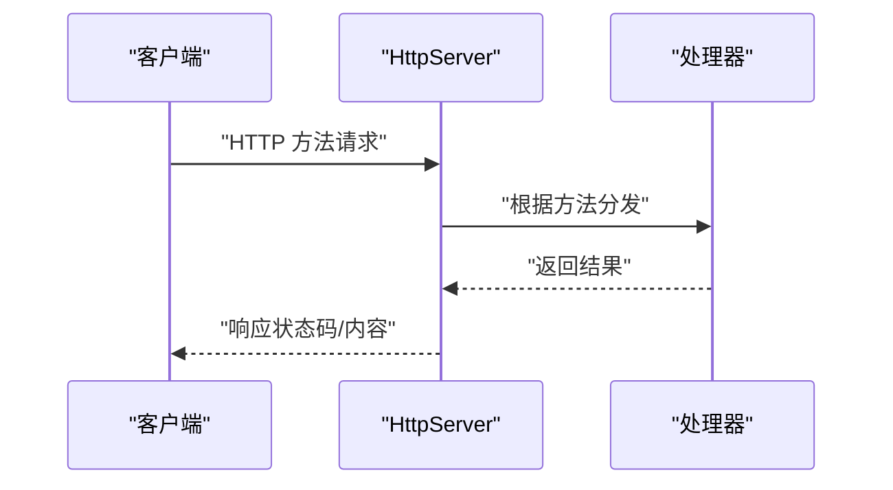

图表来源
- [examples/server/04_http_method_server.rs](file://examples/server/04_http_method_server.rs#L2-L30)

章节来源
- [examples/server/04_http_method_server.rs](file://examples/server/04_http_method_server.rs#L1-L42)

### 认证与授权（JWT）
- 签发：将负载转换为JWT令牌
- 校验：在路由上声明auth_arg，框架自动解析并传递给处理器

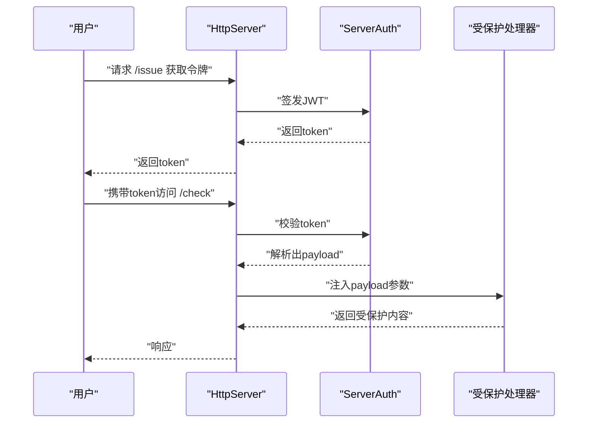

图表来源
- [examples/server/07_auth_server.rs](file://examples/server/07_auth_server.rs#L2-L11)

章节来源
- [examples/server/07_auth_server.rs](file://examples/server/07_auth_server.rs#L1-L24)

### 静态文件服务与资源嵌入
- 本地目录映射：将URL前缀映射到本地目录
- 嵌入式资源：将构建时打包的资源目录作为静态站点提供

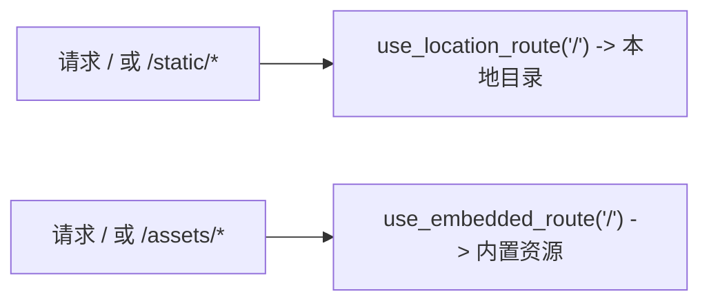

图表来源
- [examples/server/05_location_route_server.rs](file://examples/server/05_location_route_server.rs#L4-L7)
- [examples/server/06_embed_route_server.rs](file://examples/server/06_embed_route_server.rs#L4-L7)

章节来源
- [examples/server/05_location_route_server.rs](file://examples/server/05_location_route_server.rs#L1-L11)
- [examples/server/06_embed_route_server.rs](file://examples/server/06_embed_route_server.rs#L1-L11)

### WebSocket服务
- 将HTTP升级为WebSocket，支持文本与二进制帧收发
- 可用于实时通信、推送等场景

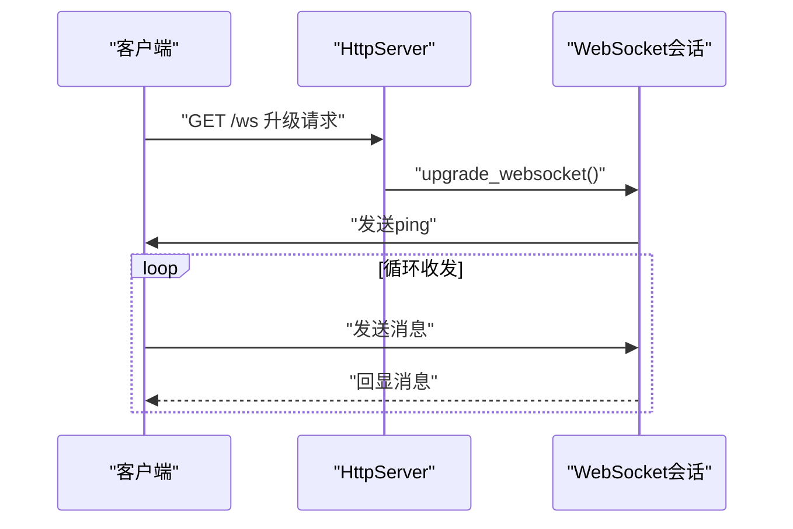

图表来源
- [examples/server/08_websocket_server.rs](file://examples/server/08_websocket_server.rs#L25-L35)

章节来源
- [examples/server/08_websocket_server.rs](file://examples/server/08_websocket_server.rs#L1-L43)

### WebDAV服务
- 提供WebDAV接口，支持本地文件系统或内存文件系统
- 适合搭建简易的文件共享或文档管理服务

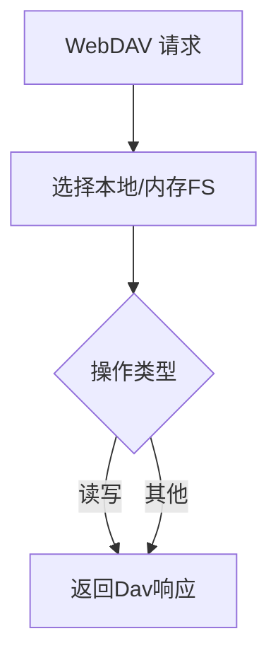

图表来源
- [examples/server/11_webdav_server.rs](file://examples/server/11_webdav_server.rs#L10-L14)

章节来源
- [examples/server/11_webdav_server.rs](file://examples/server/11_webdav_server.rs#L1-L17)

### 自定义路由与中间件
- 自定义处理器：在未启用自动注册处理器的情况下，可自定义匹配逻辑
- 与OpenAPI共存时需关闭自动处理器注册

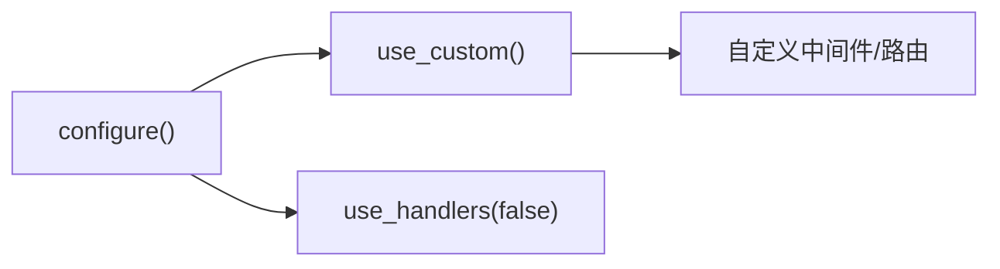

图表来源
- [examples/server/12_custom_server.rs](file://examples/server/12_custom_server.rs#L9-L13)

章节来源
- [examples/server/12_custom_server.rs](file://examples/server/12_custom_server.rs#L1-L17)

### 反向代理
- 将特定路径转发到上游服务，适合聚合微服务或对外暴露内部服务

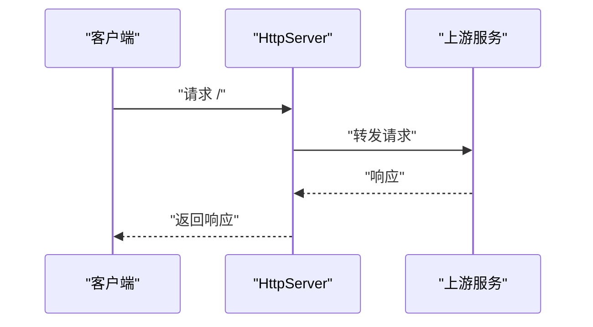

图表来源
- [examples/server/13_reverse_proxy_server.rs](file://examples/server/13_reverse_proxy_server.rs#L3-L6)

章节来源
- [examples/server/13_reverse_proxy_server.rs](file://examples/server/13_reverse_proxy_server.rs#L1-L10)

### 优雅停机
- 通过shutdown_signal获取停止信号，在收到信号后安全退出

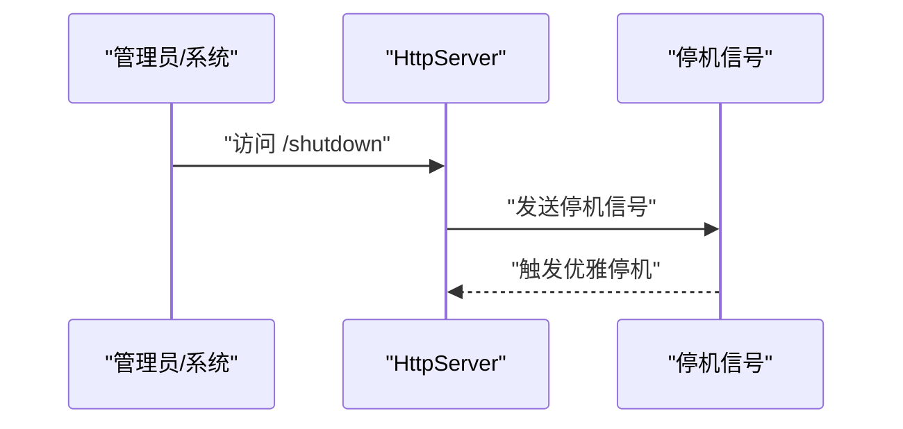

图表来源
- [examples/server/10_shutdown_server.rs](file://examples/server/10_shutdown_server.rs#L7-L13)

章节来源
- [examples/server/10_shutdown_server.rs](file://examples/server/10_shutdown_server.rs#L1-L22)

## 依赖分析
- 工作区配置：使用Cargo工作区统一管理potato与potato-macro两个包
- 依赖特性：默认开启openapi与tls；可通过特性开关启用jemalloc、ssh、webdav等
- 运行时：Tokio全功能特性用于异步运行

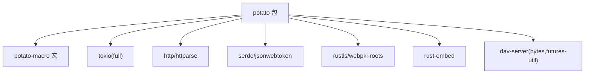

图表来源
- [Cargo.toml](file://Cargo.toml#L1-L4)
- [potato/Cargo.toml](file://potato/Cargo.toml#L16-L76)

章节来源
- [Cargo.toml](file://Cargo.toml#L1-L4)
- [potato/Cargo.toml](file://potato/Cargo.toml#L1-L76)

## 性能考虑
- 异步运行：基于Tokio事件循环，高并发I/O友好
- 可选内存分配器：启用jemalloc特性以优化内存分配
- TLS与加密：默认启用TLS，确保传输安全
- WebDAV与WebSocket：按需启用特性，避免不必要的开销

## 故障排查指南
- OpenAPI文档不可见：确认已启用use_openapi且未禁用自动处理器注册
- 静态文件404：检查use_location_route或use_embedded_route的路径映射是否正确
- JWT校验失败：确认JWT密钥已设置且与签发一致
- WebSocket升级失败：确认请求路径与处理器匹配，且未被其他中间件拦截
- WebDAV权限问题：检查本地文件系统路径权限与可用空间
- 反向代理不通：核对上游地址与路径前缀，确认网络连通性
- 优雅停机无效：确认已正确获取并持有shutdown_signal

章节来源
- [examples/server/02_openapi_server.rs](file://examples/server/02_openapi_server.rs#L8-L14)
- [examples/server/05_location_route_server.rs](file://examples/server/05_location_route_server.rs#L4-L7)
- [examples/server/06_embed_route_server.rs](file://examples/server/06_embed_route_server.rs#L4-L7)
- [examples/server/07_auth_server.rs](file://examples/server/07_auth_server.rs#L14-L22)
- [examples/server/08_websocket_server.rs](file://examples/server/08_websocket_server.rs#L25-L35)
- [examples/server/11_webdav_server.rs](file://examples/server/11_webdav_server.rs#L10-L14)
- [examples/server/13_reverse_proxy_server.rs](file://examples/server/13_reverse_proxy_server.rs#L3-L6)
- [examples/server/10_shutdown_server.rs](file://examples/server/10_shutdown_server.rs#L7-L13)

## 结论
通过以上示例，Potato框架提供了从基础HTTP服务到高级功能（OpenAPI、认证、静态文件、WebSocket、WebDAV、反向代理、优雅停机）的一站式解决方案。建议在生产环境中：
- 明确启用所需特性，避免冗余依赖
- 使用OpenAPI提升联调效率
- 采用JWT进行无状态认证
- 合理规划静态资源与嵌入资源策略
- 对关键路径进行性能监控与压测

## 附录
- 快速开始：参考示例server目录下的00至14号示例，逐步体验各功能
- 在线文档：参阅项目README中的在线文档链接