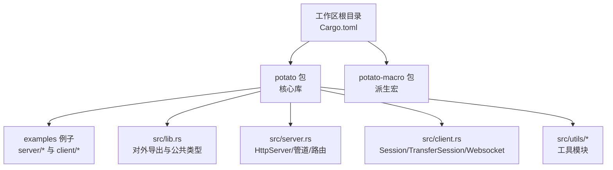
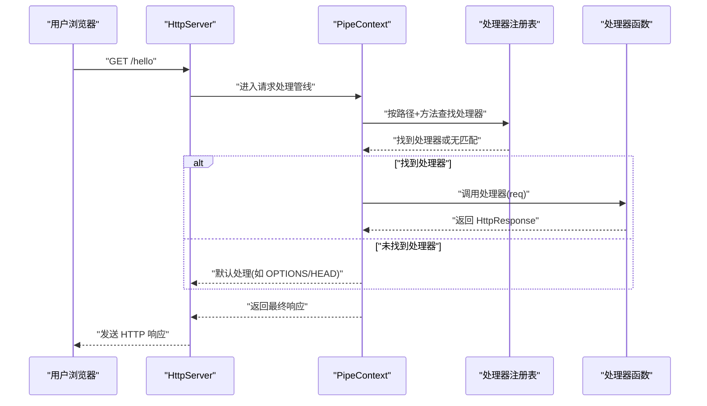
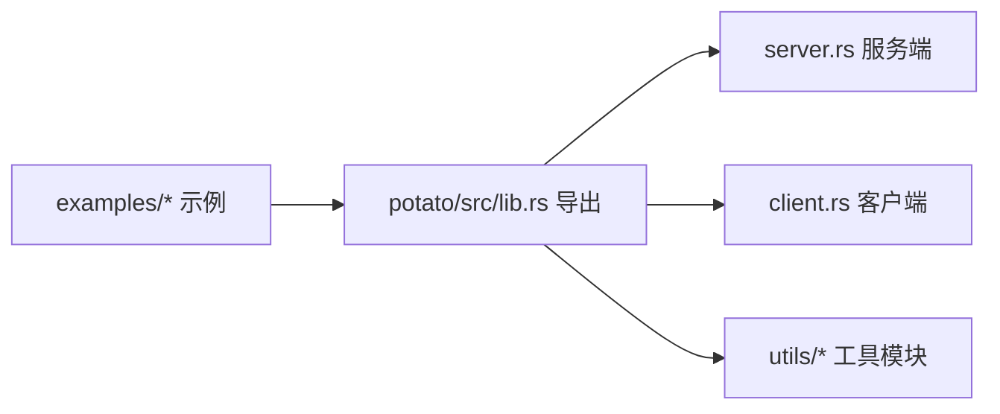

# 基础示例

<cite>
**本文引用的文件**   
- [examples/server/00_http_server.rs](file://examples/server/00_http_server.rs)
- [examples/client/00_client.rs](file://examples/client/00_client.rs)
- [examples/server/04_http_method_server.rs](file://examples/server/04_http_method_server.rs)
- [examples/client/01_client_with_arg.rs](file://examples/client/01_client_with_arg.rs)
- [examples/client/02_client_session.rs](file://examples/client/02_client_session.rs)
- [examples/server/01_https_server.rs](file://examples/server/01_https_server.rs)
- [examples/server/02_openapi_server.rs](file://examples/server/02_openapi_server.rs)
- [examples/server/03_handler_args_server.rs](file://examples/server/03_handler_args_server.rs)
- [examples/client/03_websocket_client.rs](file://examples/client/03_websocket_client.rs)
- [README.md](file://README.md)
- [Cargo.toml](file://Cargo.toml)
- [potato/src/lib.rs](file://potato/src/lib.rs)
- [potato/src/server.rs](file://potato/src/server.rs)
- [potato/src/client.rs](file://potato/src/client.rs)
- [potato/src/utils/refstr.rs](file://potato/src/utils/refstr.rs)
- [potato/src/utils/tcp_stream.rs](file://potato/src/utils/tcp_stream.rs)
</cite>

## 目录
1. [简介](#简介)
2. [项目结构](#项目结构)
3. [核心组件](#核心组件)
4. [架构总览](#架构总览)
5. [详细组件分析](#详细组件分析)
6. [依赖关系分析](#依赖关系分析)
7. [性能注意事项](#性能注意事项)
8. [故障排查指南](#故障排查指南)
9. [结论](#结论)
10. [附录：运行与实践](#附录运行与实践)

## 简介
本教程面向初学者，带你用 Potato 框架快速上手 HTTP 服务端与客户端开发。你将从最简单的 Hello World 开始，逐步掌握：
- 如何启动 HTTP/HTTPS 服务器并提供路由
- GET、POST 等常见 HTTP 方法的使用
- 客户端参数传递与响应处理
- 会话管理与连接复用
- OpenAPI 文档生成与 WebSocket 客户端示例

所有示例均来自仓库中的真实示例文件，确保可直接运行与参考。

## 项目结构
仓库采用多包工作区组织，核心库位于 potato 包，配套宏在 potato-macro 包；示例集中在 examples 目录下，按“服务端/客户端”分类。

图表来源
- [Cargo.toml](file://Cargo.toml#L1-L4)
- [README.md](file://README.md#L1-L57)

章节来源
- [Cargo.toml](file://Cargo.toml#L1-L4)
- [README.md](file://README.md#L1-L57)

## 核心组件
- 服务端
  - HttpServer：监听地址、配置管道（路由、OpenAPI、静态资源等）、接收请求并交由管道处理。
  - PipeContext：请求处理流水线，支持处理器、OpenAPI、本地文件映射、嵌入资源、反向代理、自定义处理器等。
- 客户端
  - Session：封装一次连接，自动复用同一主机/协议/端口的 TCP/TLS 连接，支持 GET/POST/PUT/DELETE 等方法及 JSON 辅助。
  - TransferSession：用于反向代理或转发场景，维护目标主机连接池，支持修改响应内容。
  - Websocket：基于升级握手与帧编解码实现双向通信。
- 请求/响应模型
  - HttpRequest/HttpResponse：统一的请求解析与响应构造，包含头部、查询参数、请求体、文件上传、条件预检等能力。
- 工具与类型
  - HeaderItem/Headers：标准化 HTTP 头部枚举与便捷设置。
  - HttpStream：抽象 TCP/TLS/双工流读写接口。

章节来源
- [potato/src/server.rs](file://potato/src/server.rs#L28-L767)
- [potato/src/client.rs](file://potato/src/client.rs#L62-L157)
- [potato/src/lib.rs](file://potato/src/lib.rs#L384-L586)
- [potato/src/utils/refstr.rs](file://potato/src/utils/refstr.rs#L32-L131)
- [potato/src/utils/tcp_stream.rs](file://potato/src/utils/tcp_stream.rs#L11-L73)

## 架构总览
下面以“Hello World”为例，展示从浏览器访问到服务端处理再到响应返回的完整链路。

图表来源
- [examples/server/00_http_server.rs](file://examples/server/00_http_server.rs#L1-L12)
- [potato/src/server.rs](file://potato/src/server.rs#L362-L407)

## 详细组件分析

### Hello World 服务端
- 示例文件：examples/server/00_http_server.rs
- 关键点
  - 使用注解声明路由与处理器，返回 HTML 响应。
  - 启动 HttpServer 并监听指定地址，打印访问提示。
- 实践建议
  - 将示例复制到你的工程中，运行后在浏览器访问提示的 URL 即可看到“hello world”。

章节来源
- [examples/server/00_http_server.rs](file://examples/server/00_http_server.rs#L1-L12)

### HTTPS 服务端
- 示例文件：examples/server/01_https_server.rs
- 关键点
  - 通过 serve_https 绑定证书与私钥，启用 TLS。
  - 访问地址为 https，注意证书有效性。
- 实践建议
  - 准备好 cert.pem 与 key.pem，确保权限正确。

章节来源
- [examples/server/01_https_server.rs](file://examples/server/01_https_server.rs#L1-L12)

### OpenAPI 文档服务端
- 示例文件：examples/server/02_openapi_server.rs
- 关键点
  - 使用 configure 配置 use_openapi，自动生成 OpenAPI 文档页面与索引。
  - 可结合处理器注解生成接口描述、参数与安全方案。
- 实践建议
  - 在浏览器打开文档页，查看自动生成的接口清单与交互界面。

章节来源
- [examples/server/02_openapi_server.rs](file://examples/server/02_openapi_server.rs#L1-L16)
- [potato/src/server.rs](file://potato/src/server.rs#L276-L331)

### 处理器参数与文件上传
- 示例文件：examples/server/03_handler_args_server.rs
- 关键点
  - 支持从请求中提取客户端地址、查询参数、JSON/表单/文件上传等。
  - 注解式声明参数名与类型，框架自动解析。
- 实践建议
  - 通过 OpenAPI 文档页测试不同类型的参数提交方式。

章节来源
- [examples/server/03_handler_args_server.rs](file://examples/server/03_handler_args_server.rs#L1-L32)
- [potato/src/lib.rs](file://potato/src/lib.rs#L384-L586)

### HTTP 方法示例（GET/POST/PUT/OPTIONS/HEAD/DELETE）
- 示例文件：examples/server/04_http_method_server.rs
- 关键点
  - 为不同方法分别声明处理器，便于验证各方法行为。
  - 可选开启 OpenAPI 文档以便统一查看。
- 实践建议
  - 使用 curl 或浏览器插件分别对各方法进行测试。

章节来源
- [examples/server/04_http_method_server.rs](file://examples/server/04_http_method_server.rs#L1-L42)

### 客户端基础调用
- 示例文件：examples/client/00_client.rs
- 关键点
  - 使用全局 get 方法发起 HTTP 请求，打印响应体。
  - 返回值为 HttpResponse，包含状态码、头部与正文。
- 实践建议
  - 替换为任意可访问的 URL 进行测试。

章节来源
- [examples/client/00_client.rs](file://examples/client/00_client.rs#L1-L7)
- [potato/src/client.rs](file://potato/src/client.rs#L191-L199)

### 客户端参数传递（Headers）
- 示例文件：examples/client/01_client_with_arg.rs
- 关键点
  - 通过 Headers 列表传递请求头，例如 User-Agent。
  - Session::new_request 会自动设置通用头（如 User-Agent）。
- 实践建议
  - 尝试添加多种标准或自定义头，观察服务端日志或响应。

章节来源
- [examples/client/01_client_with_arg.rs](file://examples/client/01_client_with_arg.rs#L1-L7)
- [potato/src/client.rs](file://potato/src/client.rs#L110-L129)
- [potato/src/utils/refstr.rs](file://potato/src/utils/refstr.rs#L32-L131)

### 客户端会话与连接复用
- 示例文件：examples/client/02_client_session.rs
- 关键点
  - Session::new 创建会话实例，内部维护同一主机/协议/端口的连接。
  - 多次请求可复用底层连接，减少握手开销。
- 实践建议
  - 对比多次请求的耗时差异，观察连接复用效果。

章节来源
- [examples/client/02_client_session.rs](file://examples/client/02_client_session.rs#L1-L10)
- [potato/src/client.rs](file://potato/src/client.rs#L101-L157)

### WebSocket 客户端
- 示例文件：examples/client/03_websocket_client.rs
- 关键点
  - 使用 Websocket::connect 发起升级握手。
  - 支持发送文本/二进制帧与心跳（Ping/Pong）。
- 实践建议
  - 结合服务端 WebSocket 示例进行联调，验证收发与心跳机制。

章节来源
- [examples/client/03_websocket_client.rs](file://examples/client/03_websocket_client.rs#L1-L11)
- [potato/src/client.rs](file://potato/src/client.rs#L475-L592)

### 服务端请求解析与响应构造
- 关键点
  - HttpRequest：解析请求行、头部、查询参数、请求体（JSON/表单/分块表单），并提供便捷方法（如 get_header、get_client_addr）。
  - HttpResponse：从内存文件、磁盘文件、字节流等构建响应，并支持条件预检（304/412）。
- 实践建议
  - 在处理器中打印或记录 HttpRequest 的关键字段，加深理解。

章节来源
- [potato/src/lib.rs](file://potato/src/lib.rs#L384-L586)
- [potato/src/lib.rs](file://potato/src/lib.rs#L588-L760)

### 管道与路由处理
- 关键点
  - PipeContext：按顺序执行管线项（处理器、OpenAPI、本地文件映射、嵌入资源、反向代理、自定义处理器）。
  - HANDLERS：基于注解收集的处理器注册表，按路径与方法分发。
- 实践建议
  - 自定义中间件或处理器时，理解管线的执行顺序与短路逻辑。

章节来源
- [potato/src/server.rs](file://potato/src/server.rs#L28-L767)

### 头部与流抽象
- 关键点
  - HeaderItem/Headers：标准化头部枚举，便于统一设置与读取。
  - HttpStream：抽象 TCP/TLS/双工流，屏蔽底层细节。
- 实践建议
  - 在需要自定义头部或调试网络层时，优先使用 Headers/HttpStream。

章节来源
- [potato/src/utils/refstr.rs](file://potato/src/utils/refstr.rs#L32-L131)
- [potato/src/utils/tcp_stream.rs](file://potato/src/utils/tcp_stream.rs#L11-L73)

## 依赖关系分析
- 工作区组织
  - 顶层 Cargo.toml 定义工作区与成员包，确保示例与库协同编译。
- 库与示例
  - examples 依赖 potato 包提供的 HttpServer、Session、Websocket 等能力。
  - 示例通过注解与宏驱动处理器注册，无需手动路由表。

图表来源
- [Cargo.toml](file://Cargo.toml#L1-L4)
- [README.md](file://README.md#L1-L57)

章节来源
- [Cargo.toml](file://Cargo.toml#L1-L4)
- [README.md](file://README.md#L1-L57)

## 性能注意事项
- 连接复用
  - 客户端 Session 默认按主机/协议/端口复用连接，减少 TLS 握手与三次握手成本。
- 压缩与条件请求
  - 服务端支持根据 Accept-Encoding 选择压缩模式；客户端可利用 If-None-Match/If-Modified-Since 等条件头减少传输。
- 流式处理
  - HttpStream 提供异步读写接口，适合高并发场景；注意合理缓冲与背压。

## 故障排查指南
- 无法访问 HTTPS
  - 确认证书与私钥路径正确，权限允许，域名与证书一致。
- OpenAPI 文档空白
  - 确保已启用 use_openapi，且处理器注解正确；检查文档页是否加载静态资源。
- 客户端请求失败
  - 检查 Headers 是否正确设置；确认目标主机可达；必要时开启 TLS 特性。
- WebSocket 握手失败
  - 确认服务端已正确升级；检查 Sec-WebSocket-* 头是否齐全；关注返回状态码。

## 结论
通过本教程，你已经掌握了 Potato 框架的基础用法：从 Hello World 到 HTTPS、OpenAPI、多方法路由、客户端参数与会话复用，以及 WebSocket 客户端示例。建议继续探索更高级特性（如认证、CORS、WebDAV、反向代理等）与宏扩展，逐步构建生产级应用。

## 附录：运行与实践
- 运行环境
  - Rust 工具链与 Cargo
  - Tokio 运行时（示例多为异步）
- 快速运行
  - 服务端示例：进入对应示例目录，执行 cargo run
  - 客户端示例：同上，观察控制台输出
- 常见命令
  - 查看在线文档与更多示例：README 中提供了链接
- 路径参考
  - 服务端 Hello World：examples/server/00_http_server.rs
  - 客户端基础调用：examples/client/00_client.rs
  - 客户端参数与会话：examples/client/01_client_with_arg.rs、examples/client/02_client_session.rs
  - HTTPS 服务端：examples/server/01_https_server.rs
  - OpenAPI 文档：examples/server/02_openapi_server.rs
  - 处理器参数与文件上传：examples/server/03_handler_args_server.rs
  - HTTP 方法示例：examples/server/04_http_method_server.rs
  - WebSocket 客户端：examples/client/03_websocket_client.rs

章节来源
- [README.md](file://README.md#L10-L57)
- [examples/server/00_http_server.rs](file://examples/server/00_http_server.rs#L1-L12)
- [examples/client/00_client.rs](file://examples/client/00_client.rs#L1-L7)
- [examples/client/01_client_with_arg.rs](file://examples/client/01_client_with_arg.rs#L1-L7)
- [examples/client/02_client_session.rs](file://examples/client/02_client_session.rs#L1-L10)
- [examples/server/01_https_server.rs](file://examples/server/01_https_server.rs#L1-L12)
- [examples/server/02_openapi_server.rs](file://examples/server/02_openapi_server.rs#L1-L16)
- [examples/server/03_handler_args_server.rs](file://examples/server/03_handler_args_server.rs#L1-L32)
- [examples/server/04_http_method_server.rs](file://examples/server/04_http_method_server.rs#L1-L42)
- [examples/client/03_websocket_client.rs](file://examples/client/03_websocket_client.rs#L1-L11)