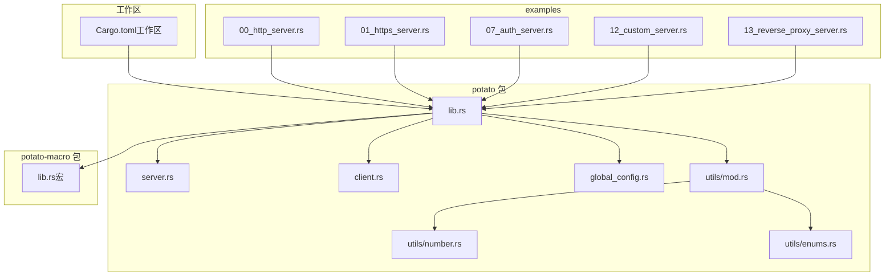
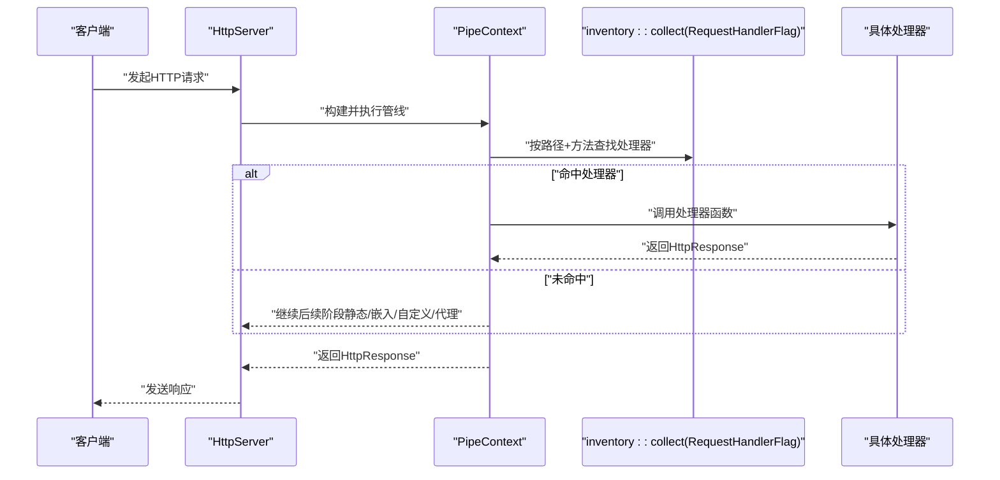
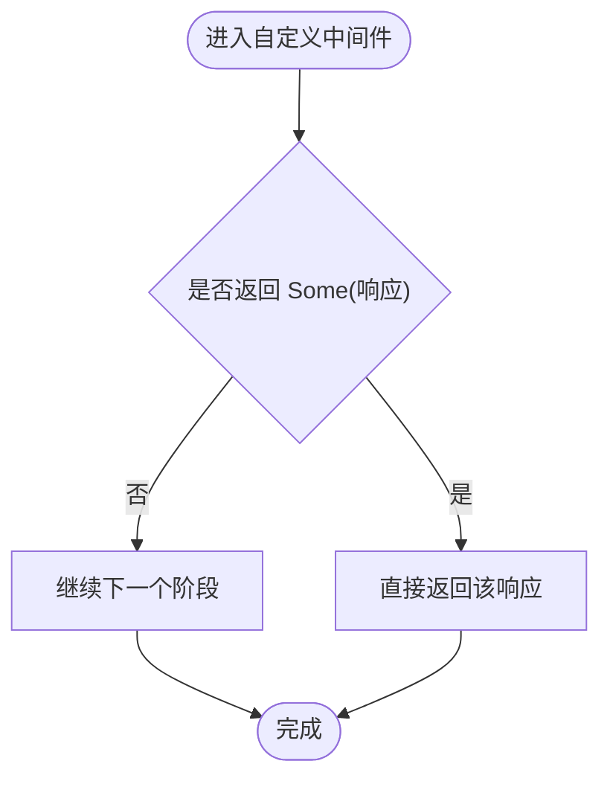
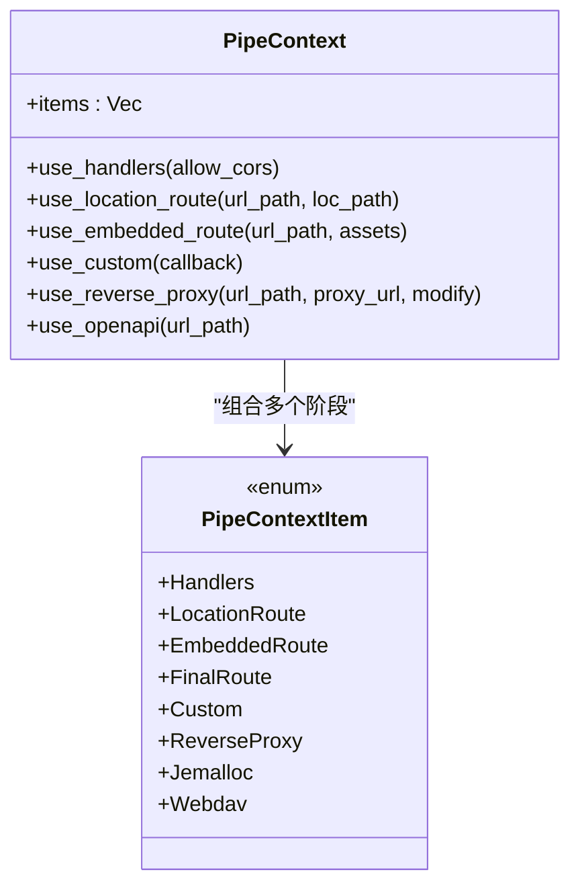
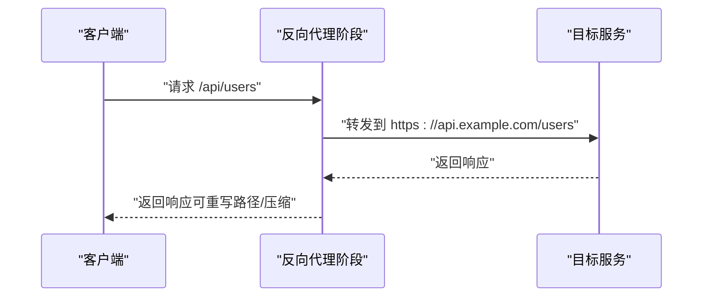
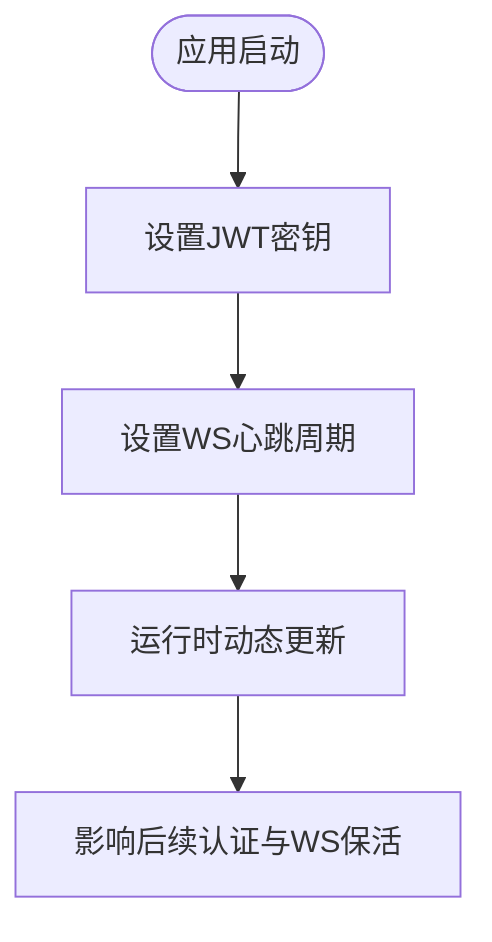
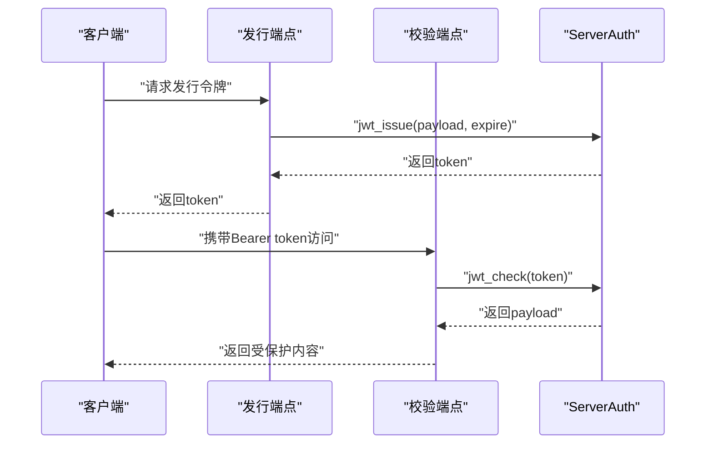
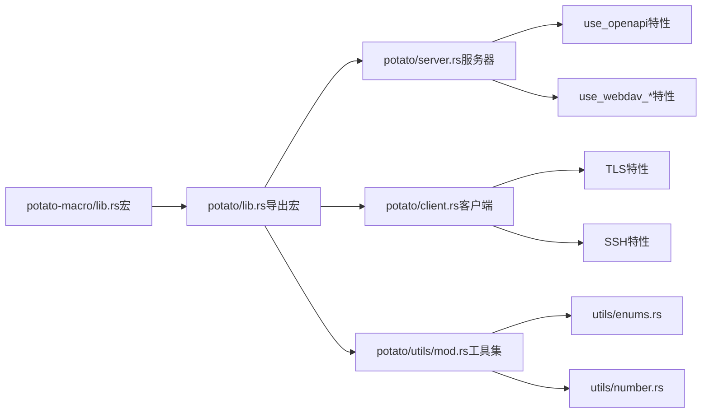

# 定制化示例

<cite>
**本文引用的文件**
- [lib.rs](file://potato/src/lib.rs)
- [main.rs](file://potato/src/main.rs)
- [server.rs](file://potato/src/server.rs)
- [client.rs](file://potato/src/client.rs)
- [global_config.rs](file://potato/src/global_config.rs)
- [mod.rs](file://potato/src/utils/mod.rs)
- [number.rs](file://potato/src/utils/number.rs)
- [enums.rs](file://potato/src/utils/enums.rs)
- [lib.rs（宏）](file://potato-macro/src/lib.rs)
- [00_http_server.rs](file://examples/server/00_http_server.rs)
- [01_https_server.rs](file://examples/server/01_https_server.rs)
- [07_auth_server.rs](file://examples/server/07_auth_server.rs)
- [12_custom_server.rs](file://examples/server/12_custom_server.rs)
- [13_reverse_proxy_server.rs](file://examples/server/13_reverse_proxy_server.rs)
- [Cargo.toml（工作区）](file://Cargo.toml)
</cite>

## 目录
1. [简介](#简介)
2. [项目结构](#项目结构)
3. [核心组件](#核心组件)
4. [架构总览](#架构总览)
5. [详细组件分析](#详细组件分析)
6. [依赖关系分析](#依赖关系分析)
7. [性能考虑](#性能考虑)
8. [故障排查指南](#故障排查指南)
9. [结论](#结论)
10. [附录](#附录)

## 简介
本教程面向希望在 Potato 框架上进行定制化开发的工程师，提供从零到一的实践路径：扩展框架功能、创建自定义中间件与处理器、集成第三方库与现有系统、灵活使用配置系统与动态配置更新、实现插件化架构、以及日志、监控与调试的定制化方案，并给出性能监控与指标收集的可落地示例。所有示例均基于仓库中的真实源码与示例工程，确保可复现与可迁移。

## 项目结构
仓库采用多包工作区组织，核心模块包括：
- potato：核心运行时与HTTP服务器、客户端、宏、工具集
- potato-macro：HTTP路由宏、头部派生宏等
- examples：各类示例，覆盖HTTP/HTTPS、认证、反向代理、自定义管道等场景

**图表来源**
- [Cargo.toml（工作区）](file://Cargo.toml#L1-L4)
- [lib.rs](file://potato/src/lib.rs#L1-L20)
- [server.rs](file://potato/src/server.rs#L1-L30)
- [client.rs](file://potato/src/client.rs#L1-L20)
- [global_config.rs](file://potato/src/global_config.rs#L1-L20)
- [mod.rs](file://potato/src/utils/mod.rs#L1-L12)
- [number.rs](file://potato/src/utils/number.rs#L1-L14)
- [enums.rs](file://potato/src/utils/enums.rs#L1-L41)
- [lib.rs（宏）](file://potato-macro/src/lib.rs#L1-L30)
- [00_http_server.rs](file://examples/server/00_http_server.rs#L1-L12)
- [01_https_server.rs](file://examples/server/01_https_server.rs#L1-L12)
- [07_auth_server.rs](file://examples/server/07_auth_server.rs#L1-L24)
- [12_custom_server.rs](file://examples/server/12_custom_server.rs#L1-L17)
- [13_reverse_proxy_server.rs](file://examples/server/13_reverse_proxy_server.rs#L1-L10)

**章节来源**
- [Cargo.toml（工作区）](file://Cargo.toml#L1-L4)
- [lib.rs](file://potato/src/lib.rs#L1-L20)

## 核心组件
- 请求/响应模型与方法枚举：定义了统一的请求结构、HTTP方法集合、压缩模式、WebSocket帧类型等，为路由与处理器提供基础数据载体。
- 服务器管线与上下文：通过 PipeContext 组合多种处理阶段（内置处理器、本地文件路由、嵌入资源、自定义回调、反向代理、OpenAPI 文档、WebDAV 等），形成可插拔的处理流水线。
- 宏系统：提供 http_get/post 等注解宏，自动解析参数、校验类型、注入 OpenAPI 文档元信息，并注册到全局路由表。
- 客户端与传输会话：支持直连、TLS、SSH 跳板、正向/反向代理、WebSocket 升级等能力，便于与外部系统集成。
- 全局配置：提供 JWT 密钥与 WebSocket 心跳周期的动态配置接口，支持运行时修改。

**章节来源**
- [lib.rs](file://potato/src/lib.rs#L124-L195)
- [server.rs](file://potato/src/server.rs#L22-L52)
- [lib.rs（宏）](file://potato-macro/src/lib.rs#L26-L300)
- [client.rs](file://potato/src/client.rs#L224-L280)
- [global_config.rs](file://potato/src/global_config.rs#L18-L35)

## 架构总览
下图展示了从请求进入、管线分发、到最终响应返回的整体流程，以及宏注册与路由表的关系。

**图表来源**
- [server.rs](file://potato/src/server.rs#L28-L38)
- [server.rs](file://potato/src/server.rs#L362-L377)
- [lib.rs（宏）](file://potato-macro/src/lib.rs#L290-L296)
- [lib.rs](file://potato/src/lib.rs#L175-L175)

## 详细组件分析

### 自定义中间件与处理器
- 自定义中间件：通过 PipeContext.use_custom 注册异步回调，返回 Some 响应即短路，None 则继续后续阶段；错误则转为错误响应。
- 处理器注册：宏将处理器包装为统一签名并提交至 inventory，服务启动后由路由表驱动分发。
- 示例参考：自定义服务器示例展示了如何在配置中插入自定义中间件。

**图表来源**
- [server.rs](file://potato/src/server.rs#L102-L113)
- [server.rs](file://potato/src/server.rs#L610-L614)

**章节来源**
- [12_custom_server.rs](file://examples/server/12_custom_server.rs#L10-L13)
- [lib.rs（宏）](file://potato-macro/src/lib.rs#L280-L296)

### 插件化架构设计与实现
- 插件入口：通过 inventory 收集 RequestHandlerFlag，实现“声明即注册”的插件式路由。
- 管线组合：PipeContext 提供多种阶段组合能力，插件可按需插入。
- 动态装配：在服务启动前，通过 configure 回调对 PipeContext 进行装配，实现“插件”级别的动态启用/禁用。

**图表来源**
- [server.rs](file://potato/src/server.rs#L40-L52)
- [server.rs](file://potato/src/server.rs#L73-L126)

**章节来源**
- [lib.rs](file://potato/src/lib.rs#L175-L175)
- [server.rs](file://potato/src/server.rs#L784-L788)

### 集成第三方库与现有系统
- 反向代理：通过 use_reverse_proxy 将匹配路径转发到目标地址，支持内容替换与压缩处理。
- OpenAPI 文档：通过 use_openapi 自动生成文档与静态资源，结合处理器元信息生成索引。
- WebDAV：通过 use_webdav_localfs/use_webdav_memfs 挂载本地或内存文件系统。
- 示例参考：反向代理示例直接将根路径代理到外部站点。

**图表来源**
- [server.rs](file://potato/src/server.rs#L115-L126)
- [server.rs](file://potato/src/server.rs#L615-L627)

**章节来源**
- [13_reverse_proxy_server.rs](file://examples/server/13_reverse_proxy_server.rs#L4-L6)
- [server.rs](file://potato/src/server.rs#L276-L331)

### 配置系统与动态配置更新
- 全局配置：提供 JWT 密钥与 WebSocket 心跳周期的动态设置与读取接口。
- 使用方式：在应用启动早期设置密钥，运行时可随时更新心跳周期以调整保活策略。
- 示例参考：认证示例在启动时设置 JWT 密钥并开启 OpenAPI 文档。

**图表来源**
- [global_config.rs](file://potato/src/global_config.rs#L19-L35)
- [07_auth_server.rs](file://examples/server/07_auth_server.rs#L15-L16)

**章节来源**
- [global_config.rs](file://potato/src/global_config.rs#L18-L63)
- [07_auth_server.rs](file://examples/server/07_auth_server.rs#L15-L22)

### 认证与授权（JWT）
- 发行令牌：通过 ServerAuth.jwt_issue 生成带过期时间的令牌。
- 校验令牌：通过 ServerAuth.jwt_check 校验并提取负载，宏支持在处理器中声明 auth_arg 自动注入已校验的负载。
- 示例参考：认证示例包含发行与校验两个端点，并开启 OpenAPI 文档。

**图表来源**
- [global_config.rs](file://potato/src/global_config.rs#L37-L63)
- [lib.rs（宏）](file://potato-macro/src/lib.rs#L130-L155)
- [07_auth_server.rs](file://examples/server/07_auth_server.rs#L2-L11)

**章节来源**
- [global_config.rs](file://potato/src/global_config.rs#L37-L63)
- [lib.rs（宏）](file://potato-macro/src/lib.rs#L130-L155)
- [07_auth_server.rs](file://examples/server/07_auth_server.rs#L2-L11)

### 日志、监控与调试定制
- 日志：建议在自定义中间件中注入请求ID、路径、耗时等上下文，输出结构化日志。
- 监控：在 PipeContext 各阶段前后埋点，统计每阶段耗时、命中率、错误码分布。
- 调试：利用 use_openapi 自动生成文档，便于联调；在 use_custom 中加入断点与条件判断，快速定位问题。
- 性能：结合 jemalloc（如启用）导出 profile，辅助定位内存热点。

说明：以上为通用实践建议，不直接对应特定源码片段。

### 性能监控与指标收集示例
- 指标维度：QPS、P95/P99 延迟、错误码分布、各阶段耗时、连接数、内存占用。
- 收集方式：在自定义中间件中对关键节点打点，聚合后暴露为文本/JSON 接口或推送至监控系统。
- 优化方向：根据指标识别瓶颈（解析、序列化、网络往返、磁盘IO），针对性优化。

说明：以上为通用实践建议，不直接对应特定源码片段。

## 依赖关系分析
- 宏依赖：potato 通过导出 potato_macro 的属性宏与派生宏，实现声明式路由与头部标准化。
- 工具依赖：utils 子模块提供枚举、数值、字符串、字节、TCP流等通用能力，被 server、client、宏广泛使用。
- 第三方集成：client 支持 TLS 与 SSH 跳板；server 在启用特性时可集成 OpenAPI、WebDAV、jemalloc。

**图表来源**
- [lib.rs（宏）](file://potato-macro/src/lib.rs#L1-L20)
- [lib.rs](file://potato/src/lib.rs#L1-L20)
- [server.rs](file://potato/src/server.rs#L17-L21)
- [client.rs](file://potato/src/client.rs#L68-L98)
- [mod.rs](file://potato/src/utils/mod.rs#L1-L12)
- [enums.rs](file://potato/src/utils/enums.rs#L1-L41)
- [number.rs](file://potato/src/utils/number.rs#L1-L14)

**章节来源**
- [lib.rs（宏）](file://potato-macro/src/lib.rs#L1-L30)
- [lib.rs](file://potato/src/lib.rs#L1-L20)
- [server.rs](file://potato/src/server.rs#L17-L21)
- [client.rs](file://potato/src/client.rs#L68-L98)
- [mod.rs](file://potato/src/utils/mod.rs#L1-L12)

## 性能考虑
- 管线阶段顺序：将高命中率、低成本的阶段前置，减少后续阶段负担。
- 内容压缩与缓存：利用内置预检头与 ETag 机制，降低重复传输与计算。
- 连接复用：客户端与传输会话维护长连接，减少握手开销。
- 资源嵌入：将静态资源嵌入二进制，减少文件系统访问。

说明：以上为通用实践建议，不直接对应特定源码片段。

## 故障排查指南
- 路由未命中：检查宏注册是否生效、路径大小写与方法是否一致、是否被后续阶段吞没。
- 认证失败：确认 JWT 密钥一致、令牌未过期、auth_arg 类型与名称正确。
- 代理异常：核对 use_reverse_proxy 的路径前缀与目标URL，关注内容重写与压缩处理。
- TLS/SSH 问题：确认编译特性开关与证书/凭据配置。

**章节来源**
- [lib.rs（宏）](file://potato-macro/src/lib.rs#L130-L155)
- [server.rs](file://potato/src/server.rs#L615-L627)
- [client.rs](file://potato/src/client.rs#L384-L411)

## 结论
通过宏驱动的声明式路由、可插拔的管线架构、完善的客户端与传输能力，以及灵活的全局配置，Potato 框架为定制化开发提供了坚实基础。结合本文提供的中间件/处理器扩展、第三方集成、配置动态更新、插件化设计与监控调试实践，开发者可以快速构建高性能、可观测、易维护的业务系统。

## 附录
- 快速开始示例
  - HTTP 服务：[00_http_server.rs](file://examples/server/00_http_server.rs#L1-L12)
  - HTTPS 服务：[01_https_server.rs](file://examples/server/01_https_server.rs#L1-L12)
  - 认证服务：[07_auth_server.rs](file://examples/server/07_auth_server.rs#L1-L24)
  - 自定义中间件：[12_custom_server.rs](file://examples/server/12_custom_server.rs#L1-L17)
  - 反向代理：[13_reverse_proxy_server.rs](file://examples/server/13_reverse_proxy_server.rs#L1-L10)
- 关键源码定位
  - 宏实现与参数解析：[lib.rs（宏）](file://potato-macro/src/lib.rs#L26-L300)
  - 服务器管线与阶段：[server.rs](file://potato/src/server.rs#L362-L767)
  - 客户端与传输：[client.rs](file://potato/src/client.rs#L224-L592)
  - 全局配置与认证：[global_config.rs](file://potato/src/global_config.rs#L18-L63)
  - 工具集：[mod.rs](file://potato/src/utils/mod.rs#L1-L12)、[enums.rs](file://potato/src/utils/enums.rs#L1-L41)、[number.rs](file://potato/src/utils/number.rs#L1-L14)