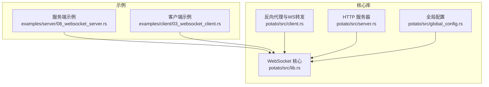
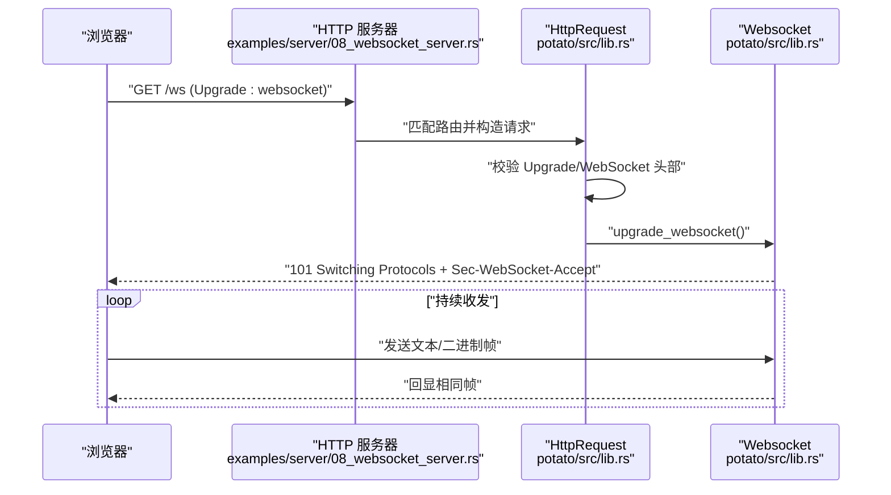
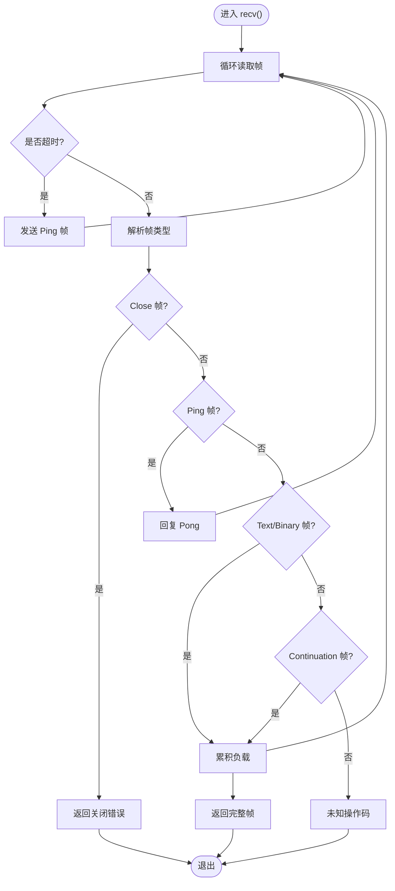
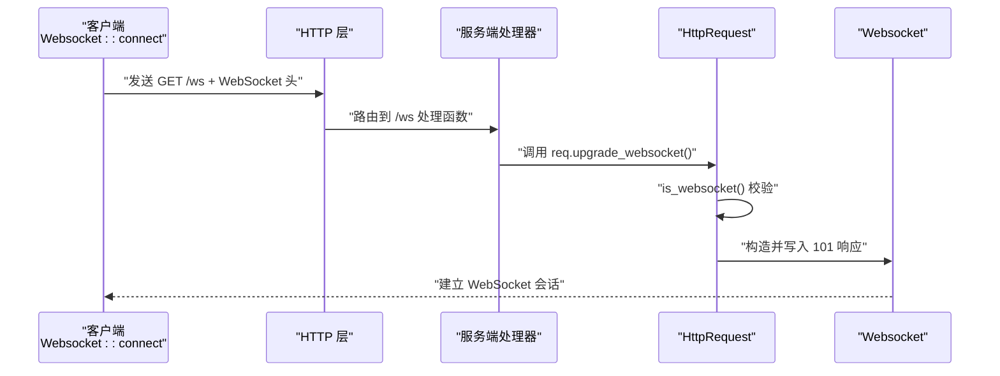
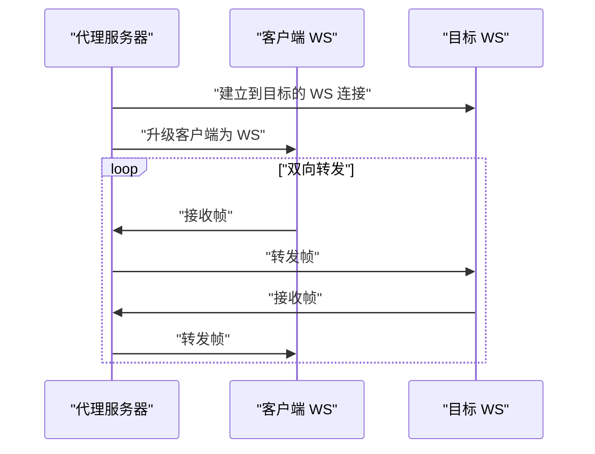
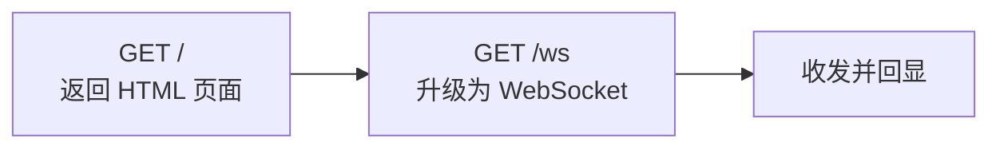
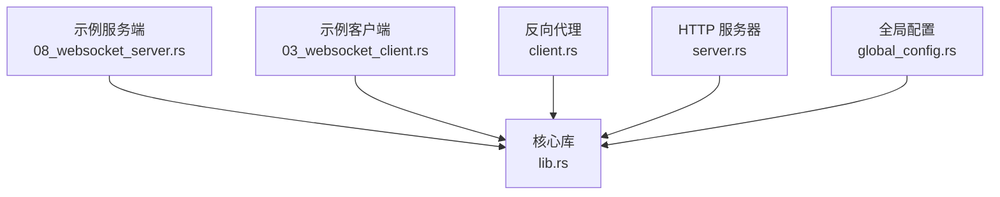

# 实时通信示例

<cite>
**本文引用的文件**
- [examples/server/08_websocket_server.rs](file://examples/server/08_websocket_server.rs)
- [examples/client/03_websocket_client.rs](file://examples/client/03_websocket_client.rs)
- [potato/src/lib.rs](file://potato/src/lib.rs)
- [potato/src/client.rs](file://potato/src/client.rs)
- [potato/src/server.rs](file://potato/src/server.rs)
- [potato/src/global_config.rs](file://potato/src/global_config.rs)
- [Cargo.toml](file://Cargo.toml)
</cite>

## 目录
1. [简介](#简介)
2. [项目结构](#项目结构)
3. [核心组件](#核心组件)
4. [架构总览](#架构总览)
5. [详细组件分析](#详细组件分析)
6. [依赖关系分析](#依赖关系分析)
7. [性能考量](#性能考量)
8. [故障排查指南](#故障排查指南)
9. [结论](#结论)
10. [附录](#附录)

## 简介
本教程基于 Potato 框架，系统讲解如何使用其 WebSocket 能力构建实时通信应用。从最基础的连接与回显开始，逐步深入到心跳检测、断线重连、消息广播与私信等高级特性，并提供服务端与客户端的完整示例路径，帮助读者快速上手并扩展为生产级的聊天应用。

## 项目结构
仓库采用工作区组织方式，核心库位于 potato 子工程，示例位于 examples 目录。WebSocket 示例主要涉及以下文件：
- 服务端示例：examples/server/08_websocket_server.rs
- 客户端示例：examples/client/03_websocket_client.rs
- 核心库（WebSocket 协议、升级、帧收发）：potato/src/lib.rs
- 反向代理与 WebSocket 转发：potato/src/client.rs
- HTTP 服务器与路由：potato/src/server.rs
- 全局配置（心跳间隔等）：potato/src/global_config.rs
- 工作区配置：Cargo.toml

**图表来源**
- [examples/server/08_websocket_server.rs](file://examples/server/08_websocket_server.rs#L1-L43)
- [examples/client/03_websocket_client.rs](file://examples/client/03_websocket_client.rs#L1-L11)
- [potato/src/lib.rs](file://potato/src/lib.rs#L200-L360)
- [potato/src/client.rs](file://potato/src/client.rs#L475-L592)
- [potato/src/server.rs](file://potato/src/server.rs#L769-L800)
- [potato/src/global_config.rs](file://potato/src/global_config.rs#L1-L63)

**章节来源**
- [Cargo.toml](file://Cargo.toml#L1-L4)
- [examples/server/08_websocket_server.rs](file://examples/server/08_websocket_server.rs#L1-L43)
- [examples/client/03_websocket_client.rs](file://examples/client/03_websocket_client.rs#L1-L11)
- [potato/src/lib.rs](file://potato/src/lib.rs#L200-L360)
- [potato/src/client.rs](file://potato/src/client.rs#L475-L592)
- [potato/src/server.rs](file://potato/src/server.rs#L769-L800)
- [potato/src/global_config.rs](file://potato/src/global_config.rs#L1-L63)

## 核心组件
- WebSocket 客户端与服务端协议实现：在 potato/src/lib.rs 中定义了 Websocket 结构体及帧收发、升级握手、心跳等能力。
- 请求升级为 WebSocket：HttpRequest 提供 upgrade_websocket 方法完成握手与返回 Websocket。
- 反向代理中的 WebSocket 转发：TransferSession 在 potato/src/client.rs 中实现了双向转发逻辑。
- HTTP 服务器：提供路由注册与请求分发，示例中通过注解注册 / 与 /ws 路由。
- 全局配置：ServerConfig 提供心跳间隔等运行时参数设置。

**章节来源**
- [potato/src/lib.rs](file://potato/src/lib.rs#L200-L360)
- [potato/src/lib.rs](file://potato/src/lib.rs#L560-L580)
- [potato/src/client.rs](file://potato/src/client.rs#L475-L592)
- [potato/src/server.rs](file://potato/src/server.rs#L28-L38)
- [potato/src/global_config.rs](file://potato/src/global_config.rs#L18-L35)

## 架构总览
下图展示了从浏览器发起 WebSocket 连接，到服务端升级为 WebSocket，再到客户端收发帧的完整流程。

**图表来源**
- [examples/server/08_websocket_server.rs](file://examples/server/08_websocket_server.rs#L25-L35)
- [potato/src/lib.rs](file://potato/src/lib.rs#L532-L580)
- [potato/src/lib.rs](file://potato/src/lib.rs#L1042-L1066)

**章节来源**
- [examples/server/08_websocket_server.rs](file://examples/server/08_websocket_server.rs#L25-L35)
- [potato/src/lib.rs](file://potato/src/lib.rs#L532-L580)
- [potato/src/lib.rs](file://potato/src/lib.rs#L1042-L1066)

## 详细组件分析

### 组件一：WebSocket 帧收发与心跳
- 收包循环：recv() 内部维护临时缓冲，按帧聚合；遇到 Ping 自动回 Pong；超时则主动 Ping。
- 发包：send()/send_text()/send_binary() 将帧编码后写入底层流。
- 心跳周期：通过 ServerConfig::get_ws_ping_duration() 获取心跳间隔，用于 recv 的超时控制。

**图表来源**
- [potato/src/lib.rs](file://potato/src/lib.rs#L285-L308)
- [potato/src/lib.rs](file://potato/src/lib.rs#L337-L359)
- [potato/src/global_config.rs](file://potato/src/global_config.rs#L28-L34)

**章节来源**
- [potato/src/lib.rs](file://potato/src/lib.rs#L285-L308)
- [potato/src/lib.rs](file://potato/src/lib.rs#L337-L359)
- [potato/src/global_config.rs](file://potato/src/global_config.rs#L28-L34)

### 组件二：WebSocket 握手与升级
- 客户端握手：Websocket::connect() 设置 Upgrade/Connection/Sec-WebSocket-* 头，等待 101 切换协议。
- 服务端升级：HttpRequest::is_websocket() 校验头部；upgrade_websocket() 生成响应头并写入底层流，返回 Websocket。

**图表来源**
- [potato/src/lib.rs](file://potato/src/lib.rs#L208-L232)
- [potato/src/lib.rs](file://potato/src/lib.rs#L532-L580)
- [potato/src/lib.rs](file://potato/src/lib.rs#L1042-L1066)

**章节来源**
- [potato/src/lib.rs](file://potato/src/lib.rs#L208-L232)
- [potato/src/lib.rs](file://potato/src/lib.rs#L532-L580)
- [potato/src/lib.rs](file://potato/src/lib.rs#L1042-L1066)

### 组件三：反向代理中的 WebSocket 转发
当启用反向代理时，TransferSession::transfer_websocket() 会在客户端与目标 WebSocket 之间进行双向转发，保持帧的原样传递。

**图表来源**
- [potato/src/client.rs](file://potato/src/client.rs#L475-L592)

**章节来源**
- [potato/src/client.rs](file://potato/src/client.rs#L475-L592)

### 组件四：服务端路由与示例
- 注解路由：通过宏注册 / 与 /ws 路由。
- / 路由返回一个简单的 HTML 页面，页面内通过 WebSocket 发送多条消息并监听状态。
- /ws 路由将请求升级为 WebSocket，发送一次 Ping 后进入循环，收到文本或二进制帧后回显。

**图表来源**
- [examples/server/08_websocket_server.rs](file://examples/server/08_websocket_server.rs#L2-L23)
- [examples/server/08_websocket_server.rs](file://examples/server/08_websocket_server.rs#L25-L35)

**章节来源**
- [examples/server/08_websocket_server.rs](file://examples/server/08_websocket_server.rs#L2-L23)
- [examples/server/08_websocket_server.rs](file://examples/server/08_websocket_server.rs#L25-L35)

### 组件五：客户端示例
- 客户端连接到 ws://127.0.0.1:8080/ws。
- 发送一次 Ping，随后发送一段文本，接收服务端回显帧并打印。

**章节来源**
- [examples/client/03_websocket_client.rs](file://examples/client/03_websocket_client.rs#L1-L11)

## 依赖关系分析
- 服务端示例依赖于核心库的 WebSocket 协议与升级能力。
- 客户端示例直接使用 Websocket::connect() 与 send()/recv()。
- 反向代理模块依赖于 TransferSession::transfer_websocket() 实现跨服务转发。
- 全局配置模块为心跳等行为提供可调参数。

**图表来源**
- [examples/server/08_websocket_server.rs](file://examples/server/08_websocket_server.rs#L1-L43)
- [examples/client/03_websocket_client.rs](file://examples/client/03_websocket_client.rs#L1-L11)
- [potato/src/lib.rs](file://potato/src/lib.rs#L200-L360)
- [potato/src/client.rs](file://potato/src/client.rs#L475-L592)
- [potato/src/server.rs](file://potato/src/server.rs#L769-L800)
- [potato/src/global_config.rs](file://potato/src/global_config.rs#L1-L63)

**章节来源**
- [Cargo.toml](file://Cargo.toml#L1-L4)
- [examples/server/08_websocket_server.rs](file://examples/server/08_websocket_server.rs#L1-L43)
- [examples/client/03_websocket_client.rs](file://examples/client/03_websocket_client.rs#L1-L11)
- [potato/src/lib.rs](file://potato/src/lib.rs#L200-L360)
- [potato/src/client.rs](file://potato/src/client.rs#L475-L592)
- [potato/src/server.rs](file://potato/src/server.rs#L769-L800)
- [potato/src/global_config.rs](file://potato/src/global_config.rs#L1-L63)

## 性能考量
- 心跳间隔：通过 ServerConfig::set_ws_ping_duration() 调整心跳周期，过短增加 CPU 开销，过长可能导致误判断开。
- 帧聚合：recv() 对分片帧进行聚合，避免频繁字符串拼接；建议在业务层对大消息进行分块传输与背压控制。
- 反向代理：TransferSession 在转发过程中保持帧原样，注意网络抖动与丢包场景下的重连策略。
- 编码压缩：HTTP 层支持 gzip 压缩，但 WebSocket 帧通常已为二进制，需评估压缩收益。

[本节为通用指导，无需特定文件引用]

## 故障排查指南
- 握手失败：检查客户端是否正确设置 Upgrade/Connection/Sec-WebSocket-* 头，服务端是否通过 is_websocket() 校验。
- 收不到消息：确认客户端是否定时发送 Ping，服务端心跳超时会触发 Ping；同时检查浏览器控制台是否存在网络错误。
- 断线重连：在客户端侧实现指数退避重试与最大重试次数限制；在服务端侧根据心跳周期判断异常连接并清理资源。
- 代理转发问题：确认反向代理 URL 与路径前缀处理，确保目标 WS 地址与查询参数正确拼接。

**章节来源**
- [potato/src/lib.rs](file://potato/src/lib.rs#L208-L232)
- [potato/src/lib.rs](file://potato/src/lib.rs#L532-L580)
- [potato/src/client.rs](file://potato/src/client.rs#L475-L592)
- [potato/src/global_config.rs](file://potato/src/global_config.rs#L28-L34)

## 结论
通过 Potato 框架提供的 WebSocket 能力，可以快速搭建从基础连接到复杂消息处理的实时通信系统。结合心跳检测、断线重连与反向代理转发，能够满足聊天应用的广播、私信与事件通知等需求。建议在生产环境中进一步完善鉴权、限流与监控体系。

[本节为总结性内容，无需特定文件引用]

## 附录

### A. 从零到一：基础聊天应用步骤
- 步骤1：启动服务端示例，访问 / 观察连接状态变化。
- 步骤2：在 /ws 路由中加入用户标识与房间管理，实现消息广播。
- 步骤3：新增私信路由，基于用户 ID 建立点对点通道。
- 步骤4：集成心跳与断线重连，保障长连接稳定性。
- 步骤5：接入鉴权与权限控制，防止未授权访问。

**章节来源**
- [examples/server/08_websocket_server.rs](file://examples/server/08_websocket_server.rs#L2-L23)
- [examples/server/08_websocket_server.rs](file://examples/server/08_websocket_server.rs#L25-L35)

### B. 安全与合规建议
- 使用 wss 与 TLS，避免明文传输。
- 引入鉴权（如 JWT）与权限校验，限制消息发送与订阅范围。
- 对输入进行长度与格式校验，防止恶意攻击。
- 记录审计日志，便于追踪与取证。

[本节为通用指导，无需特定文件引用]