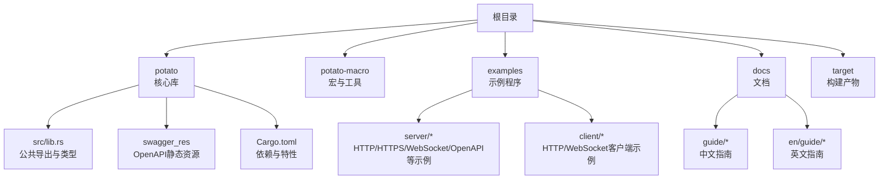
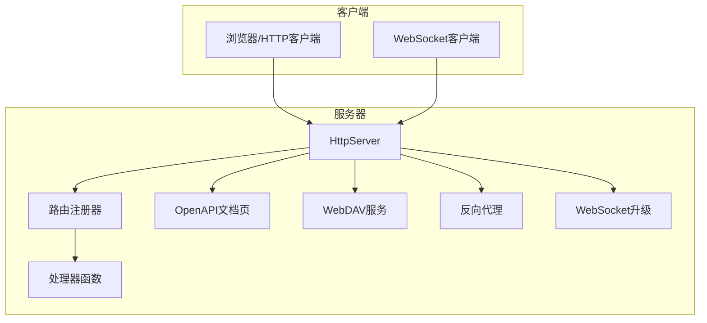
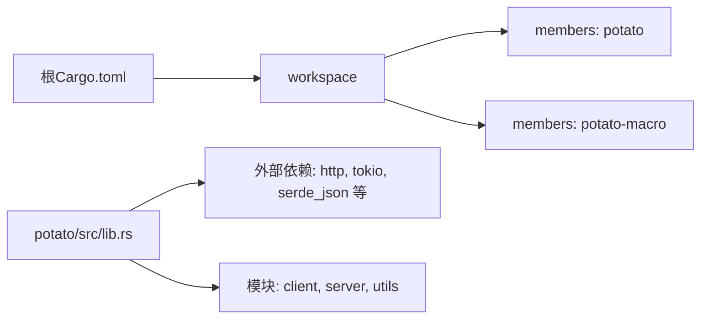

# 示例教程

<cite>
**本文引用的文件**
- [README.md](file://README.md)
- [Cargo.toml](file://Cargo.toml)
- [examples/server/00_http_server.rs](file://examples/server/00_http_server.rs)
- [examples/server/01_https_server.rs](file://examples/server/01_https_server.rs)
- [examples/server/02_openapi_server.rs](file://examples/server/02_openapi_server.rs)
- [examples/server/03_handler_args_server.rs](file://examples/server/03_handler_args_server.rs)
- [examples/server/04_http_method_server.rs](file://examples/server/04_http_method_server.rs)
- [examples/server/05_location_route_server.rs](file://examples/server/05_location_route_server.rs)
- [examples/server/06_embed_route_server.rs](file://examples/server/06_embed_route_server.rs)
- [examples/server/07_auth_server.rs](file://examples/server/07_auth_server.rs)
- [examples/server/08_websocket_server.rs](file://examples/server/08_websocket_server.rs)
- [examples/server/09_jemalloc_server.rs](file://examples/server/09_jemalloc_server.rs)
- [examples/server/10_shutdown_server.rs](file://examples/server/10_shutdown_server.rs)
- [examples/server/11_webdav_server.rs](file://examples/server/11_webdav_server.rs)
- [examples/server/12_custom_server.rs](file://examples/server/12_custom_server.rs)
- [examples/server/13_reverse_proxy_server.rs](file://examples/server/13_reverse_proxy_server.rs)
- [examples/server/14_reverse_proxy_with_ssh_server.rs](file://examples/server/14_reverse_proxy_with_ssh_server.rs)
- [examples/client/00_client.rs](file://examples/client/00_client.rs)
- [examples/client/01_client_with_arg.rs](file://examples/client/01_client_with_arg.rs)
- [examples/client/02_client_session.rs](file://examples/client/02_client_session.rs)
- [examples/client/03_websocket_client.rs](file://examples/client/03_websocket_client.rs)
- [potato/src/lib.rs](file://potato/src/lib.rs)
</cite>

## 目录
1. [简介](#简介)
2. [项目结构](#项目结构)
3. [核心组件](#核心组件)
4. [架构总览](#架构总览)
5. [详细组件分析](#详细组件分析)
6. [依赖关系分析](#依赖关系分析)
7. [性能考虑](#性能考虑)
8. [故障排查指南](#故障排查指南)
9. [结论](#结论)
10. [附录](#附录)

## 简介
本教程以Potato框架为核心，提供从入门到进阶的完整示例教程集合。内容覆盖HTTP服务、HTTPS与TLS、OpenAPI文档与测试、文件上传与WebDAV、WebSocket实时通信、反向代理与SSH跳板、优雅停机与自定义路由等主题。每个教程均给出可运行的示例代码路径、详细注释说明与运行步骤，帮助读者快速掌握Potato在真实场景中的使用方法。

## 项目结构
仓库采用多包工作区组织方式，核心库位于potato与potato-macro两个成员包中；examples目录下提供大量服务器端与客户端示例；docs目录包含官方文档与指南。

图示来源
- [Cargo.toml](file://Cargo.toml#L1-L4)
- [README.md](file://README.md#L1-L57)

章节来源
- [Cargo.toml](file://Cargo.toml#L1-L4)
- [README.md](file://README.md#L1-L57)

## 核心组件
- 服务器与路由：通过注解声明HTTP处理器，自动收集并注册路由，支持HTTP/HTTPS、静态文件、嵌入资源、WebDAV、反向代理、自定义中间件等。
- 客户端：提供HTTP客户端与WebSocket客户端，支持会话、头部参数、升级协议等。
- OpenAPI：内置OpenAPI文档页面，可按需启用并生成交互式接口文档。
- WebSocket：内置WebSocket握手、帧编解码、心跳保活与收发逻辑。
- 配置与特性：支持Jemalloc内存剖析、JWT鉴权、优雅停机、SSH跳板等高级能力。

章节来源
- [potato/src/lib.rs](file://potato/src/lib.rs#L124-L175)
- [potato/src/lib.rs](file://potato/src/lib.rs#L203-L359)
- [potato/src/lib.rs](file://potato/src/lib.rs#L385-L586)
- [README.md](file://README.md#L10-L50)

## 架构总览
下图展示了Potato框架的典型运行时架构：客户端发起请求，服务器解析HTTP请求，根据路由匹配调用对应处理器，处理器返回HttpResponse；对于WebSocket请求，服务器执行协议升级后进入消息循环；OpenAPI、WebDAV、反向代理等功能作为中间件或路由扩展被集成。

图示来源
- [examples/server/00_http_server.rs](file://examples/server/00_http_server.rs#L1-L12)
- [examples/server/02_openapi_server.rs](file://examples/server/02_openapi_server.rs#L1-L16)
- [examples/server/08_websocket_server.rs](file://examples/server/08_websocket_server.rs#L1-L43)
- [examples/server/11_webdav_server.rs](file://examples/server/11_webdav_server.rs#L1-L17)
- [examples/server/13_reverse_proxy_server.rs](file://examples/server/13_reverse_proxy_server.rs#L1-L10)

## 详细组件分析

### 教程一：Hello World（HTTP）
- 目标：最简单的HTTP服务启动与访问。
- 关键点：使用注解声明GET路由，创建HttpServer并启动HTTP服务。
- 运行步骤：
  - 在终端执行示例程序。
  - 打开浏览器访问示例输出的URL。
- 参考路径：
  - [examples/server/00_http_server.rs](file://examples/server/00_http_server.rs#L1-L12)

章节来源
- [examples/server/00_http_server.rs](file://examples/server/00_http_server.rs#L1-L12)

### 教程二：HTTPS与TLS证书
- 目标：启用HTTPS服务，支持TLS证书。
- 关键点：通过serve_https加载证书与私钥文件。
- 运行步骤：
  - 准备证书与私钥文件。
  - 启动示例程序，访问HTTPS地址。
- 参考路径：
  - [examples/server/01_https_server.rs](file://examples/server/01_https_server.rs#L1-L12)

章节来源
- [examples/server/01_https_server.rs](file://examples/server/01_https_server.rs#L1-L12)

### 教程三：OpenAPI文档生成与API测试
- 目标：启用OpenAPI文档页面，自动生成接口文档。
- 关键点：配置use_openapi，访问文档页面进行接口测试。
- 运行步骤：
  - 启动示例程序。
  - 访问文档页面，查看并测试接口。
- 参考路径：
  - [examples/server/02_openapi_server.rs](file://examples/server/02_openapi_server.rs#L1-L16)

章节来源
- [examples/server/02_openapi_server.rs](file://examples/server/02_openapi_server.rs#L1-L16)

### 教程四：请求参数与文件上传
- 目标：演示如何从请求中读取客户端地址、查询参数、表单字段与上传文件。
- 关键点：处理器参数绑定、PostFile结构体、multipart/form-data解析。
- 运行步骤：
  - 启动示例程序。
  - 使用HTTP客户端或浏览器上传文件，观察响应。
- 参考路径：
  - [examples/server/03_handler_args_server.rs](file://examples/server/03_handler_args_server.rs#L1-L32)

章节来源
- [examples/server/03_handler_args_server.rs](file://examples/server/03_handler_args_server.rs#L1-L32)

### 教程五：RESTful CRUD与HTTP方法
- 目标：实现RESTful风格的CRUD接口，覆盖常见HTTP方法。
- 关键点：为不同路径绑定不同HTTP方法的处理器。
- 运行步骤：
  - 启动示例程序。
  - 使用HTTP客户端分别调用GET/POST/PUT/DELETE/OPTIONS/HEAD等方法。
- 参考路径：
  - [examples/server/04_http_method_server.rs](file://examples/server/04_http_method_server.rs#L1-L42)

章节来源
- [examples/server/04_http_method_server.rs](file://examples/server/04_http_method_server.rs#L1-L42)

### 教程六：静态文件与嵌入资源
- 目标：提供静态文件服务与将资源嵌入二进制的能力。
- 关键点：use_location_route与use_embedded_route两种方式。
- 运行步骤：
  - 启动示例程序，访问根路径查看静态资源。
- 参考路径：
  - [examples/server/05_location_route_server.rs](file://examples/server/05_location_route_server.rs#L1-L11)
  - [examples/server/06_embed_route_server.rs](file://examples/server/06_embed_route_server.rs#L1-L11)

章节来源
- [examples/server/05_location_route_server.rs](file://examples/server/05_location_route_server.rs#L1-L11)
- [examples/server/06_embed_route_server.rs](file://examples/server/06_embed_route_server.rs#L1-L11)

### 教程七：JWT鉴权与认证
- 目标：基于JWT实现简单认证流程。
- 关键点：签发令牌与在路由上启用认证参数。
- 运行步骤：
  - 启动示例程序。
  - 先访问签发令牌接口，再携带令牌访问受保护接口。
- 参考路径：
  - [examples/server/07_auth_server.rs](file://examples/server/07_auth_server.rs#L1-L24)

章节来源
- [examples/server/07_auth_server.rs](file://examples/server/07_auth_server.rs#L1-L24)

### 教程八：WebSocket实时通信
- 目标：实现WebSocket连接、消息收发与心跳保活。
- 关键点：HTTP请求升级为WebSocket、帧编解码、Ping/Pong心跳。
- 运行步骤：
  - 启动示例程序。
  - 打开页面，观察控制台日志与消息回显。
- 参考路径：
  - [examples/server/08_websocket_server.rs](file://examples/server/08_websocket_server.rs#L1-L43)

章节来源
- [examples/server/08_websocket_server.rs](file://examples/server/08_websocket_server.rs#L1-L43)

### 教程九：内存剖析与性能优化
- 目标：启用Jemalloc内存剖析，生成性能报告。
- 关键点：开启jemalloc特性，生成PDF报告。
- 运行步骤：
  - 按照注释安装系统依赖并启用特性。
  - 启动示例程序，访问生成的报告页面。
- 参考路径：
  - [examples/server/09_jemalloc_server.rs](file://examples/server/09_jemalloc_server.rs#L1-L16)

章节来源
- [examples/server/09_jemalloc_server.rs](file://examples/server/09_jemalloc_server.rs#L1-L16)

### 教程十：优雅停机
- 目标：在运行时触发优雅停机信号，平滑关闭服务。
- 关键点：获取shutdown_signal并在特定路由触发。
- 运行步骤：
  - 启动示例程序。
  - 调用/shutdown路由触发停机。
- 参考路径：
  - [examples/server/10_shutdown_server.rs](file://examples/server/10_shutdown_server.rs#L1-L22)

章节来源
- [examples/server/10_shutdown_server.rs](file://examples/server/10_shutdown_server.rs#L1-L22)

### 教程十一：WebDAV集成
- 目标：启用WebDAV，支持本地文件系统或内存文件系统。
- 关键点：use_webdav_localfs或use_webdav_memfs。
- 运行步骤：
  - 启动示例程序。
  - 使用WebDAV客户端访问/webdav路径。
- 参考路径：
  - [examples/server/11_webdav_server.rs](file://examples/server/11_webdav_server.rs#L1-L17)

章节来源
- [examples/server/11_webdav_server.rs](file://examples/server/11_webdav_server.rs#L1-L17)

### 教程十二：自定义路由与中间件
- 目标：实现自定义中间件与全局处理逻辑。
- 关键点：use_custom注册自定义处理函数。
- 运行步骤：
  - 启动示例程序。
  - 访问/hello路径，观察自定义响应。
- 参考路径：
  - [examples/server/12_custom_server.rs](file://examples/server/12_custom_server.rs#L1-L17)

章节来源
- [examples/server/12_custom_server.rs](file://examples/server/12_custom_server.rs#L1-L17)

### 教程十三：反向代理
- 目标：将请求转发到上游服务。
- 关键点：use_reverse_proxy配置路径与目标地址。
- 运行步骤：
  - 启动示例程序。
  - 访问根路径，请求将被转发至目标站点。
- 参考路径：
  - [examples/server/13_reverse_proxy_server.rs](file://examples/server/13_reverse_proxy_server.rs#L1-L10)

章节来源
- [examples/server/13_reverse_proxy_server.rs](file://examples/server/13_reverse_proxy_server.rs#L1-L10)

### 教程十四：反向代理+SSH跳板
- 目标：通过SSH跳板进行安全代理。
- 关键点：TransferSession与SshJumpboxInfo配置。
- 运行步骤：
  - 配置SSH跳板信息。
  - 启动示例程序，请求经由跳板转发。
- 参考路径：
  - [examples/server/14_reverse_proxy_with_ssh_server.rs](file://examples/server/14_reverse_proxy_with_ssh_server.rs#L1-L25)

章节来源
- [examples/server/14_reverse_proxy_with_ssh_server.rs](file://examples/server/14_reverse_proxy_with_ssh_server.rs#L1-L25)

### 教程十五：HTTP客户端与WebSocket客户端
- 目标：演示HTTP客户端与WebSocket客户端的基本用法。
- 关键点：HTTP客户端请求、会话管理、WebSocket连接与消息收发。
- 运行步骤：
  - 启动相应示例程序。
  - 观察控制台输出与WebSocket消息交互。
- 参考路径：
  - [examples/client/00_client.rs](file://examples/client/00_client.rs)
  - [examples/client/01_client_with_arg.rs](file://examples/client/01_client_with_arg.rs)
  - [examples/client/02_client_session.rs](file://examples/client/02_client_session.rs)
  - [examples/client/03_websocket_client.rs](file://examples/client/03_websocket_client.rs)

章节来源
- [examples/client/00_client.rs](file://examples/client/00_client.rs)
- [examples/client/01_client_with_arg.rs](file://examples/client/01_client_with_arg.rs)
- [examples/client/02_client_session.rs](file://examples/client/02_client_session.rs)
- [examples/client/03_websocket_client.rs](file://examples/client/03_websocket_client.rs)

## 依赖关系分析
- 工作区组织：根Cargo.toml声明工作区与解析器版本，成员包含potato与potato-macro。
- 依赖导入：lib.rs统一导出模块与外部依赖，便于上层使用。
- 示例与核心：示例程序通过cargo add引入potato与Tokio运行时，按需启用特性（如webdav、jemalloc）。

图示来源
- [Cargo.toml](file://Cargo.toml#L1-L4)
- [potato/src/lib.rs](file://potato/src/lib.rs#L1-L16)

章节来源
- [Cargo.toml](file://Cargo.toml#L1-L4)
- [potato/src/lib.rs](file://potato/src/lib.rs#L1-L16)

## 性能考虑
- 内存管理：启用jemalloc特性可生成内存剖析报告，辅助定位内存问题。
- 并发模型：基于Tokio异步运行时，适合高并发I/O密集型场景。
- 压缩与缓存：框架支持条件预检与压缩模式选择，有助于减少带宽与提升响应速度。
- 资源嵌入：将静态资源嵌入二进制可降低部署复杂度并提升访问效率。

章节来源
- [examples/server/09_jemalloc_server.rs](file://examples/server/09_jemalloc_server.rs#L1-L16)
- [README.md](file://README.md#L10-L50)

## 故障排查指南
- 请求解析失败：检查请求头是否完整、Content-Length是否正确、Content-Type是否被正确识别。
- WebSocket升级失败：确认请求头包含正确的Upgrade、Connection、Sec-WebSocket-*字段且版本为13。
- HTTPS证书错误：确保证书与私钥路径正确，权限允许读取。
- WebDAV权限问题：确认映射目录存在且具备读写权限。
- 反向代理异常：检查上游地址可达性与路径前缀配置。
- 优雅停机无效：确认已正确获取并使用shutdown_signal。

章节来源
- [potato/src/lib.rs](file://potato/src/lib.rs#L588-L699)
- [potato/src/lib.rs](file://potato/src/lib.rs#L560-L579)
- [examples/server/01_https_server.rs](file://examples/server/01_https_server.rs#L1-L12)
- [examples/server/11_webdav_server.rs](file://examples/server/11_webdav_server.rs#L1-L17)
- [examples/server/13_reverse_proxy_server.rs](file://examples/server/13_reverse_proxy_server.rs#L1-L10)
- [examples/server/10_shutdown_server.rs](file://examples/server/10_shutdown_server.rs#L1-L22)

## 结论
本教程集合覆盖了Potato框架的核心能力与典型应用场景，从基础HTTP服务到高级特性如WebDAV、WebSocket、反向代理与SSH跳板，均可通过示例快速上手。建议结合OpenAPI文档进行接口测试，并在生产环境中配合HTTPS、鉴权与监控策略，以获得更稳定与安全的服务体验。

## 附录
- 快速开始
  - 添加依赖：参见根README中的使用说明。
  - 运行示例：在examples/server目录下选择对应示例，使用cargo run运行。
- 常用命令
  - 启动HTTP服务：cargo run --example 00_http_server
  - 启动HTTPS服务：准备证书后运行01_https_server示例
  - 启用WebDAV：运行11_webdav_server示例并按需切换memfs/localfs
  - 启用Jemalloc：按注释安装系统依赖并启用特性后运行09_jemalloc_server示例
- 参考路径
  - [README.md](file://README.md#L10-L50)
  - [examples/server/00_http_server.rs](file://examples/server/00_http_server.rs#L1-L12)
  - [examples/server/01_https_server.rs](file://examples/server/01_https_server.rs#L1-L12)
  - [examples/server/02_openapi_server.rs](file://examples/server/02_openapi_server.rs#L1-L16)
  - [examples/server/03_handler_args_server.rs](file://examples/server/03_handler_args_server.rs#L1-L32)
  - [examples/server/04_http_method_server.rs](file://examples/server/04_http_method_server.rs#L1-L42)
  - [examples/server/05_location_route_server.rs](file://examples/server/05_location_route_server.rs#L1-L11)
  - [examples/server/06_embed_route_server.rs](file://examples/server/06_embed_route_server.rs#L1-L11)
  - [examples/server/07_auth_server.rs](file://examples/server/07_auth_server.rs#L1-L24)
  - [examples/server/08_websocket_server.rs](file://examples/server/08_websocket_server.rs#L1-L43)
  - [examples/server/09_jemalloc_server.rs](file://examples/server/09_jemalloc_server.rs#L1-L16)
  - [examples/server/10_shutdown_server.rs](file://examples/server/10_shutdown_server.rs#L1-L22)
  - [examples/server/11_webdav_server.rs](file://examples/server/11_webdav_server.rs#L1-L17)
  - [examples/server/12_custom_server.rs](file://examples/server/12_custom_server.rs#L1-L17)
  - [examples/server/13_reverse_proxy_server.rs](file://examples/server/13_reverse_proxy_server.rs#L1-L10)
  - [examples/server/14_reverse_proxy_with_ssh_server.rs](file://examples/server/14_reverse_proxy_with_ssh_server.rs#L1-L25)
  - [examples/client/00_client.rs](file://examples/client/00_client.rs)
  - [examples/client/01_client_with_arg.rs](file://examples/client/01_client_with_arg.rs)
  - [examples/client/02_client_session.rs](file://examples/client/02_client_session.rs)
  - [examples/client/03_websocket_client.rs](file://examples/client/03_websocket_client.rs)