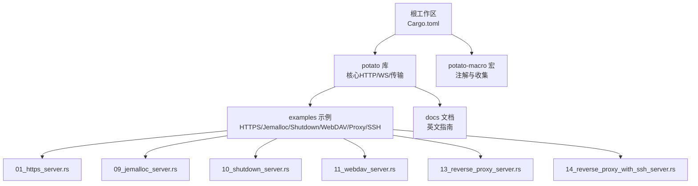
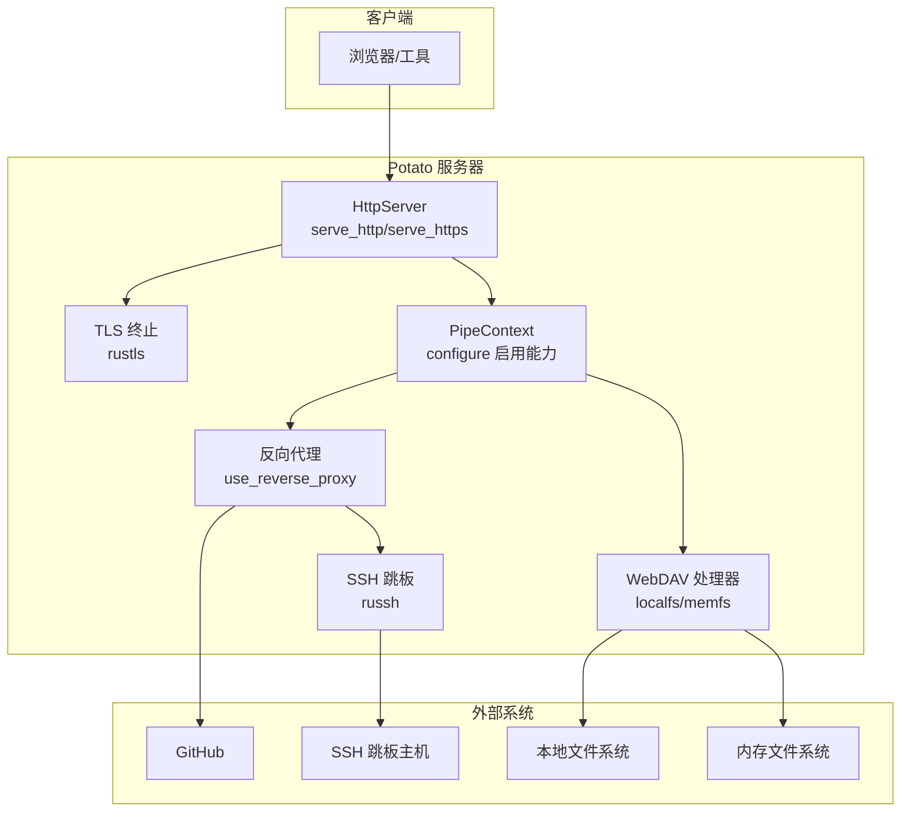
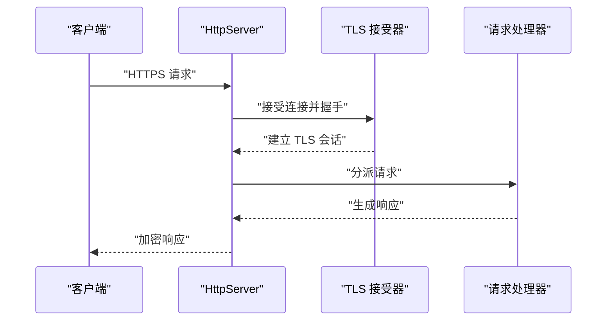
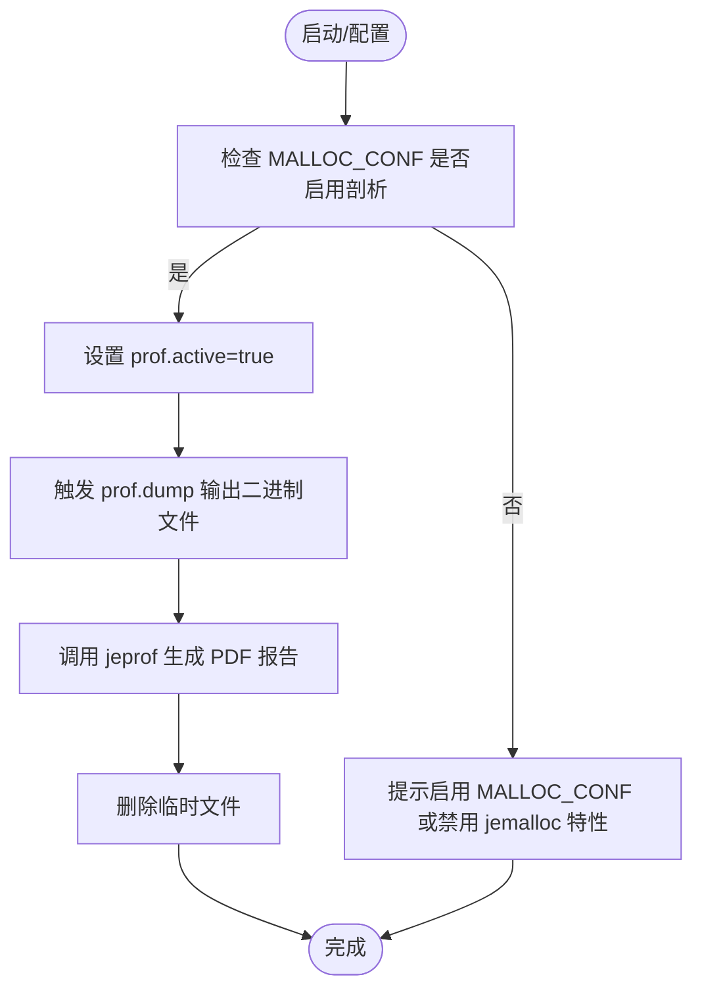
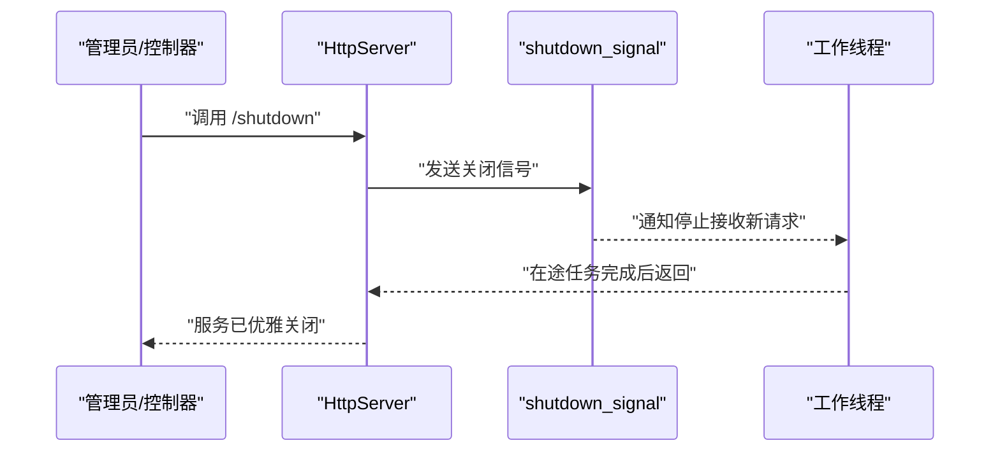
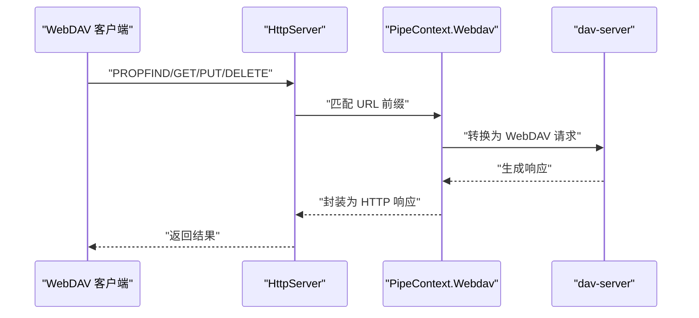
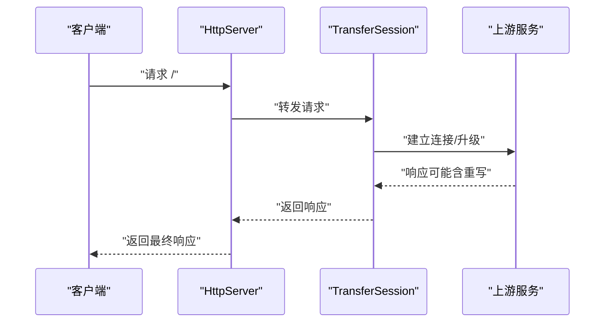
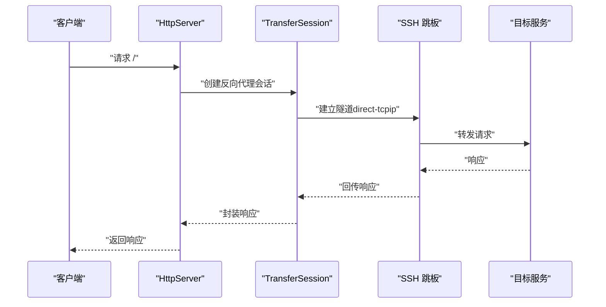
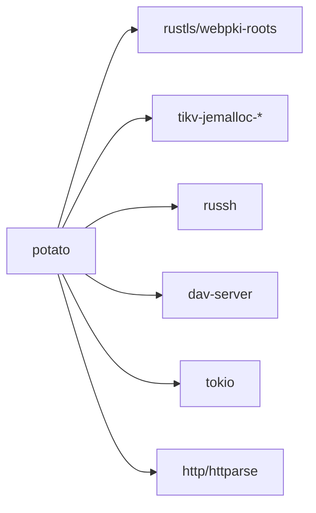

# 高级功能示例

<cite>
**本文引用的文件**
- [examples/server/01_https_server.rs](file://examples/server/01_https_server.rs)
- [examples/server/09_jemalloc_server.rs](file://examples/server/09_jemalloc_server.rs)
- [examples/server/10_shutdown_server.rs](file://examples/server/10_shutdown_server.rs)
- [examples/server/11_webdav_server.rs](file://examples/server/11_webdav_server.rs)
- [examples/server/13_reverse_proxy_server.rs](file://examples/server/13_reverse_proxy_server.rs)
- [examples/server/14_reverse_proxy_with_ssh_server.rs](file://examples/server/14_reverse_proxy_with_ssh_server.rs)
- [potato/src/utils/jemalloc_helper.rs](file://potato/src/utils/jemalloc_helper.rs)
- [potato/src/utils/process.rs](file://potato/src/utils/process.rs)
- [potato/src/server.rs](file://potato/src/server.rs)
- [potato/src/client.rs](file://potato/src/client.rs)
- [potato/Cargo.toml](file://potato/Cargo.toml)
- [docs/en/guide/04_server_route.md](file://docs/en/guide/04_server_route.md)
- [README.md](file://README.md)
</cite>

## 目录
1. [简介](#简介)
2. [项目结构](#项目结构)
3. [核心组件](#核心组件)
4. [架构总览](#架构总览)
5. [详细组件分析](#详细组件分析)
6. [依赖关系分析](#依赖关系分析)
7. [性能与内存优化](#性能与内存优化)
8. [故障排查指南](#故障排查指南)
9. [结论](#结论)
10. [附录](#附录)

## 简介
本文件面向企业级应用，系统性展示 Potato 框架的高级能力与最佳实践，覆盖 HTTPS/TLS 配置与证书管理、内存与性能优化（jemalloc）、优雅关闭与进程管理、WebDAV 协议集成与文件共享、反向代理与负载均衡思路、以及基于 SSH 跳板的安全访问模式。每个示例均给出配置要点、安全考量与生产部署建议。

## 项目结构
仓库采用多模块工作区组织，核心库位于 potato/，配套宏库在 potato-macro/；examples/ 提供各类高级示例；docs/ 包含英文文档；根目录提供 README 与构建配置。

图表来源
- [Cargo.toml](file://Cargo.toml#L1-L4)
- [README.md](file://README.md#L1-L57)

章节来源
- [Cargo.toml](file://Cargo.toml#L1-L4)
- [README.md](file://README.md#L1-L57)

## 核心组件
- 服务器与路由：通过注解注册处理器，支持 HTTP 方法与路径匹配，内置条件预检（ETag/If-Modified-Since）等。
- 传输与会话：提供正向/反向代理、WebSocket 升级、TLS 连接封装、可选 SSH 跳板隧道。
- 工具与特性：jemalloc 内存剖析、进程命令执行、WebDAV 文件系统桥接。
- 配置上下文：在 configure 回调中启用 HTTPS、WebDAV、反向代理、SSH 等能力。

章节来源
- [potato/src/server.rs](file://potato/src/server.rs#L812-L887)
- [potato/src/client.rs](file://potato/src/client.rs#L232-L614)
- [potato/src/utils/jemalloc_helper.rs](file://potato/src/utils/jemalloc_helper.rs#L1-L71)
- [potato/src/utils/process.rs](file://potato/src/utils/process.rs#L1-L27)

## 架构总览
下图展示了从客户端到服务端、再到外部目标（如 WebDAV、GitHub、SSH 跳板）的关键交互路径，体现反向代理、TLS 终止、SSH 隧道与内存剖析等能力。

图表来源
- [potato/src/server.rs](file://potato/src/server.rs#L812-L887)
- [potato/src/server.rs](file://potato/src/server.rs#L333-L360)
- [potato/src/client.rs](file://potato/src/client.rs#L232-L614)
- [examples/server/13_reverse_proxy_server.rs](file://examples/server/13_reverse_proxy_server.rs#L1-L10)
- [examples/server/11_webdav_server.rs](file://examples/server/11_webdav_server.rs#L1-L17)
- [examples/server/14_reverse_proxy_with_ssh_server.rs](file://examples/server/14_reverse_proxy_with_ssh_server.rs#L1-L25)

## 详细组件分析

### HTTPS 配置与 TLS 证书管理最佳实践
- 功能入口：服务器提供 HTTPS 服务方法，绑定证书与私钥文件，支持优雅关闭信号。
- 证书加载：使用 rustls 读取 PEM 证书与私钥，构建单证书服务端配置。
- 生产建议：
  - 使用受信 CA 签发的证书，定期轮换；私钥权限最小化，仅允许运行用户读取。
  - 在反向代理前终止 TLS，后端走内网明文或受控隧道，降低证书管理复杂度。
  - 启用安全套件与 TLS1.2+，禁用过时协议与弱密码套件。
  - 结合健康检查与自动重载，避免证书到期导致中断。

图表来源
- [potato/src/server.rs](file://potato/src/server.rs#L812-L887)
- [examples/server/01_https_server.rs](file://examples/server/01_https_server.rs#L1-L12)

章节来源
- [examples/server/01_https_server.rs](file://examples/server/01_https_server.rs#L1-L12)
- [potato/src/server.rs](file://potato/src/server.rs#L812-L887)

### 内存管理与性能优化（jemalloc）
- jemalloc 启用：通过特性开关启用，设置 MALLOC_CONF=prof:true 启用剖析；提供内存剖析转 PDF 的辅助流程。
- 剖析流程：触发 prof.dump 输出二进制文件，调用 jeprof 生成 PDF 报告；清理临时文件。
- 生产建议：
  - 在测试与预生产开启 jemalloc 剖析，定位热点分配与碎片；生产默认关闭以减少开销。
  - 结合系统监控（RSS、GC/分配速率）与火焰图，持续优化热点路径。
  - 注意 jemalloc 版本与平台兼容性，Linux 下效果更佳。

图表来源
- [potato/src/utils/jemalloc_helper.rs](file://potato/src/utils/jemalloc_helper.rs#L14-L71)
- [potato/src/utils/process.rs](file://potato/src/utils/process.rs#L7-L25)
- [examples/server/09_jemalloc_server.rs](file://examples/server/09_jemalloc_server.rs#L1-L16)

章节来源
- [examples/server/09_jemalloc_server.rs](file://examples/server/09_jemalloc_server.rs#L1-L16)
- [potato/src/utils/jemalloc_helper.rs](file://potato/src/utils/jemalloc_helper.rs#L1-L71)
- [potato/src/utils/process.rs](file://potato/src/utils/process.rs#L1-L27)

### 优雅关闭与进程管理
- 关闭信号：服务器在启动时暴露 shutdown_signal，可在路由中触发发送，配合 select 实现优雅退出。
- 实践建议：
  - 在容器编排中接收 SIGTERM，先停止接收新连接，等待在途请求完成。
  - 对长连接（WebSocket、上传流）设置超时与清理策略。
  - 使用进程管理器（systemd、Kubernetes）确保退出码与日志可追踪。

图表来源
- [examples/server/10_shutdown_server.rs](file://examples/server/10_shutdown_server.rs#L1-L22)
- [potato/src/server.rs](file://potato/src/server.rs#L826-L887)

章节来源
- [examples/server/10_shutdown_server.rs](file://examples/server/10_shutdown_server.rs#L1-L22)
- [potato/src/server.rs](file://potato/src/server.rs#L826-L887)

### WebDAV 协议集成与文件共享
- 能力启用：在 configure 中选择 use_webdav_localfs 或 use_webdav_memfs，绑定 URL 前缀与存储路径。
- 处理流程：匹配 URL 前缀后，将请求转换为 WebDAV 语义，交由 dav-server 处理，支持锁系统与常用方法。
- 安全建议：
  - 限制共享目录范围，避免根目录暴露；结合鉴权中间件。
  - 控制并发写入与大文件传输，设置超时与配额。
  - 如需公网访问，前置 HTTPS 与反向代理，并开启访问审计。

图表来源
- [potato/src/server.rs](file://potato/src/server.rs#L333-L360)
- [potato/src/server.rs](file://potato/src/server.rs#L668-L682)
- [examples/server/11_webdav_server.rs](file://examples/server/11_webdav_server.rs#L1-L17)
- [docs/en/guide/04_server_route.md](file://docs/en/guide/04_server_route.md#L106-L134)

章节来源
- [examples/server/11_webdav_server.rs](file://examples/server/11_webdav_server.rs#L1-L17)
- [potato/src/server.rs](file://potato/src/server.rs#L333-L360)
- [potato/src/server.rs](file://potato/src/server.rs#L668-L682)
- [docs/en/guide/04_server_route.md](file://docs/en/guide/04_server_route.md#L106-L134)

### 反向代理与负载均衡实现思路
- 能力启用：在 configure 中使用 use_reverse_proxy，指定本地路径前缀、上游地址与是否修改响应内容中的 URL。
- 行为特征：支持 WebSocket 自动升级、可替换静态资源中的硬编码地址，便于在 CDN/反代后透明回源。
- 负载均衡建议：
  - 将多个上游实例加入同一前缀，结合外部负载均衡器（Nginx/LB）进行健康检查与会话亲和。
  - 对长连接与大文件场景，考虑连接复用与背压控制。

图表来源
- [examples/server/13_reverse_proxy_server.rs](file://examples/server/13_reverse_proxy_server.rs#L1-L10)
- [docs/en/guide/04_server_route.md](file://docs/en/guide/04_server_route.md#L117-L134)
- [potato/src/client.rs](file://potato/src/client.rs#L275-L450)

章节来源
- [examples/server/13_reverse_proxy_server.rs](file://examples/server/13_reverse_proxy_server.rs#L1-L10)
- [docs/en/guide/04_server_route.md](file://docs/en/guide/04_server_route.md#L117-L134)
- [potato/src/client.rs](file://potato/src/client.rs#L275-L450)

### SSH 跳板代理的安全访问模式
- 能力启用：通过 TransferSession.from_reverse_proxy 创建会话，再 with_ssh_jumpbox 配置跳板信息，实现安全隧道。
- 流程要点：建立 SSH 连接并通过直连 TCP/IP 通道转发流量，支持复用连接与双向数据流。
- 安全建议：
  - 使用密钥认证替代口令；限制跳板主机权限与可访问目标。
  - 仅在必要网络边界启用，结合防火墙与最小暴露面；记录审计日志。
  - 对外暴露的反向代理应前置 TLS 与鉴权。

图表来源
- [examples/server/14_reverse_proxy_with_ssh_server.rs](file://examples/server/14_reverse_proxy_with_ssh_server.rs#L1-L25)
- [potato/src/client.rs](file://potato/src/client.rs#L256-L273)
- [potato/src/client.rs](file://potato/src/client.rs#L333-L417)

章节来源
- [examples/server/14_reverse_proxy_with_ssh_server.rs](file://examples/server/14_reverse_proxy_with_ssh_server.rs#L1-L25)
- [potato/src/client.rs](file://potato/src/client.rs#L256-L273)
- [potato/src/client.rs](file://potato/src/client.rs#L333-L417)

## 依赖关系分析
- 特性开关：通过 Cargo features 控制 TLS、jemalloc、SSH、WebDAV 等能力的编译与运行时行为。
- 外部依赖：rustls/webpki 用于 TLS；jemalloc 系列用于内存剖析；russh 用于 SSH；dav-server 用于 WebDAV。

图表来源
- [potato/Cargo.toml](file://potato/Cargo.toml#L16-L76)

章节来源
- [potato/Cargo.toml](file://potato/Cargo.toml#L16-L76)

## 性能与内存优化
- jemalloc 建议：仅在开发/测试启用剖析，生产默认关闭；结合系统监控与热点分析持续优化。
- 传输层优化：合理设置连接池、复用与背压；对大文件与长连接使用流式处理。
- 服务器参数：根据 CPU/IO 特性调整线程数、监听队列与缓冲大小；启用必要的压缩与缓存头。

## 故障排查指南
- TLS 握手失败：检查证书链完整性、域名匹配与时间同步；确认私钥权限与格式。
- WebDAV 权限问题：核对共享目录权限与 SELinux/AppArmor；确认方法支持与锁系统状态。
- 反向代理内容替换异常：确认 modify_content 参数与响应编码；检查上游返回的绝对 URL。
- SSH 跳板连接失败：验证主机可达性、密钥/口令正确性与防火墙策略；查看隧道日志。
- 内存剖析无输出：确认 MALLOC_CONF=prof:true 已生效；检查 jeprof 可用性与临时目录权限。

## 结论
Potato 框架在保持简洁语法的同时，提供了企业级所需的 HTTPS/TLS、内存剖析、优雅关闭、WebDAV、反向代理与 SSH 跳板等能力。通过合理的特性开关与配置，可在不同环境中实现高可用、可观测与可扩展的服务架构。

## 附录
- 快速开始与更多示例请参考在线文档与示例目录。
- 生产部署建议：前置 Nginx/TLS 终止、容器编排与健康检查、日志与指标采集、定期安全审计。