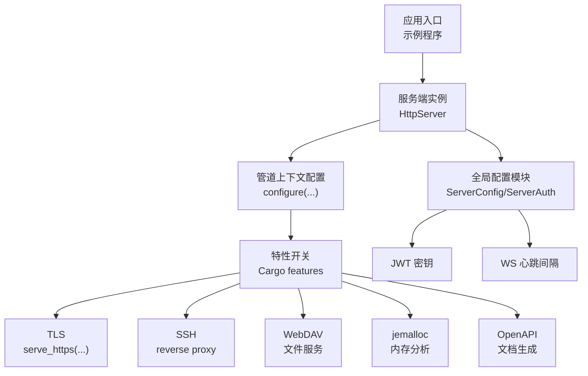
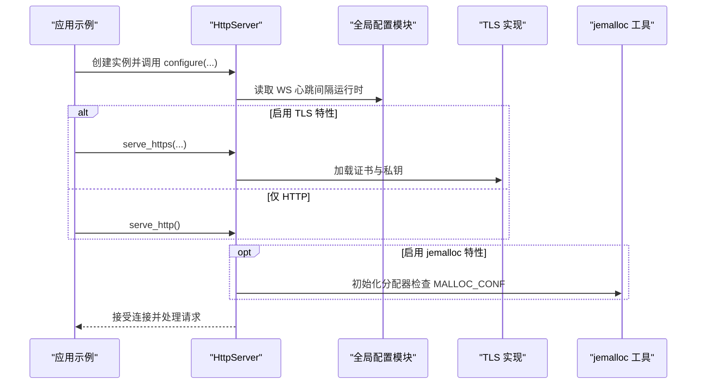
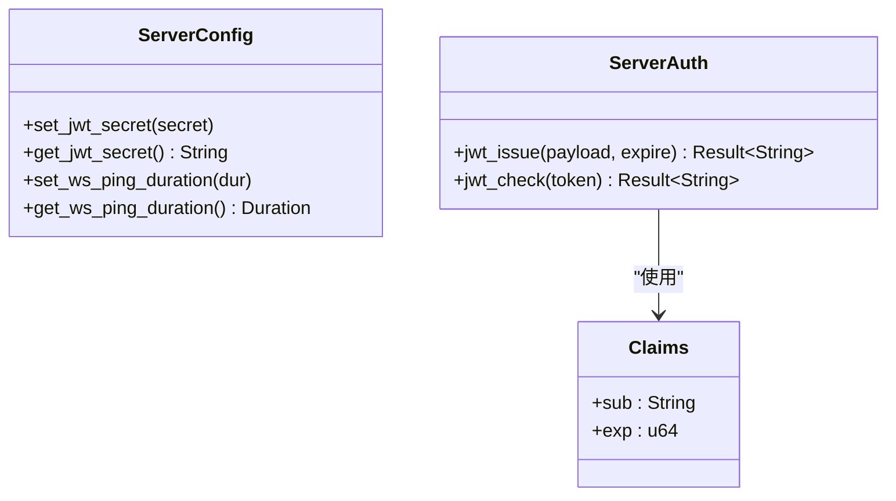
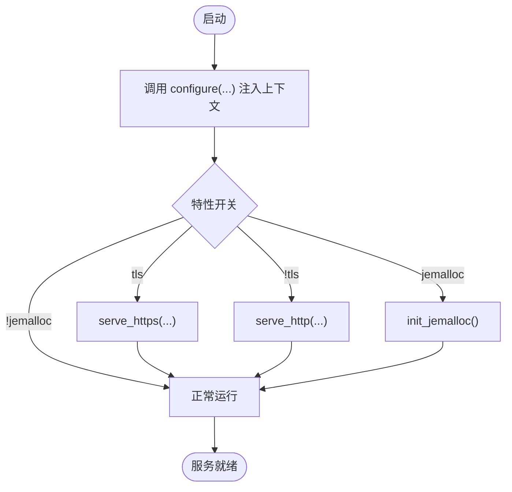
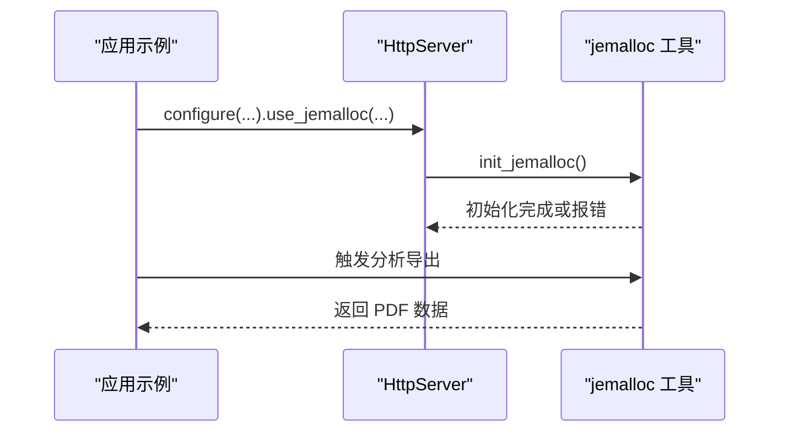
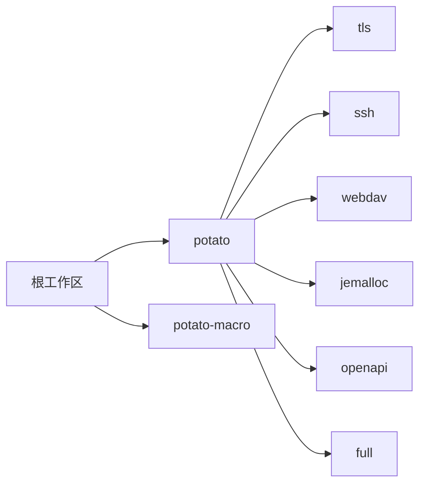

# 配置管理

<cite>
**本文引用的文件**
- [Cargo.toml（框架）](file://potato/Cargo.toml)
- [全局配置模块](file://potato/src/global_config.rs)
- [核心库入口与通用类型](file://potato/src/lib.rs)
- [服务端实现](file://potato/src/server.rs)
- [jemalloc 辅助工具](file://potato/src/utils/jemalloc_helper.rs)
- [示例：HTTP 服务器](file://examples/server/00_http_server.rs)
- [示例：HTTPS 服务器](file://examples/server/01_https_server.rs)
- [示例：jemalloc 性能分析](file://examples/server/09_jemalloc_server.rs)
- [根工作区配置](file://Cargo.toml)
- [README（英文）](file://README.md)
- [README（中文）](file://README.zh.md)
</cite>

## 目录
1. [简介](#简介)
2. [项目结构](#项目结构)
3. [核心组件](#核心组件)
4. [架构总览](#架构总览)
5. [详细组件分析](#详细组件分析)
6. [依赖关系分析](#依赖关系分析)
7. [性能考量](#性能考量)
8. [故障排查指南](#故障排查指南)
9. [结论](#结论)
10. [附录](#附录)

## 简介
本指南系统化阐述 Potato 框架的配置管理，涵盖以下主题：
- 全局配置项：服务器参数、认证令牌密钥、WebSocket 心跳间隔等
- 配置文件格式与加载机制：默认配置、用户配置与环境变量覆盖
- 功能模块开关：条件编译特性（TLS、SSH、WebDAV、jemalloc、OpenAPI）
- 不同部署环境的配置策略：开发、测试、生产
- 配置验证与错误处理
- 最佳实践与安全建议
- 配置迁移与版本兼容性

## 项目结构
Potato 将配置能力分布于多个层次：
- 特性开关通过 Cargo features 控制（TLS、SSH、WebDAV、jemalloc、OpenAPI、full）
- 运行时配置通过全局配置模块与服务端上下文配置接口暴露
- 示例程序展示如何在运行时启用特定功能（如 jemalloc）

图表来源
- [服务端实现](file://potato/src/server.rs#L783-L933)
- [全局配置模块](file://potato/src/global_config.rs#L12-L64)
- [Cargo.toml（框架）](file://potato/Cargo.toml#L65-L72)

章节来源
- [服务端实现](file://potato/src/server.rs#L783-L933)
- [Cargo.toml（框架）](file://potato/Cargo.toml#L65-L72)

## 核心组件
- 全局配置模块
  - 提供 JWT 密钥设置与读取、WebSocket 心跳间隔设置与读取、JWT 签发与校验
  - 使用异步读写锁保证并发安全
- 服务端配置接口
  - 通过 configure 回调注入管道上下文，支持运行时按需启用特性
  - 条件编译控制 TLS/SSH/WebDAV/jemalloc/OpenAPI 等功能
- jemalloc 辅助工具
  - 在启用 jemalloc 特性时初始化分配器，并通过环境变量控制是否开启分析
  - 支持导出分析数据并生成 PDF 报告

章节来源
- [全局配置模块](file://potato/src/global_config.rs#L12-L64)
- [服务端实现](file://potato/src/server.rs#L783-L933)
- [jemalloc 辅助工具](file://potato/src/utils/jemalloc_helper.rs#L14-L34)

## 架构总览
下图展示了从应用启动到服务运行的关键流程，以及配置在其中的作用点。

图表来源
- [服务端实现](file://potato/src/server.rs#L799-L933)
- [全局配置模块](file://potato/src/global_config.rs#L28-L35)
- [jemalloc 辅助工具](file://potato/src/utils/jemalloc_helper.rs#L14-L34)

## 详细组件分析

### 全局配置模块（ServerConfig/ServerAuth）
- 职责
  - 维护 JWT 密钥与 WebSocket 心跳间隔的全局状态
  - 提供 JWT 签发与校验能力，基于 jsonwebtoken
- 关键行为
  - 设置/读取 JWT 密钥：用于签发与校验令牌
  - 设置/读取 WS 心跳间隔：影响 WebSocket 接收循环中的超时与心跳发送
  - JWT 签发：构造 Claims 并使用密钥编码
  - JWT 校验：解码并验证过期时间
- 并发模型
  - 使用异步读写锁保护共享状态，确保多任务安全访问

图表来源
- [全局配置模块](file://potato/src/global_config.rs#L12-L64)

章节来源
- [全局配置模块](file://potato/src/global_config.rs#L12-L64)

### 服务端配置接口（configure 与条件编译）
- 职责
  - 通过 configure 回调注入管道上下文，实现运行时功能开关
  - serve_http/serve_https 根据特性决定是否启用 TLS
  - jemalloc 初始化在启用相应特性时执行
- 关键点
  - configure 只是注册回调，不直接读取配置文件；实际配置来源于特性开关与环境变量
  - TLS 仅在启用 tls 特性时可用
  - jemalloc 仅在启用 jemalloc 特性时可用

图表来源
- [服务端实现](file://potato/src/server.rs#L783-L933)
- [jemalloc 辅助工具](file://potato/src/utils/jemalloc_helper.rs#L14-L34)

章节来源
- [服务端实现](file://potato/src/server.rs#L783-L933)
- [jemalloc 辅助工具](file://potato/src/utils/jemalloc_helper.rs#L14-L34)

### jemalloc 性能分析（运行时配置）
- 能力
  - 初始化 jemalloc 分配器（仅在启用 jemalloc 特性时）
  - 通过环境变量 MALLOC_CONF 控制是否启用分析
  - 导出分析数据并生成 PDF 报告
- 使用方式
  - 在示例中通过 configure 回调启用 jemalloc，并在运行时触发分析输出
- 注意事项
  - 需要安装 jeprof 等工具链以生成 PDF
  - 仅在 Linux 上支持

图表来源
- [jemalloc 辅助工具](file://potato/src/utils/jemalloc_helper.rs#L14-L70)
- [示例：jemalloc 性能分析](file://examples/server/09_jemalloc_server.rs#L10-L12)

章节来源
- [jemalloc 辅助工具](file://potato/src/utils/jemalloc_helper.rs#L14-L70)
- [示例：jemalloc 性能分析](file://examples/server/09_jemalloc_server.rs#L1-L16)

### HTTPS 与证书加载（条件编译）
- 能力
  - 在启用 tls 特性时，支持 serve_https 并从 PEM 文件加载证书与私钥
- 使用方式
  - 示例程序演示了如何传入证书与私钥路径并启动 HTTPS 服务

章节来源
- [服务端实现](file://potato/src/server.rs#L812-L824)
- [示例：HTTPS 服务器](file://examples/server/01_https_server.rs#L8-L11)

## 依赖关系分析
- 特性与依赖
  - tls：启用 rustls、tokio-rustls、webpki-roots
  - ssh：启用 russh
  - webdav：启用 bytes、dav-server、futures-util、webpki-roots
  - jemalloc：启用 tikv-jemalloc 系列
  - openapi：无额外依赖（由宏生成）
  - full：聚合上述所有特性
- 工作区
  - 根 Cargo.toml 定义工作区成员为 potato 与 potato-macro

图表来源
- [Cargo.toml（框架）](file://potato/Cargo.toml#L65-L72)
- [根工作区配置](file://Cargo.toml#L1-L4)

章节来源
- [Cargo.toml（框架）](file://potato/Cargo.toml#L65-L72)
- [根工作区配置](file://Cargo.toml#L1-L4)

## 性能考量
- jemalloc
  - 通过 jemalloc 特性启用内存分配器，结合 MALLOC_CONF 控制分析开关
  - 建议在开发与性能压测阶段启用，生产环境谨慎评估开销
- WebSocket 心跳
  - 通过全局配置调整 WS 心跳间隔，平衡保活与 CPU 开销
- TLS
  - 启用 TLS 会引入证书加载与握手成本，建议在生产环境使用硬件加速或优化的证书链

章节来源
- [jemalloc 辅助工具](file://potato/src/utils/jemalloc_helper.rs#L14-L34)
- [全局配置模块](file://potato/src/global_config.rs#L28-L35)
- [服务端实现](file://potato/src/server.rs#L873-L931)

## 故障排查指南
- jemalloc 初始化失败
  - 现象：启动时报错提示未启用分析或无法写入 prof.active
  - 处理：设置 MALLOC_CONF=prof:true 或禁用 jemalloc 特性
- TLS 启动异常
  - 现象：serve_https 报证书/私钥加载错误
  - 处理：确认证书与私钥路径正确且权限可读
- WebSocket 心跳超时
  - 现象：客户端断连或频繁 ping/pong
  - 处理：调整 WS 心跳间隔配置，检查网络与代理设置
- OpenAPI 文档
  - 现象：未生成文档
  - 处理：确认启用 openapi 特性并在示例基础上添加注解

章节来源
- [jemalloc 辅助工具](file://potato/src/utils/jemalloc_helper.rs#L14-L34)
- [服务端实现](file://potato/src/server.rs#L812-L824)
- [全局配置模块](file://potato/src/global_config.rs#L28-L35)

## 结论
Potato 的配置管理采用“特性开关 + 运行时配置”的组合模式：特性开关控制功能可用性，运行时配置提供细粒度参数调节。通过全局配置模块与服务端上下文配置接口，开发者可在不修改源码的情况下灵活适配不同环境与需求。

## 附录

### 配置项清单与说明
- 服务器参数
  - 监听地址：通过服务端实例构造函数传入
  - TLS 证书与私钥：仅在启用 tls 特性时生效
- 认证与安全
  - JWT 密钥：通过全局配置设置，用于签发与校验令牌
- WebSocket
  - 心跳间隔：通过全局配置设置，影响接收循环超时与心跳发送
- 性能与分析
  - jemalloc：通过 jemalloc 特性与 MALLOC_CONF 控制分析开关
- 功能开关
  - tls、ssh、webdav、jemalloc、openapi、full

章节来源
- [服务端实现](file://potato/src/server.rs#L799-L933)
- [全局配置模块](file://potato/src/global_config.rs#L18-L35)
- [jemalloc 辅助工具](file://potato/src/utils/jemalloc_helper.rs#L14-L34)
- [Cargo.toml（框架）](file://potato/Cargo.toml#L65-L72)

### 配置文件格式与加载机制
- 默认配置
  - 通过特性开关启用功能（如 tls、ssh、webdav、jemalloc、openapi）
- 用户配置
  - 通过 configure 回调注入管道上下文，实现运行时功能启用
- 环境变量覆盖
  - jemalloc：通过 MALLOC_CONF 控制分析开关
- 配置加载位置
  - TLS 证书与私钥：在 serve_https 中显式传入路径
  - JWT 密钥：通过全局配置接口设置

章节来源
- [服务端实现](file://potato/src/server.rs#L812-L824)
- [全局配置模块](file://potato/src/global_config.rs#L20-L26)
- [jemalloc 辅助工具](file://potato/src/utils/jemalloc_helper.rs#L18-L29)

### 不同部署环境的配置策略
- 开发环境
  - 启用 openapi 以便快速生成文档
  - 可选启用 jemalloc 以进行内存分析
- 测试环境
  - 启用 tls 以模拟生产网络栈
  - 使用较短 WS 心跳间隔以快速检测异常
- 生产环境
  - 禁用不必要的特性以减少依赖与攻击面
  - 明确设置 TLS 证书与私钥路径
  - 严格管理 JWT 密钥轮换与过期策略

章节来源
- [Cargo.toml（框架）](file://potato/Cargo.toml#L65-L72)
- [服务端实现](file://potato/src/server.rs#L812-L824)
- [全局配置模块](file://potato/src/global_config.rs#L38-L62)

### 功能模块启用与禁用方法
- 条件编译
  - 在 Cargo.toml 中启用对应特性
- 运行时配置
  - 通过 configure 回调注入上下文，启用相关处理管线
- 示例参考
  - jemalloc：示例程序展示如何启用并导出分析报告
  - HTTPS：示例程序展示如何加载证书并启动 HTTPS 服务

章节来源
- [Cargo.toml（框架）](file://potato/Cargo.toml#L65-L72)
- [示例：jemalloc 性能分析](file://examples/server/09_jemalloc_server.rs#L10-L12)
- [示例：HTTPS 服务器](file://examples/server/01_https_server.rs#L8-L11)

### 配置验证与错误处理
- TLS
  - 证书与私钥加载失败时返回错误，需检查路径与权限
- jemalloc
  - 初始化失败时根据 MALLOC_CONF 决定是否启用分析
- JWT
  - 校验过期时间，过期返回错误
- WebSocket
  - 超时自动发送 ping，断连返回错误

章节来源
- [服务端实现](file://potato/src/server.rs#L873-L931)
- [jemalloc 辅助工具](file://potato/src/utils/jemalloc_helper.rs#L14-L34)
- [全局配置模块](file://potato/src/global_config.rs#L52-L62)

### 最佳实践与安全考虑
- 安全
  - 严格管理 JWT 密钥，定期轮换
  - 生产环境强制启用 TLS 并使用强密码套件
- 性能
  - 在开发与压测阶段启用 jemalloc，生产环境谨慎评估
  - 合理设置 WS 心跳间隔，避免过度保活
- 可维护性
  - 使用特性开关隔离可选功能，保持最小依赖集
  - 通过 configure 回调集中管理运行时配置

章节来源
- [全局配置模块](file://potato/src/global_config.rs#L38-L62)
- [服务端实现](file://potato/src/server.rs#L812-L824)
- [jemalloc 辅助工具](file://potato/src/utils/jemalloc_helper.rs#L14-L34)

### 配置迁移与版本兼容性
- 版本升级
  - 关注特性名称变更与依赖更新，必要时调整 Cargo.toml
- 兼容性
  - 通过特性开关实现向后兼容，逐步替换旧功能
- 迁移步骤
  - 升级依赖 → 检查特性开关 → 验证 TLS/SSH/WebDAV/jemalloc/OpenAPI → 回归测试

章节来源
- [Cargo.toml（框架）](file://potato/Cargo.toml#L1-L14)
- [根工作区配置](file://Cargo.toml#L1-L4)
- [README（英文）](file://README.md#L1-L57)
- [README（中文）](file://README.zh.md#L1-L58)