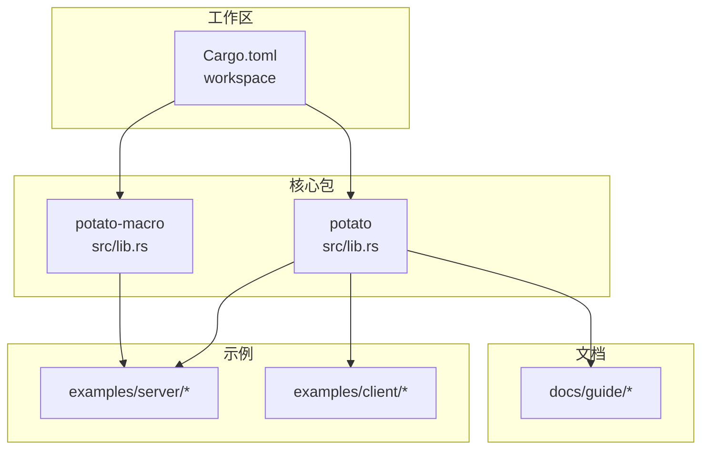
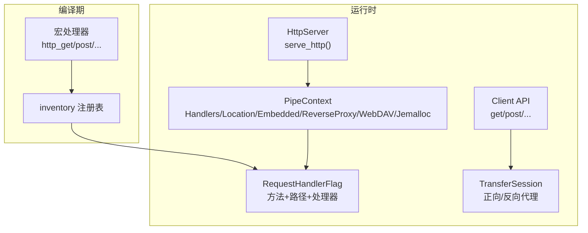
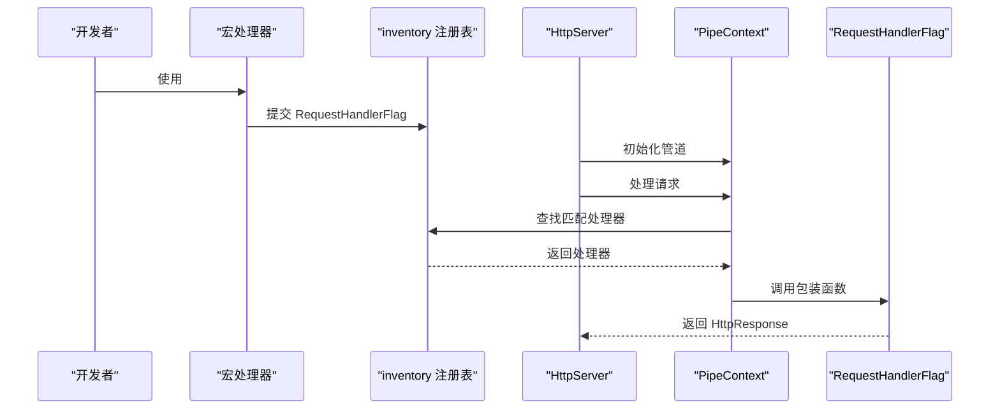
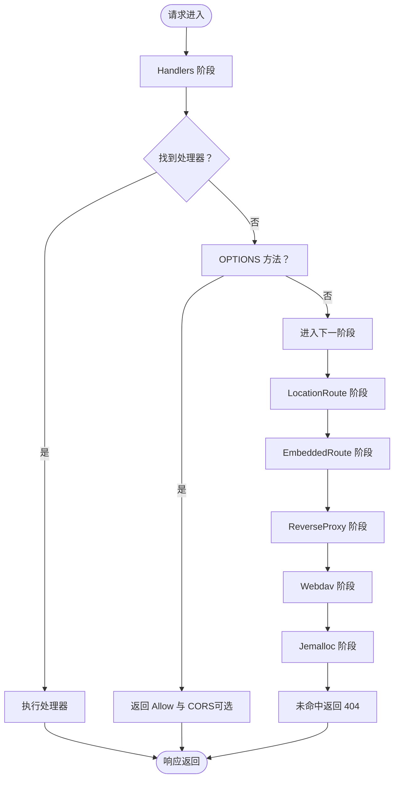
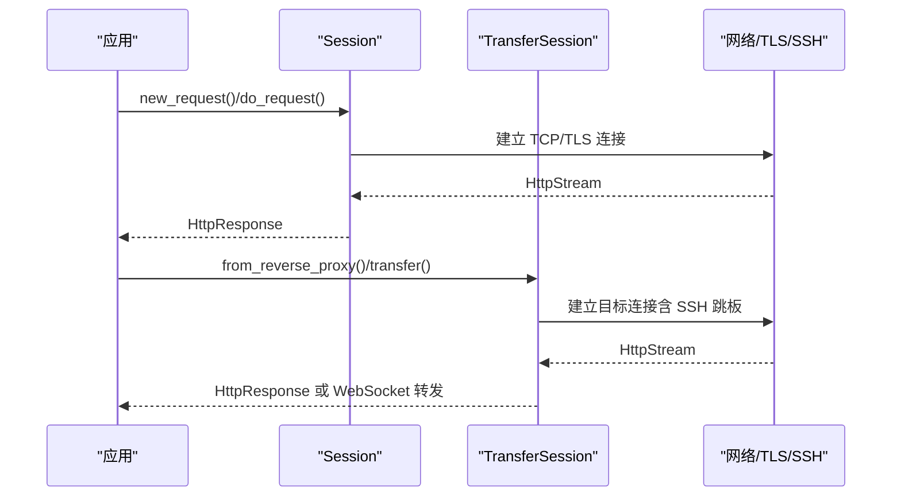
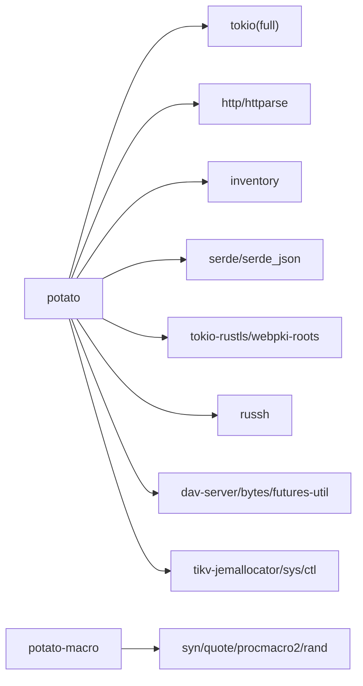

# 项目概述

<cite>
**本文档引用的文件**
- [README.md](file://README.md)
- [README.zh.md](file://README.zh.md)
- [Cargo.toml](file://Cargo.toml)
- [potato/Cargo.toml](file://potato/Cargo.toml)
- [potato/src/lib.rs](file://potato/src/lib.rs)
- [potato/src/server.rs](file://potato/src/server.rs)
- [potato/src/client.rs](file://potato/src/client.rs)
- [potato-macro/src/lib.rs](file://potato-macro/src/lib.rs)
- [potato-macro/src/utils.rs](file://potato-macro/src/utils.rs)
- [examples/server/00_http_server.rs](file://examples/server/00_http_server.rs)
- [examples/client/00_client.rs](file://examples/client/00_client.rs)
- [docs/guide/00_introduction.md](file://docs/guide/00_introduction.md)
- [docs/guide/01_hello_world.md](file://docs/guide/01_hello_world.md)
</cite>

## 目录
1. [引言](#引言)
2. [项目结构](#项目结构)
3. [核心组件](#核心组件)
4. [架构总览](#架构总览)
5. [详细组件分析](#详细组件分析)
6. [依赖关系分析](#依赖关系分析)
7. [性能考量](#性能考量)
8. [故障排查指南](#故障排查指南)
9. [结论](#结论)
10. [附录](#附录)

## 引言
Potato 是一个高性能、语法简洁的 Rust HTTP 框架，专注于为开发者提供极简的 API 接口与声明式路由体验。它通过宏驱动的方式实现声明式路由，结合 Tokio 异步运行时，构建出低耦合、高扩展的 HTTP 服务与客户端能力。项目旨在解决现有 Rust HTTP 生态中“每个库都难以用”的问题，让开发者能够以更少的样板代码完成复杂的 HTTP 功能。

- 高性能：基于 Tokio 异步运行时与自研高效数据结构，减少内存分配与拷贝。
- 声明式路由：通过宏系统自动收集路由处理器，无需手工注册。
- 简洁 API：客户端与服务器端均提供极简调用方式，降低学习成本。
- 多功能特性：支持 TLS、OpenAPI 文档、WebDAV、反向代理、SSH 跳板等高级能力（按需启用）。

**章节来源**
- [README.md](file://README.md#L1-L57)
- [README.zh.md](file://README.zh.md#L1-L58)
- [docs/guide/00_introduction.md](file://docs/guide/00_introduction.md#L1-L76)

## 项目结构
仓库采用多包工作区组织，核心模块包括：
- potato：HTTP 服务器、客户端、工具集与宏导出
- potato-macro：声明式路由宏与派生宏
- examples：丰富的示例，覆盖服务器、客户端、TLS、WebDAV、反向代理等场景
- docs：中英文文档与指南

**图表来源**
- [Cargo.toml](file://Cargo.toml#L1-L4)
- [potato/Cargo.toml](file://potato/Cargo.toml#L1-L76)

**章节来源**
- [Cargo.toml](file://Cargo.toml#L1-L4)
- [potato/Cargo.toml](file://potato/Cargo.toml#L1-L76)

## 核心组件
- 宏驱动路由系统：通过属性宏自动收集路由处理器，生成注册表，运行时按路径与方法分发。
- 服务器内核：基于管道（PipeContext）链式处理，支持处理器、静态资源、嵌入资源、反向代理、WebDAV、Jemalloc 分析等。
- 客户端与传输会话：提供轻量级 HTTP 客户端与反向/正向代理能力，支持 TLS 与 SSH 跳板。
- 数据结构与工具：自研高效字符串与字节容器、压缩/解压、TCP 流封装、条件预检（ETag/If-*）等。

**章节来源**
- [potato/src/lib.rs](file://potato/src/lib.rs#L1-L1220)
- [potato/src/server.rs](file://potato/src/server.rs#L1-L933)
- [potato/src/client.rs](file://potato/src/client.rs#L1-L615)
- [potato-macro/src/lib.rs](file://potato-macro/src/lib.rs#L1-L399)

## 架构总览
Potato 的整体架构围绕“宏驱动 + 异步运行时 + 管道处理”的模式展开。宏在编译期收集路由处理器，运行时通过 inventory 注册表进行查找；服务器端以管道形式串联多种处理阶段；客户端与传输层复用底层流与 TLS 支持。

**图表来源**
- [potato-macro/src/lib.rs](file://potato-macro/src/lib.rs#L26-L300)
- [potato/src/lib.rs](file://potato/src/lib.rs#L152-L175)
- [potato/src/server.rs](file://potato/src/server.rs#L28-L767)
- [potato/src/client.rs](file://potato/src/client.rs#L105-L157)

## 详细组件分析

### 宏驱动路由系统
- 属性宏：http_get、http_post、http_put、http_delete、http_options、http_head 等，支持 path 与 auth_arg 参数。
- 自动收集：宏在编译期生成包装函数与 RequestHandlerFlag，并提交至 inventory 注册表。
- 运行时分发：服务器启动后，按路径与方法在注册表中查找对应处理器执行。

**图表来源**
- [potato-macro/src/lib.rs](file://potato-macro/src/lib.rs#L26-L300)
- [potato/src/lib.rs](file://potato/src/lib.rs#L152-L175)
- [potato/src/server.rs](file://potato/src/server.rs#L362-L377)

**章节来源**
- [potato-macro/src/lib.rs](file://potato-macro/src/lib.rs#L26-L300)
- [potato/src/lib.rs](file://potato/src/lib.rs#L152-L175)

### 服务器内核与管道处理
- 管道阶段：Handlers（处理器）、LocationRoute（本地文件路由）、EmbeddedRoute（嵌入资源）、ReverseProxy（反向代理）、Webdav（WebDAV）、Jemalloc（内存分析）等。
- 条件预检：支持 If-Modified-Since、If-None-Match、If-Match、If-Unmodified-Since 等，返回 304/412。
- OpenAPI 文档：可选生成 OpenAPI JSON 与 Swagger UI。

**图表来源**
- [potato/src/server.rs](file://potato/src/server.rs#L362-L767)

**章节来源**
- [potato/src/server.rs](file://potato/src/server.rs#L28-L767)

### 客户端与传输会话
- Session：维护连接与主机信息，自动复用连接，支持 TLS 与非 TLS。
- TransferSession：支持正向/反向代理、SSH 跳板、WebSocket 转发、内容替换与压缩处理。
- 快速 API：get/post/put/delete/head/options/connect/patch/trace 及 JSON 辅助方法。

**图表来源**
- [potato/src/client.rs](file://potato/src/client.rs#L105-L157)
- [potato/src/client.rs](file://potato/src/client.rs#L224-L592)

**章节来源**
- [potato/src/client.rs](file://potato/src/client.rs#L105-L157)
- [potato/src/client.rs](file://potato/src/client.rs#L224-L592)

### 数据结构与工具
- 高效容器：LocalHipStr/LocalHipByt 等，减少堆分配与字符串拷贝。
- 压缩与编码：Gzip 压缩/解压、URL 编码、ETag 生成。
- TCP 流封装：HttpStream 抽象 TCP/TLS/双向流，统一读写接口。
- 条件预检：parse_http_date、check_precondition_headers 等。

**章节来源**
- [potato/src/lib.rs](file://potato/src/lib.rs#L45-L122)
- [potato/src/lib.rs](file://potato/src/lib.rs#L588-L759)

## 依赖关系分析
- 工作区：workspace 包含 potato 与 potato-macro 两个成员。
- 依赖：Tokio（full 特性）、http、httparse、inventory、serde、tokio-rustls、russh、dav-server 等（按需启用）。
- 特性开关：tls、openapi、ssh、webdav、jemalloc、full 等，便于按需裁剪体积与功能。

**图表来源**
- [potato/Cargo.toml](file://potato/Cargo.toml#L16-L76)

**章节来源**
- [potato/Cargo.toml](file://potato/Cargo.toml#L16-L76)

## 性能考量
- 异步运行时：Tokio 提供高效的事件循环与任务调度，适合高并发 I/O。
- 内存管理：自研高效字符串与字节容器，减少分配与拷贝；可选 jemalloc 特性用于内存分析。
- 压缩与缓存：内置 Gzip 压缩与条件预检（304/412），降低带宽与 CPU 开销。
- 连接复用：Session 与 TransferSession 维护连接池，减少握手与建连开销。
- 特性按需：通过特性开关裁剪功能，避免不必要的依赖与二进制大小。

[本节为通用性能建议，不直接分析具体文件]

## 故障排查指南
- 宏参数校验：path 必须以 “/” 开头；auth_arg 必须指向存在的 String 类型参数。
- TLS 限制：非 tls 构建下不支持 TLS；确保启用 tls 特性并正确配置证书。
- 代理与跳板：SSH 跳板需要 russh 特性；反向代理需正确设置前缀与目标 URL。
- 条件预检：若返回 304/412，请检查 If-* 请求头与 ETag 生成逻辑。
- 日志与错误：使用 anyhow 错误链输出详细错误信息，便于定位问题。

**章节来源**
- [potato-macro/src/lib.rs](file://potato-macro/src/lib.rs#L57-L65)
- [potato/src/client.rs](file://potato/src/client.rs#L68-L98)
- [potato/src/server.rs](file://potato/src/server.rs#L440-L461)

## 结论
Potato 以“宏驱动 + 异步运行时 + 管道处理”为核心理念，提供了简洁而强大的 HTTP 能力。它在保持高性能的同时，显著降低了学习与使用成本，适用于从简单 Web 服务到复杂企业级应用的广泛场景。通过特性开关与模块化设计，用户可以按需裁剪功能，获得最佳的性能与体积平衡。

[本节为总结性内容，不直接分析具体文件]

## 附录

### 快速开始（服务器）
- 添加依赖：potato 与 tokio（full 特性）
- 创建路由处理器：使用 #[http_get("/path")] 标注
- 启动服务器：创建 HttpServer 并调用 serve_http()

示例参考：
- [examples/server/00_http_server.rs](file://examples/server/00_http_server.rs#L1-L12)
- [docs/guide/01_hello_world.md](file://docs/guide/01_hello_world.md#L15-L27)

**章节来源**
- [README.md](file://README.md#L14-L35)
- [examples/server/00_http_server.rs](file://examples/server/00_http_server.rs#L1-L12)
- [docs/guide/01_hello_world.md](file://docs/guide/01_hello_world.md#L15-L27)

### 快速开始（客户端）
- 直接调用 potato::get/post 等方法
- Session 支持复用连接与 TLS

示例参考：
- [examples/client/00_client.rs](file://examples/client/00_client.rs#L1-L7)
- [docs/guide/01_hello_world.md](file://docs/guide/01_hello_world.md#L33-L40)

**章节来源**
- [README.md](file://README.md#L37-L46)
- [examples/client/00_client.rs](file://examples/client/00_client.rs#L1-L7)
- [docs/guide/01_hello_world.md](file://docs/guide/01_hello_world.md#L33-L40)

### 设计理念与差异化特点
- 与 Axum/Actix/Ntex 等对比：Potato 强调“极简 API”，宏驱动自动注册，避免手工路由注册。
- 与 reqwest 对比：Potato 提供统一的客户端 API 与传输层抽象，支持代理与 TLS。
- 技术栈：Rust + Tokio，强调零成本抽象与高性能。

**章节来源**
- [docs/guide/00_introduction.md](file://docs/guide/00_introduction.md#L1-L76)