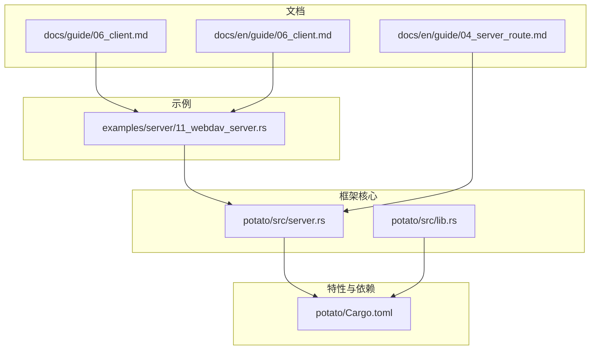
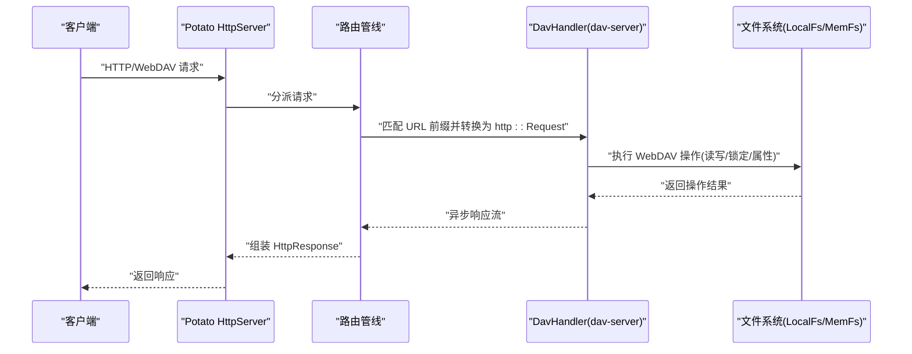
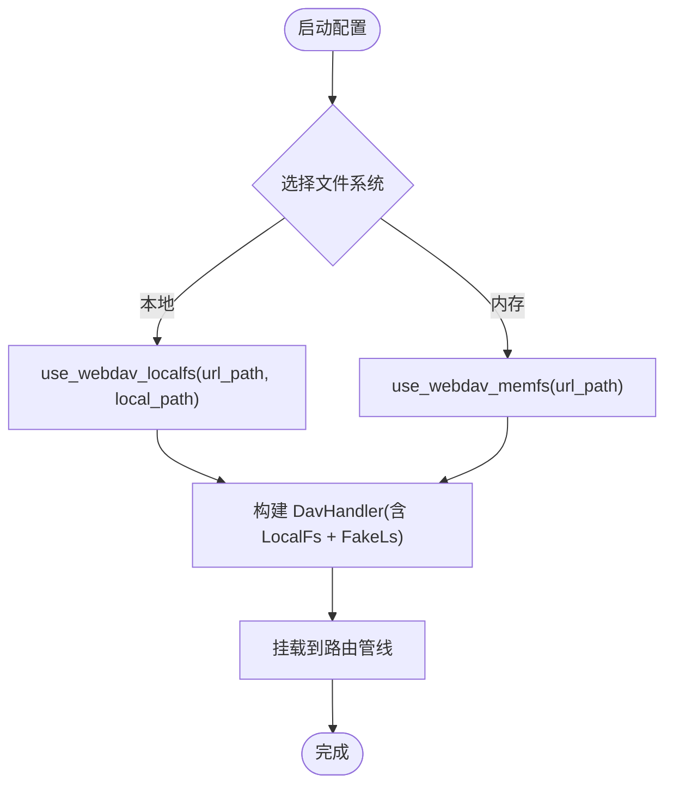
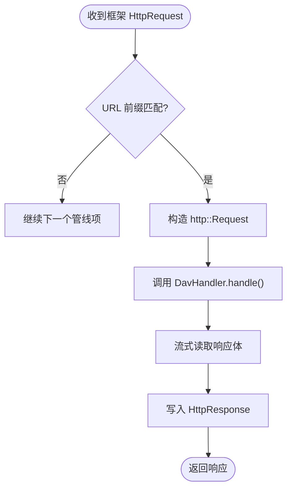
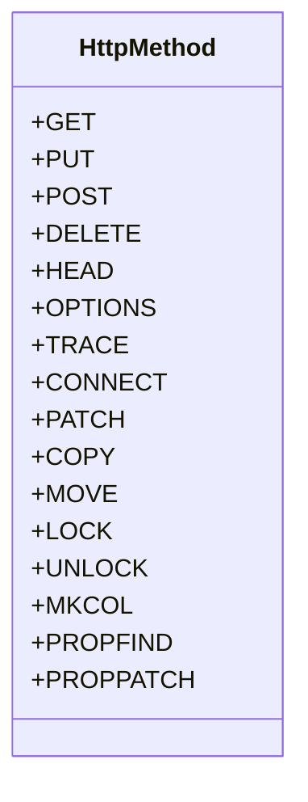
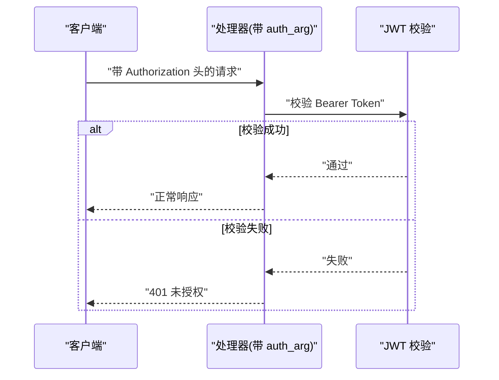
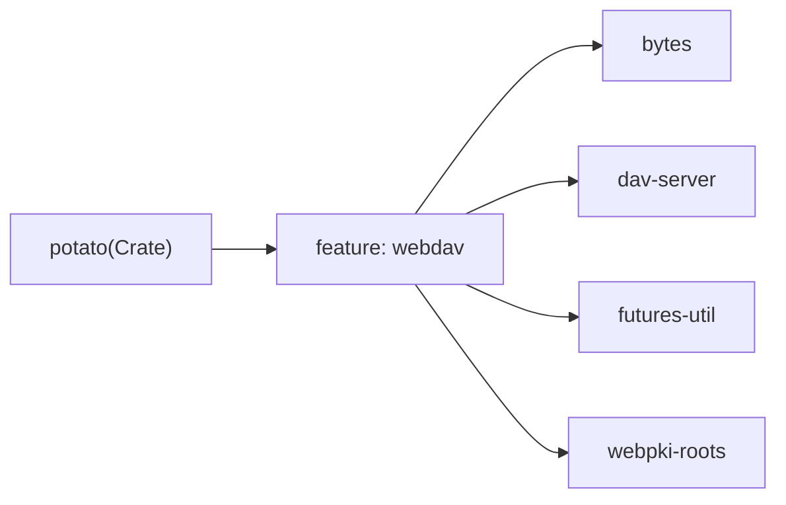

# WebDAV协议支持

<cite>
**本文档引用的文件**
- [examples/server/11_webdav_server.rs](file://examples/server/11_webdav_server.rs)
- [potato/src/server.rs](file://potato/src/server.rs)
- [potato/src/lib.rs](file://potato/src/lib.rs)
- [potato/Cargo.toml](file://potato/Cargo.toml)
- [docs/en/guide/04_server_route.md](file://docs/en/guide/04_server_route.md)
- [docs/guide/06_client.md](file://docs/guide/06_client.md)
- [docs/en/guide/06_client.md](file://docs/en/guide/06_client.md)
- [README.md](file://README.md)
- [README.zh.md](file://README.zh.md)
</cite>

## 目录
1. [简介](#简介)
2. [项目结构](#项目结构)
3. [核心组件](#核心组件)
4. [架构总览](#架构总览)
5. [详细组件分析](#详细组件分析)
6. [依赖关系分析](#依赖关系分析)
7. [性能考量](#性能考量)
8. [故障排查指南](#故障排查指南)
9. [结论](#结论)
10. [附录](#附录)

## 简介
本文件系统性阐述 Potato 框架中对 WebDAV 协议的支持与实现细节，涵盖以下方面：
- WebDAV 核心概念与扩展能力：文件锁定、版本控制、远程锁定机制
- HTTP 方法扩展：PROPFIND、PROPPATCH、MKCOL、COPY、MOVE 等
- 权限管理与认证：ACL 配置与用户认证
- 文件同步与冲突解决策略
- WebDAV 客户端集成指南与常见问题
- 与标准 Web 服务器的兼容性与互操作性
- 安全配置与访问控制最佳实践

Potato 通过可选特性启用 WebDAV 支持，内部基于 dav-server 库构建 DavHandler，并将其挂载到框架路由管线中统一处理。

## 项目结构
围绕 WebDAV 的关键文件与模块分布如下：
- 示例服务器：演示如何启用 WebDAV 并绑定本地文件系统或内存文件系统
- 服务端核心：在路由管线中注入 WebDAV 处理器，桥接 HTTP 请求与 dav-server
- 构建与特性：定义 webdav 特性及依赖项
- 文档：服务器路由与客户端使用指南

**图表来源**
- [examples/server/11_webdav_server.rs](file://examples/server/11_webdav_server.rs#L1-L16)
- [potato/src/server.rs](file://potato/src/server.rs#L333-L360)
- [potato/Cargo.toml](file://potato/Cargo.toml#L59-L71)
- [docs/en/guide/04_server_route.md](file://docs/en/guide/04_server_route.md#L106-L115)
- [docs/guide/06_client.md](file://docs/guide/06_client.md#L1-L72)
- [docs/en/guide/06_client.md](file://docs/en/guide/06_client.md#L1-L71)

**章节来源**
- [examples/server/11_webdav_server.rs](file://examples/server/11_webdav_server.rs#L1-L16)
- [potato/src/server.rs](file://potato/src/server.rs#L333-L360)
- [potato/Cargo.toml](file://potato/Cargo.toml#L59-L71)
- [docs/en/guide/04_server_route.md](file://docs/en/guide/04_server_route.md#L106-L115)
- [docs/guide/06_client.md](file://docs/guide/06_client.md#L1-L72)
- [docs/en/guide/06_client.md](file://docs/en/guide/06_client.md#L1-L71)

## 核心组件
- WebDAV 路由挂载
  - 通过 HttpServer::configure 中的 use_webdav_localfs/use_webdav_memfs 将 dav-server 的 DavHandler 注入到指定 URL 前缀下
  - 默认使用 FakeLs 锁系统，表示未启用真实分布式锁，适合开发或单机场景
- 请求桥接
  - 在路由匹配阶段，将框架的 HttpRequest 转换为 http::Request，并将响应流式读取回写到框架 HttpResponse
- HTTP 方法支持
  - 框架内置 HttpMethod 枚举包含 PROPFIND、PROPPATCH、MKCOL、COPY、MOVE、LOCK、UNLOCK 等，确保 WebDAV 扩展方法可被识别与处理

关键实现位置：
- WebDAV 挂载接口：[use_webdav_localfs](file://potato/src/server.rs#L333-L350)、[use_webdav_memfs](file://potato/src/server.rs#L352-L360)
- 请求桥接与响应回写：[WebDAV 管线处理](file://potato/src/server.rs#L668-L761)
- HTTP 方法枚举：[HttpMethod](file://potato/src/lib.rs#L177-L195)

**章节来源**
- [potato/src/server.rs](file://potato/src/server.rs#L333-L360)
- [potato/src/server.rs](file://potato/src/server.rs#L668-L761)
- [potato/src/lib.rs](file://potato/src/lib.rs#L177-L195)

## 架构总览
下图展示 Potato 如何将 WebDAV 请求接入 dav-server 并返回结果的整体流程：

**图表来源**
- [potato/src/server.rs](file://potato/src/server.rs#L668-L761)
- [potato/src/server.rs](file://potato/src/server.rs#L333-L360)

## 详细组件分析

### WebDAV 路由挂载与文件系统选择
- use_webdav_localfs
  - 绑定本地文件系统，将 URL 前缀映射到本地目录
  - 默认启用 FakeLs 锁系统，不进行真实分布式锁管理
- use_webdav_memfs
  - 绑定内存文件系统，适合测试与临时数据
  - 同样使用 FakeLs 锁系统

**图表来源**
- [potato/src/server.rs](file://potato/src/server.rs#L333-L360)

**章节来源**
- [potato/src/server.rs](file://potato/src/server.rs#L333-L360)

### 请求桥接与响应回写
- 匹配逻辑：仅当请求 URL 以注册的 WebDAV 前缀开头时进入 dav-server 处理
- 请求转换：将框架的 body、headers、URI 等转换为 http::Request
- 响应回写：遍历 dav-server 返回的异步响应流，逐块写入框架 HttpResponse

**图表来源**
- [potato/src/server.rs](file://potato/src/server.rs#L668-L761)

**章节来源**
- [potato/src/server.rs](file://potato/src/server.rs#L668-L761)

### HTTP 方法扩展支持
框架的 HttpMethod 枚举包含 WebDAV 扩展方法，确保这些方法能被正确识别与处理：
- PROPFIND、PROPPATCH、MKCOL、COPY、MOVE、LOCK、UNLOCK 等

**图表来源**
- [potato/src/lib.rs](file://potato/src/lib.rs#L177-L195)

**章节来源**
- [potato/src/lib.rs](file://potato/src/lib.rs#L177-L195)

### 权限管理与认证
- JWT 认证参数
  - 通过函数注解的 auth_arg 参数，结合 Authorization 头部携带的 Bearer Token 进行校验
  - 当鉴权失败时返回 401，不执行处理器
- WebDAV 与认证
  - 当前实现未在 WebDAV 管线中强制要求认证；若需启用，可在业务层自行添加中间件或在 dav-server 层面配置认证策略

**图表来源**
- [potato-macro/src/lib.rs](file://potato-macro/src/lib.rs#L125-L149)

**章节来源**
- [docs/en/guide/02_method_annotation.md](file://docs/en/guide/02_method_annotation.md#L23-L36)
- [docs/guide/02_method_annotation.md](file://docs/guide/02_method_annotation.md#L23-L36)

### 文件锁定、版本控制与远程锁定
- 当前实现
  - 使用 FakeLs 作为锁系统，不提供分布式锁能力
  - 未启用 WebDAV 版本控制扩展
- 生产建议
  - 若需分布式锁，可替换为支持分布式锁的实现
  - 版本控制可通过 dav-server 的版本化文件系统或自定义扩展实现

**章节来源**
- [potato/src/server.rs](file://potato/src/server.rs#L339-L346)

### 文件同步与冲突解决策略
- 冲突检测
  - 可利用 dav-server 的预检检查与条件请求头（如 If-Match/If-None-Match）实现乐观并发控制
- 冲突解决
  - 建议在应用层引入合并策略（如时间戳、ETag 对比、内容差异比较）以决定保留哪一份变更
  - 对于目录合并，采用“保留最新”或“手动干预”的策略

**章节来源**
- [potato/src/server.rs](file://potato/src/server.rs#L644-L662)

### WebDAV 客户端集成指南
- 客户端基础用法
  - 支持基本 GET/POST 等请求，以及会话复用与 WebSocket 连接
- WebDAV 客户端
  - 可使用标准 WebDAV 客户端工具或 SDK，按需设置认证头与请求头
  - 注意与服务器的 TLS/证书配置保持一致

**章节来源**
- [docs/guide/06_client.md](file://docs/guide/06_client.md#L1-L72)
- [docs/en/guide/06_client.md](file://docs/en/guide/06_client.md#L1-L71)

### 与标准 Web 服务器的兼容性与互操作性
- 兼容性
  - 通过 dav-server 实现标准 WebDAV 行为，可与主流 WebDAV 客户端互通
- 互操作性
  - 支持嵌入式资源路由与静态文件路由，便于与现有站点共存
  - 可与其他路由（如 OpenAPI、反向代理）组合使用

**章节来源**
- [docs/en/guide/04_server_route.md](file://docs/en/guide/04_server_route.md#L1-L55)
- [docs/en/guide/04_server_route.md](file://docs/en/guide/04_server_route.md#L106-L134)

### 安全配置与访问控制最佳实践
- 最小权限原则
  - 为不同用户授予最小必要权限，避免全局写权限
- 认证与授权
  - 强制启用 JWT 或其他认证机制，并在 dav-server 层面配置 ACL
- 传输安全
  - 使用 HTTPS/TLS，避免明文传输敏感元数据
- 路径隔离
  - 将 WebDAV 路由与业务路由分离，限制可访问路径范围

**章节来源**
- [docs/en/guide/02_method_annotation.md](file://docs/en/guide/02_method_annotation.md#L23-L36)
- [docs/guide/02_method_annotation.md](file://docs/guide/02_method_annotation.md#L23-L36)

## 依赖关系分析
WebDAV 功能通过可选特性启用，依赖 dav-server 与相关异步工具库。

**图表来源**
- [potato/Cargo.toml](file://potato/Cargo.toml#L59-L71)

**章节来源**
- [potato/Cargo.toml](file://potato/Cargo.toml#L59-L71)

## 性能考量
- 流式响应
  - WebDAV 响应采用流式读取，降低内存占用
- 文件系统选择
  - 本地文件系统适合大文件与高吞吐场景；内存文件系统适合测试与小规模数据
- 并发与锁
  - FakeLs 不引入分布式锁开销，但需注意单实例部署场景

**章节来源**
- [potato/src/server.rs](file://potato/src/server.rs#L754-L757)
- [potato/src/server.rs](file://potato/src/server.rs#L333-L360)

## 故障排查指南
- 404 未找到
  - 确认请求 URL 是否以注册的 WebDAV 前缀开头
- 401 未授权
  - 检查是否启用了需要认证的处理器，确认 Authorization 头格式与签名有效
- 409 冲突
  - 检查 ETag/If-Match 是否匹配，必要时重试或合并变更
- 500 服务器错误
  - 查看 dav-server 日志与文件系统权限，确认磁盘空间与访问权限

**章节来源**
- [potato/src/server.rs](file://potato/src/server.rs#L644-L662)
- [docs/en/guide/02_method_annotation.md](file://docs/en/guide/02_method_annotation.md#L23-L36)

## 结论
Potato 通过可选特性与 dav-server 的深度集成，提供了开箱即用的 WebDAV 能力。其设计将 WebDAV 请求无缝接入框架路由管线，既保证了标准兼容性，又保留了灵活扩展的空间。生产环境中建议结合认证、TLS、ACL 与分布式锁策略，确保安全性与一致性。

## 附录
- 快速开始
  - 在示例中启用 WebDAV 并绑定本地目录
  - 参考示例与文档中的路由与客户端用法

**章节来源**
- [examples/server/11_webdav_server.rs](file://examples/server/11_webdav_server.rs#L1-L16)
- [docs/en/guide/04_server_route.md](file://docs/en/guide/04_server_route.md#L106-L115)
- [README.md](file://README.md#L14-L19)
- [README.zh.md](file://README.zh.md#L14-L19)