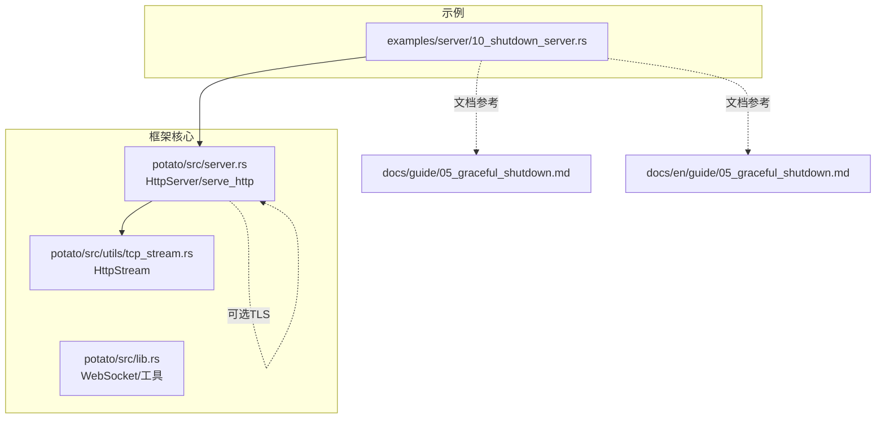
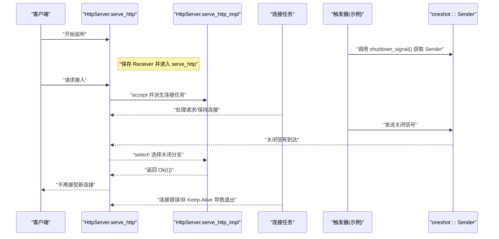
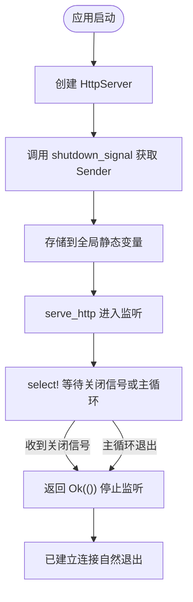
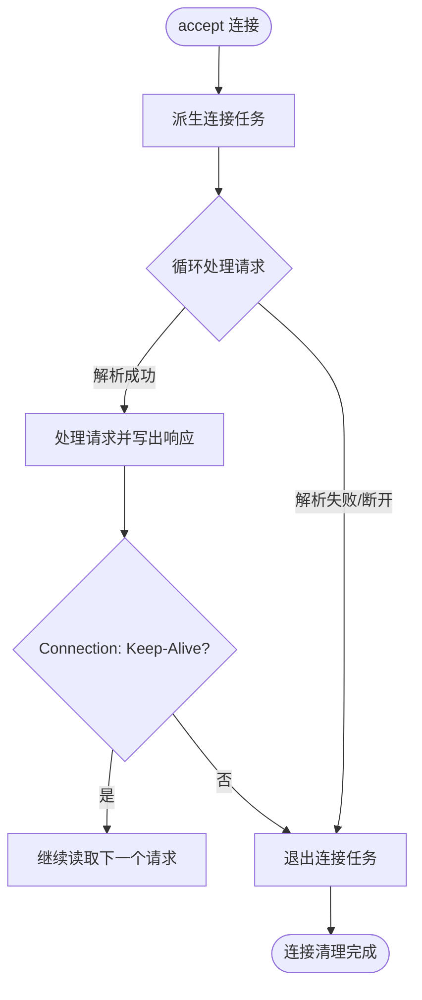
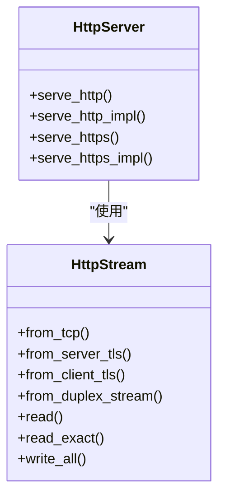

# 优雅关闭机制

<cite>
**本文引用的文件**
- [examples/server/10_shutdown_server.rs](file://examples/server/10_shutdown_server.rs)
- [docs/guide/05_graceful_shutdown.md](file://docs/guide/05_graceful_shutdown.md)
- [docs/en/guide/05_graceful_shutdown.md](file://docs/en/guide/05_graceful_shutdown.md)
- [potato/src/server.rs](file://potato/src/server.rs)
- [potato/src/utils/tcp_stream.rs](file://potato/src/utils/tcp_stream.rs)
- [potato/src/lib.rs](file://potato/src/lib.rs)
- [Cargo.toml](file://Cargo.toml)
</cite>

## 目录
1. [简介](#简介)
2. [项目结构](#项目结构)
3. [核心组件](#核心组件)
4. [架构总览](#架构总览)
5. [组件详解](#组件详解)
6. [依赖关系分析](#依赖关系分析)
7. [性能考量](#性能考量)
8. [故障排查指南](#故障排查指南)
9. [结论](#结论)
10. [附录](#附录)

## 简介
本文件系统化阐述 Potato 框架的优雅关闭机制，覆盖以下关键主题：
- 信号与外部触发：如何通过 oneshot 通道接收“关闭”信号，以及如何在示例中通过 HTTP 接口触发该信号。
- 连接生命周期与清理：活跃连接的处理策略、Keep-Alive 的行为、以及连接关闭时机。
- 资源释放顺序：网络套接字、TLS 流、底层 TCP 连接的关闭顺序与一致性。
- 多进程场景：如何在多进程部署下协调优雅关闭（建议与最佳实践）。
- 健康检查与停机维护：如何结合优雅关闭实现“停机维护模式”。
- 监控与日志：如何在关闭过程中进行可观测性增强。

## 项目结构
与优雅关闭直接相关的代码主要集中在以下模块：
- 服务器入口与关闭控制：HttpServer 及其 serve_http/serve_https 实现
- 连接抽象与关闭语义：HttpStream
- 示例与文档：演示如何通过 HTTP 触发关闭信号

**图表来源**
- [examples/server/10_shutdown_server.rs](file://examples/server/10_shutdown_server.rs#L1-L22)
- [potato/src/server.rs](file://potato/src/server.rs#L769-L832)
- [potato/src/utils/tcp_stream.rs](file://potato/src/utils/tcp_stream.rs#L11-L73)
- [docs/guide/05_graceful_shutdown.md](file://docs/guide/05_graceful_shutdown.md#L1-L29)
- [docs/en/guide/05_graceful_shutdown.md](file://docs/en/guide/05_graceful_shutdown.md#L1-L29)

**章节来源**
- [Cargo.toml](file://Cargo.toml#L1-L4)
- [examples/server/10_shutdown_server.rs](file://examples/server/10_shutdown_server.rs#L1-L22)
- [docs/guide/05_graceful_shutdown.md](file://docs/guide/05_graceful_shutdown.md#L1-L29)
- [docs/en/guide/05_graceful_shutdown.md](file://docs/en/guide/05_graceful_shutdown.md#L1-L29)

## 核心组件
- HttpServer：提供监听、请求处理与优雅关闭控制。关键点：
  - 提供 shutdown_signal 获取 oneshot 发送端；接收端保存在实例中，serve_http 内部通过 select! 等待关闭信号或主循环结束。
  - serve_http/serve_https 在有关闭信号时采用“主循环 + 关闭信号”的竞态模式，收到关闭信号后立即返回，不再接受新连接。
- HttpStream：统一抽象 TCP/TLS/Duplex 流，提供 read/write 接口；连接断开会返回错误，驱动上层退出循环。
- 示例程序：通过 HTTP 路由触发 oneshot 信号，实现“外部触发优雅关闭”。

**章节来源**
- [potato/src/server.rs](file://potato/src/server.rs#L769-L832)
- [potato/src/server.rs](file://potato/src/server.rs#L826-L871)
- [potato/src/utils/tcp_stream.rs](file://potato/src/utils/tcp_stream.rs#L11-L73)
- [examples/server/10_shutdown_server.rs](file://examples/server/10_shutdown_server.rs#L1-L22)

## 架构总览
优雅关闭的关键流程如下：
- 应用启动后注册 shutdown_signal，将其暴露为 oneshot Sender。
- 外部通过 HTTP 请求调用触发器，向 oneshot Sender 发送信号。
- 服务器在 serve_http 中使用 select! 等待主循环或关闭信号；收到关闭信号后立即返回，停止接受新连接。
- 已建立的连接在各自任务中按 Keep-Alive 或错误退出自然关闭。

**图表来源**
- [potato/src/server.rs](file://potato/src/server.rs#L799-L810)
- [potato/src/server.rs](file://potato/src/server.rs#L826-L871)
- [examples/server/10_shutdown_server.rs](file://examples/server/10_shutdown_server.rs#L7-L13)

## 组件详解

### 1) 信号与触发机制
- 服务器提供 shutdown_signal 获取 oneshot::Sender，用于外部触发优雅关闭。
- 示例程序将该 Sender 存储在全局静态变量中，HTTP 路由在收到请求时发送信号。
- 服务器在 serve_http 中通过 select! 竞速关闭信号与主循环，收到信号后立即返回，不再接受新连接。

**图表来源**
- [examples/server/10_shutdown_server.rs](file://examples/server/10_shutdown_server.rs#L4-L13)
- [potato/src/server.rs](file://potato/src/server.rs#L790-L797)
- [potato/src/server.rs](file://potato/src/server.rs#L799-L810)

**章节来源**
- [examples/server/10_shutdown_server.rs](file://examples/server/10_shutdown_server.rs#L1-L22)
- [docs/guide/05_graceful_shutdown.md](file://docs/guide/05_graceful_shutdown.md#L1-L29)
- [docs/en/guide/05_graceful_shutdown.md](file://docs/en/guide/05_graceful_shutdown.md#L1-L29)
- [potato/src/server.rs](file://potato/src/server.rs#L790-L797)
- [potato/src/server.rs](file://potato/src/server.rs#L799-L810)

### 2) 连接清理与等待策略
- 主循环 accept 新连接，每个连接派生独立任务处理。
- 连接任务在以下情况下退出：
  - 请求解析失败或连接断开（read 返回错误）
  - 非 Keep-Alive 的请求处理完成后
  - 服务器收到关闭信号后不再接受新连接，旧连接自然退出
- Keep-Alive 行为由请求头决定；若连接未显式要求 Keep-Alive，则处理完当前请求后退出。

**图表来源**
- [potato/src/server.rs](file://potato/src/server.rs#L834-L871)
- [potato/src/server.rs](file://potato/src/server.rs#L852-L868)

**章节来源**
- [potato/src/server.rs](file://potato/src/server.rs#L826-L871)

### 3) 资源释放顺序
- HttpStream 抽象了 TCP/TLS/Duplex 三种流，统一提供 read/write 接口。
- 当连接断开或处理错误时，上层任务退出，底层流随之被释放。
- TLS 场景下，serve_https 对 accept 到的流进行 TLS 握手，握手失败则跳过；成功后同样遵循上述退出逻辑。

**图表来源**
- [potato/src/utils/tcp_stream.rs](file://potato/src/utils/tcp_stream.rs#L11-L73)
- [potato/src/server.rs](file://potato/src/server.rs#L826-L931)

**章节来源**
- [potato/src/utils/tcp_stream.rs](file://potato/src/utils/tcp_stream.rs#L11-L73)
- [potato/src/server.rs](file://potato/src/server.rs#L873-L931)

### 4) 多进程环境下的优雅关闭
- 建议做法：
  - 使用进程外控制器（如 systemd、Kubernetes、自研编排器）向各工作进程发送统一的关闭信号。
  - 各进程独立持有各自的 oneshot 通道，互不共享；通过外部触发器统一发送。
  - 在编排层设置合理的优雅期限（grace period），先发送关闭信号，再等待一段时间后强制终止。
  - 对于需要持久化的状态，可在关闭前触发“停机维护模式”，拒绝新请求并等待存量请求完成。
- 本仓库未提供内置的多进程信号分发机制，以上为通用工程实践建议。

[本节为概念性指导，不直接分析具体文件]

### 5) 健康检查与停机维护
- 健康检查：在关闭前可暴露健康检查端点，返回“正在关闭/不可用”状态，以便负载均衡器摘除实例。
- 停机维护：可通过在优雅关闭前将服务切换至“只读/降级”模式，减少对用户的影响。
- 与优雅关闭配合：关闭信号到达后，立即停止接受新连接，同时允许现有连接完成处理。

[本节为概念性指导，不直接分析具体文件]

### 6) 监控与日志配置
- 建议在以下阶段输出日志：
  - 接收关闭信号时记录时间戳与来源
  - 开始停止接受新连接时记录
  - 连接任务退出时记录原因（断开/非 Keep-Alive）
- 结合观测系统上报指标：当前活跃连接数、请求 QPS、关闭耗时等。
- 日志格式建议包含：时间、级别、模块、事件描述、上下文信息（如客户端地址）。

[本节为概念性指导，不直接分析具体文件]

## 依赖关系分析
- HttpServer 依赖 oneshot 通道作为优雅关闭的触发器。
- 连接处理依赖 HttpStream 抽象，屏蔽 TCP/TLS 细节。
- 示例程序通过 HTTP 路由触发 oneshot 信号，形成“外部触发 → 服务器优雅关闭”的闭环。

**图表来源**
- [examples/server/10_shutdown_server.rs](file://examples/server/10_shutdown_server.rs#L7-L13)
- [potato/src/server.rs](file://potato/src/server.rs#L790-L797)
- [potato/src/server.rs](file://potato/src/server.rs#L799-L810)
- [potato/src/server.rs](file://potato/src/server.rs#L826-L871)
- [potato/src/utils/tcp_stream.rs](file://potato/src/utils/tcp_stream.rs#L11-L73)

**章节来源**
- [examples/server/10_shutdown_server.rs](file://examples/server/10_shutdown_server.rs#L1-L22)
- [potato/src/server.rs](file://potato/src/server.rs#L790-L797)
- [potato/src/server.rs](file://potato/src/server.rs#L799-L810)
- [potato/src/server.rs](file://potato/src/server.rs#L826-L871)
- [potato/src/utils/tcp_stream.rs](file://potato/src/utils/tcp_stream.rs#L11-L73)

## 性能考量
- 连接派生策略：每连接一个任务，适合高并发场景；注意合理设置系统 ulimit 与内核参数。
- Keep-Alive：在高延迟网络下可降低握手开销，但需关注内存占用与连接数上限。
- 关闭窗口：关闭信号到达后尽快停止接受新连接，避免“幽灵连接”。
- TLS：握手成本较高，建议复用连接或启用 ALPN/Session Ticket 优化。

[本节提供一般性建议，不直接分析具体文件]

## 故障排查指南
- 症状：关闭信号发出后仍有新连接接入
  - 检查是否正确调用 shutdown_signal 获取 Sender，并在 serve_http 前保存 Receiver。
  - 确认触发器确实调用了 oneshot::Sender::send。
- 症状：连接长时间不退出
  - 检查请求是否设置了 Connection: Keep-Alive；必要时在触发关闭前主动断开长连接。
  - 查看连接任务是否因解析错误或写入失败提前退出。
- 症状：TLS 场景下关闭异常
  - 确认 TLS 握手成功后再派生连接任务；握手失败应跳过并继续监听。
- 症状：日志缺失
  - 在触发关闭、停止监听、连接退出等关键节点增加日志输出，便于定位问题。

**章节来源**
- [examples/server/10_shutdown_server.rs](file://examples/server/10_shutdown_server.rs#L7-L13)
- [potato/src/server.rs](file://potato/src/server.rs#L799-L810)
- [potato/src/server.rs](file://potato/src/server.rs#L826-L871)
- [potato/src/server.rs](file://potato/src/server.rs#L873-L931)

## 结论
Potato 框架的优雅关闭基于 oneshot 通道与 Tokio 的 select! 竞速机制，实现简单可靠：
- 外部通过 HTTP 触发器发送关闭信号，服务器在收到信号后停止接受新连接。
- 已建立连接在各自任务中按 Keep-Alive 或错误自然退出，避免强制中断。
- HttpStream 抽象屏蔽了 TCP/TLS 细节，保证资源释放的一致性。
对于多进程与生产环境，建议结合外部编排与健康检查，形成完整的停机维护流程。

[本节为总结性内容，不直接分析具体文件]

## 附录
- 示例路径：examples/server/10_shutdown_server.rs
- 文档路径：docs/guide/05_graceful_shutdown.md、docs/en/guide/05_graceful_shutdown.md
- 核心实现：potato/src/server.rs、potato/src/utils/tcp_stream.rs

[本节为补充信息，不直接分析具体文件]