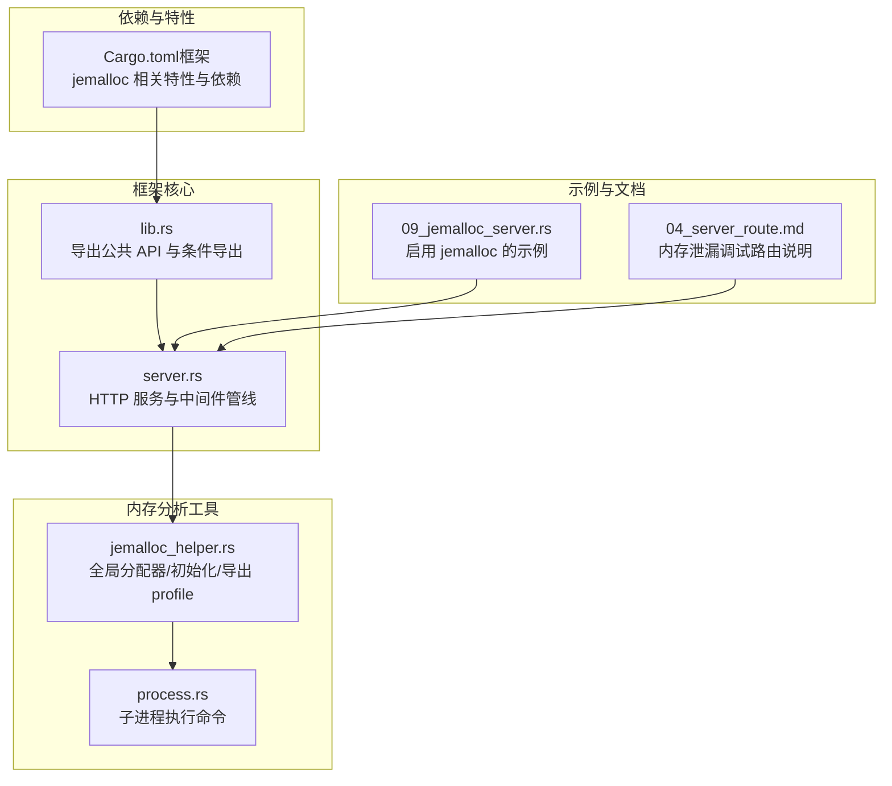
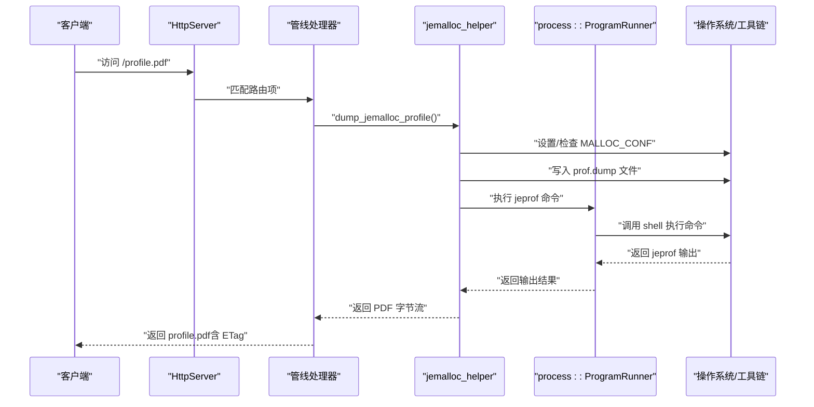
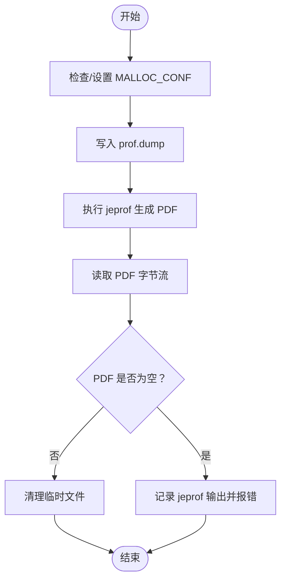
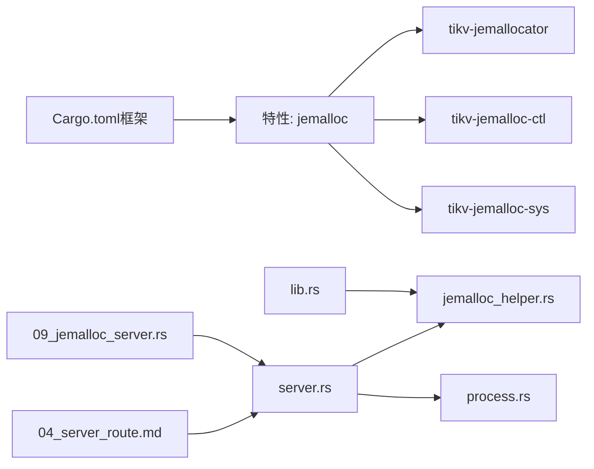

# 内存管理优化

<cite>
**本文引用的文件**
- [jemalloc_helper.rs](file://potato/src/utils/jemalloc_helper.rs)
- [process.rs](file://potato/src/utils/process.rs)
- [server.rs](file://potato/src/server.rs)
- [lib.rs](file://potato/src/lib.rs)
- [Cargo.toml（框架）](file://potato/Cargo.toml)
- [09_jemalloc_server.rs](file://examples/server/09_jemalloc_server.rs)
- [04_server_route.md](file://docs/en/guide/04_server_route.md)
</cite>

## 目录
1. [简介](#简介)
2. [项目结构](#项目结构)
3. [核心组件](#核心组件)
4. [架构总览](#架构总览)
5. [组件详解](#组件详解)
6. [依赖关系分析](#依赖关系分析)
7. [性能考量](#性能考量)
8. [故障排除指南](#故障排除指南)
9. [结论](#结论)
10. [附录](#附录)

## 简介
本文件系统性阐述 Potato 框架在 Linux 平台上的内存管理优化方案，重点围绕 jemalloc 集成与配置、内存分配器选择策略、性能对比、内存分析工具链（profile.pdf 生成）、内存池与对象复用思路、垃圾回收优化、监控指标与调优实践，以及不同场景下的配置建议与故障排除。文档严格基于仓库现有实现与示例进行分析与总结。

## 项目结构
与内存管理优化直接相关的模块与文件分布如下：
- 分配器接管与控制：jemalloc 全局分配器、运行时开关与 profile 导出
- 服务器路由与触发：在启用 jemalloc 特性后，通过自定义路由暴露 profile.pdf
- 工具链执行：通过子进程调用 jeprof 生成 PDF 报告
- 示例与文档：演示如何启用 jemalloc 功能与安装依赖

图表来源
- [lib.rs](file://potato/src/lib.rs#L1-L40)
- [server.rs](file://potato/src/server.rs#L826-L887)
- [jemalloc_helper.rs](file://potato/src/utils/jemalloc_helper.rs#L1-L70)
- [process.rs](file://potato/src/utils/process.rs#L1-L27)
- [09_jemalloc_server.rs](file://examples/server/09_jemalloc_server.rs#L1-L16)
- [Cargo.toml（框架）](file://potato/Cargo.toml#L43-L76)

章节来源
- [Cargo.toml（框架）](file://potato/Cargo.toml#L43-L76)
- [lib.rs](file://potato/src/lib.rs#L1-L40)
- [server.rs](file://potato/src/server.rs#L826-L887)
- [jemalloc_helper.rs](file://potato/src/utils/jemalloc_helper.rs#L1-L70)
- [process.rs](file://potato/src/utils/process.rs#L1-L27)
- [09_jemalloc_server.rs](file://examples/server/09_jemalloc_server.rs#L1-L16)
- [04_server_route.md](file://docs/en/guide/04_server_route.md#L57-L82)

## 核心组件
- jemalloc 全局分配器与初始化
  - 在启用 jemalloc 特性时，通过全局静态变量接管系统内存分配，确保后续所有分配走 jemalloc 路径
  - 初始化阶段读取环境变量 MALLOC_CONF，若包含 prof:true 则激活 profiling
- profile 导出与 PDF 生成
  - 触发 prof.dump 将堆栈信息写入临时文件
  - 使用 jeprof 命令将二进制 dump 转换为 PDF 报告
  - 通过 HTTP 路由返回该 PDF，支持条件请求（ETag）
- 服务器集成
  - 在 serve_http/serve_https 启动时自动初始化 jemalloc
  - 在管线中注册 Jemalloc 类型的路由项，匹配到路径即触发导出流程

章节来源
- [jemalloc_helper.rs](file://potato/src/utils/jemalloc_helper.rs#L8-L34)
- [jemalloc_helper.rs](file://potato/src/utils/jemalloc_helper.rs#L36-L70)
- [server.rs](file://potato/src/server.rs#L826-L887)
- [server.rs](file://potato/src/server.rs#L629-L667)
- [lib.rs](file://potato/src/lib.rs#L17-L18)

## 架构总览
下图展示从请求到内存分析报告返回的关键流程，涵盖 jemalloc 初始化、profiling 控制、dump 与 jeprof 转换、PDF 返回等步骤。

图表来源
- [server.rs](file://potato/src/server.rs#L629-L667)
- [jemalloc_helper.rs](file://potato/src/utils/jemalloc_helper.rs#L14-L34)
- [jemalloc_helper.rs](file://potato/src/utils/jemalloc_helper.rs#L36-L70)
- [process.rs](file://potato/src/utils/process.rs#L7-L25)

## 组件详解

### jemalloc 集成与初始化
- 全局分配器接管
  - 条件编译启用 jemalloc 特性后，全局静态变量作为系统默认分配器
- 初始化逻辑
  - 防重复初始化标志位，仅首次启动生效
  - 读取 MALLOC_CONF 环境变量，若包含 prof:true 则通过 jemalloc ctl 激活 profiling
  - 若未设置或未启用 profiling，则抛出提示，指导用户开启或禁用 jemalloc 特性
- 适用平台
  - 示例注释明确当前仅支持 Linux；需安装 jemalloc 开发包与图形工具链以生成 PDF

章节来源
- [jemalloc_helper.rs](file://potato/src/utils/jemalloc_helper.rs#L8-L34)
- [09_jemalloc_server.rs](file://examples/server/09_jemalloc_server.rs#L1-L6)

### profile 导出与 PDF 生成
- 导出流程
  - 清理历史文件，生成唯一 dump 文件名
  - 通过 jemalloc ctl 写入 prof.dump
  - 获取当前可执行文件路径，拼接 jeprof 命令，生成 PDF
  - 读取 PDF 文件字节流返回给调用方
- 错误处理
  - 若 PDF 为空，读取 jeprof 输出并抛出错误
  - 成功后清理临时文件
- 服务器集成
  - 在 serve_http/serve_https 启动时调用初始化
  - 注册 Jemalloc 路由项，命中路径即触发导出并返回 PDF

图表来源
- [jemalloc_helper.rs](file://potato/src/utils/jemalloc_helper.rs#L36-L70)
- [process.rs](file://potato/src/utils/process.rs#L7-L25)

章节来源
- [jemalloc_helper.rs](file://potato/src/utils/jemalloc_helper.rs#L36-L70)
- [process.rs](file://potato/src/utils/process.rs#L1-L27)
- [server.rs](file://potato/src/server.rs#L826-L887)
- [server.rs](file://potato/src/server.rs#L629-L667)

### 服务器路由与条件请求
- 路由注册
  - 当启用 jemalloc 特性时，管线项包含 Jemalloc，用于匹配指定路径
- 请求处理
  - 命中路径后，触发导出流程并生成 ETag（基于内容哈希与长度）
  - 支持 If-None-Match/If-Modified-Since 等条件请求，返回 304 或 412
  - 返回 profile.pdf 作为响应体

章节来源
- [server.rs](file://potato/src/server.rs#L629-L667)

### 依赖与特性配置
- Cargo.toml 中的 jemalloc 相关依赖与特性
  - tikv-jemallocator、tikv-jemalloc-ctl、tikv-jemalloc-sys
  - 特性名称 jemalloc，启用后自动链接上述依赖
- 示例与文档
  - 示例程序演示如何在 configure 中启用 use_jemalloc 并绑定路由
  - 文档说明需要安装 libjemalloc-dev、graphviz、ghostscript 等工具

章节来源
- [Cargo.toml（框架）](file://potato/Cargo.toml#L43-L76)
- [09_jemalloc_server.rs](file://examples/server/09_jemalloc_server.rs#L1-L16)
- [04_server_route.md](file://docs/en/guide/04_server_route.md#L57-L82)

## 依赖关系分析
- 条件特性
  - jemalloc 特性开启时，lib.rs 条件导出 jemalloc_helper，server.rs 在启动时调用初始化，管线中出现 Jemalloc 项
- 外部工具链
  - jeprof 依赖 graphviz 与 ghostscript；二进制 dump 依赖 jemalloc profiling 功能
- 运行时环境
  - 仅 Linux 平台支持；需正确设置 MALLOC_CONF=prof:true

图表来源
- [Cargo.toml（框架）](file://potato/Cargo.toml#L43-L76)
- [lib.rs](file://potato/src/lib.rs#L17-L18)
- [server.rs](file://potato/src/server.rs#L826-L887)
- [jemalloc_helper.rs](file://potato/src/utils/jemalloc_helper.rs#L1-L70)
- [process.rs](file://potato/src/utils/process.rs#L1-L27)
- [09_jemalloc_server.rs](file://examples/server/09_jemalloc_server.rs#L1-L16)
- [04_server_route.md](file://docs/en/guide/04_server_route.md#L57-L82)

章节来源
- [Cargo.toml（框架）](file://potato/Cargo.toml#L43-L76)
- [lib.rs](file://potato/src/lib.rs#L17-L18)
- [server.rs](file://potato/src/server.rs#L826-L887)
- [jemalloc_helper.rs](file://potato/src/utils/jemalloc_helper.rs#L1-L70)
- [process.rs](file://potato/src/utils/process.rs#L1-L27)
- [09_jemalloc_server.rs](file://examples/server/09_jemalloc_server.rs#L1-L16)
- [04_server_route.md](file://docs/en/guide/04_server_route.md#L57-L82)

## 性能考量
- jemalloc 优势
  - 更好的多线程并发性能与低碎片化
  - 提供 profiling 能力，便于定位热点与泄漏
- 与系统分配器对比
  - 在高并发、高频小对象分配场景下，jemalloc 通常具备更优的吞吐与延迟表现
  - 需权衡额外的 profiling 开销与内存占用
- 调优建议
  - 生产环境优先关闭 profiling，减少开销
  - 仅在问题定位阶段启用 MALLOC_CONF=prof:true
  - 结合业务峰值 QPS 与对象生命周期设计，合理规划内存池与对象复用策略

## 故障排除指南
- 无法生成 profile.pdf
  - 检查是否安装 graphviz 与 ghostscript
  - 确认已设置 MALLOC_CONF=prof:true 并重新启动服务
  - 查看 jeprof 命令输出，确认可执行文件路径与 dump 文件存在
- 访问 /profile.pdf 返回空 PDF
  - 确保 jemalloc 已初始化且 prof.active 已激活
  - 检查是否存在足够权限写入 /tmp 与生成 PDF
- Linux 平台限制
  - 当前仅支持 Linux；非 Linux 环境请禁用 jemalloc 特性

章节来源
- [09_jemalloc_server.rs](file://examples/server/09_jemalloc_server.rs#L1-L6)
- [04_server_route.md](file://docs/en/guide/04_server_route.md#L57-L82)
- [jemalloc_helper.rs](file://potato/src/utils/jemalloc_helper.rs#L14-L34)
- [jemalloc_helper.rs](file://potato/src/utils/jemalloc_helper.rs#L36-L70)

## 结论
Potato 框架通过条件特性与全局分配器接管，将 jemalloc 无缝集成至 HTTP 服务中。配合 MALLOC_CONF 的 profiling 控制与 jeprof 工具链，可在 Linux 平台上快速生成 profile.pdf，辅助定位内存热点与泄漏问题。生产部署建议关闭 profiling 以降低开销，仅在问题排查阶段启用。结合业务特征设计内存池与对象复用策略，可进一步提升整体性能与稳定性。

## 附录

### 安装与依赖清单（Linux）
- Ubuntu/Debian
  - 安装 jemalloc 开发包与图形工具链
- 环境变量
  - 设置 MALLOC_CONF=prof:true 以启用 profiling

章节来源
- [09_jemalloc_server.rs](file://examples/server/09_jemalloc_server.rs#L4-L5)
- [04_server_route.md](file://docs/en/guide/04_server_route.md#L75-L82)

### 启用 jemalloc 的示例与文档
- 示例程序展示了如何在 configure 中启用 use_jemalloc 并绑定路由
- 文档说明了启用 jemalloc 特性的命令与所需依赖

章节来源
- [09_jemalloc_server.rs](file://examples/server/09_jemalloc_server.rs#L7-L15)
- [04_server_route.md](file://docs/en/guide/04_server_route.md#L57-L82)