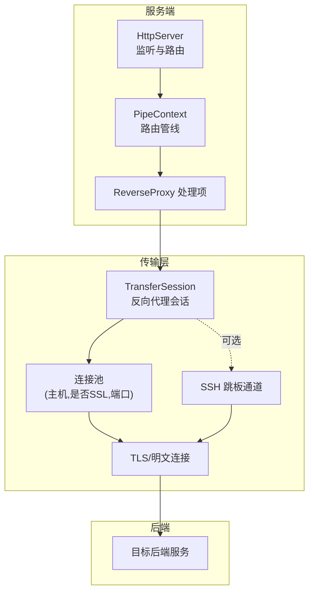
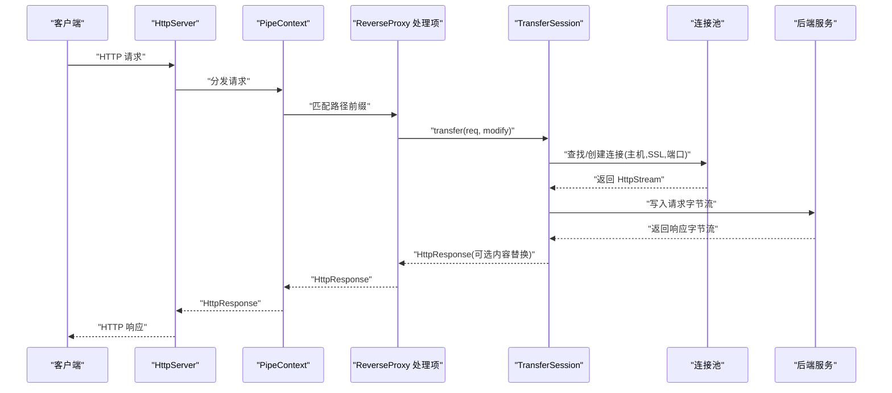
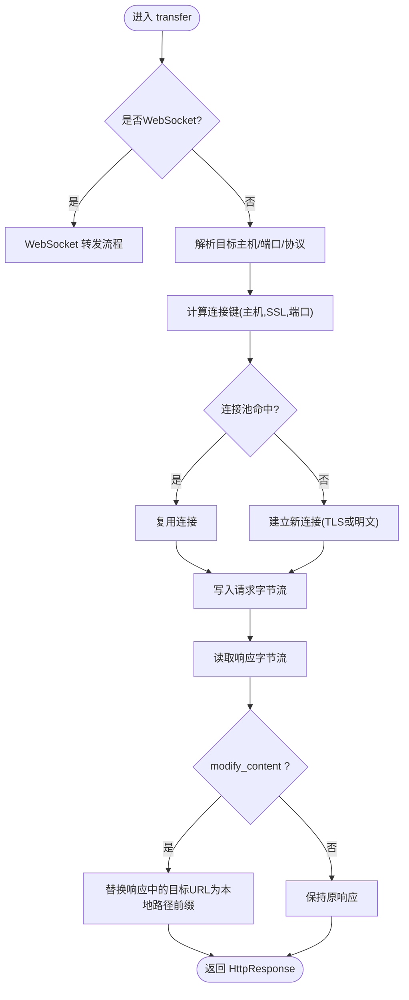
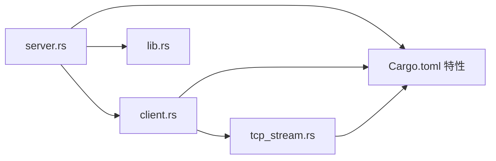

# 反向代理功能

<cite>
**本文引用的文件**
- [lib.rs](file://potato/src/lib.rs)
- [server.rs](file://potato/src/server.rs)
- [client.rs](file://potato/src/client.rs)
- [tcp_stream.rs](file://potato/src/utils/tcp_stream.rs)
- [global_config.rs](file://potato/src/global_config.rs)
- [Cargo.toml](file://potato/Cargo.toml)
- [13_reverse_proxy_server.rs](file://examples/server/13_reverse_proxy_server.rs)
- [14_reverse_proxy_with_ssh_server.rs](file://examples/server/14_reverse_proxy_with_ssh_server.rs)
- [06_client.md](file://docs/guide/06_client.md)
- [04_server_route.md](file://docs/en/guide/04_server_route.md)
</cite>

## 目录
1. [简介](#简介)
2. [项目结构](#项目结构)
3. [核心组件](#核心组件)
4. [架构总览](#架构总览)
5. [组件详解](#组件详解)
6. [依赖关系分析](#依赖关系分析)
7. [性能考量](#性能考量)
8. [故障排查指南](#故障排查指南)
9. [结论](#结论)
10. [附录](#附录)

## 简介
本文件系统性阐述该代码库中的反向代理能力，覆盖工作原理、架构设计、请求转发与响应处理、连接管理、负载均衡策略建议、健康检查机制、SSL/TLS终止、缓存与静态资源优化、限流与熔断建议、SSH跳板代理配置与安全注意事项，以及性能监控与故障诊断实践。文档以仓库现有实现为基础，结合示例与特性开关，给出可操作的配置与扩展建议。

## 项目结构
- 框架核心位于 potato 模块，提供 HTTP 服务端、客户端、传输会话、工具集等能力。
- 反向代理由服务端路由管线与传输会话共同实现：服务端通过管线匹配路径，将请求交由传输会话转发至后端；传输会话负责建立连接、转发请求、处理响应及可选的内容替换。
- 示例目录提供最小可用的反向代理与带 SSH 跳板的反向代理启动方式。

图表来源
- [server.rs](file://potato/src/server.rs#L40-L126)
- [client.rs](file://potato/src/client.rs#L224-L254)
- [tcp_stream.rs](file://potato/src/utils/tcp_stream.rs#L11-L18)

章节来源
- [server.rs](file://potato/src/server.rs#L40-L126)
- [client.rs](file://potato/src/client.rs#L224-L254)
- [tcp_stream.rs](file://potato/src/utils/tcp_stream.rs#L11-L18)

## 核心组件
- HttpServer：HTTP 服务入口，绑定地址、接收连接、分发请求到路由管线。
- PipeContext：路由管线容器，按顺序执行处理器，支持自定义处理器、静态路由、嵌入式资源、反向代理、WebDAV 等。
- TransferSession：反向代理核心，负责解析目标地址、复用连接、转发请求、处理响应、可选内容替换与 WebSocket 升级。
- HttpStream：统一的网络读写抽象，支持 TCP、可选 TLS（服务端/客户端）、双向流（用于 SSH 跳板）。
- 配置与特性：通过 Cargo 特性开关控制 TLS、SSH、jemalloc、OpenAPI、WebDAV 等功能。

章节来源
- [server.rs](file://potato/src/server.rs#L769-L797)
- [server.rs](file://potato/src/server.rs#L54-L76)
- [client.rs](file://potato/src/client.rs#L224-L254)
- [tcp_stream.rs](file://potato/src/utils/tcp_stream.rs#L11-L18)
- [Cargo.toml](file://potato/Cargo.toml#L65-L72)

## 架构总览
反向代理在服务端通过管线匹配路径前缀，命中后交由 TransferSession 执行实际转发。TransferSession 内部维护“主机+是否SSL+端口”的连接键，复用已有连接；若启用 SSH 跳板特性，可通过 SSH 建立直连隧道，再经 TLS 或明文发送到后端。

图表来源
- [server.rs](file://potato/src/server.rs#L615-L627)
- [client.rs](file://potato/src/client.rs#L275-L473)

章节来源
- [server.rs](file://potato/src/server.rs#L615-L627)
- [client.rs](file://potato/src/client.rs#L275-L473)

## 组件详解

### 反向代理工作原理与请求转发
- 路由匹配：PipeContext 的 ReverseProxy 项根据本地路径前缀判断是否命中，命中后构造 TransferSession 并调用 transfer。
- 目标解析：若使用 from_reverse_proxy，直接从配置的目标 URL 解析主机、端口与协议；否则从请求头 Host/X-Forwarded-* 推断。
- 连接复用：以 (主机, 是否SSL, 端口) 作为键缓存 HttpStream，避免重复握手与建连开销。
- 请求写入：将请求序列化后的字节写入底层 HttpStream。
- 响应读取：从 HttpStream 读取响应字节流，构建 HttpResponse 返回。

图表来源
- [client.rs](file://potato/src/client.rs#L275-L473)

章节来源
- [server.rs](file://potato/src/server.rs#L615-L627)
- [client.rs](file://potato/src/client.rs#L275-L473)

### 响应处理与内容替换
- 当 modify_content 为真时，对响应内容进行替换：将目标后端 URL 替换成本地路径前缀，确保静态资源与内联链接正确指向本机。
- 对 gzip 压缩内容先解压再替换，再按需压缩回字节流。
- 清理 Transfer-Encoding，设置 Content-Length，保证下游客户端正确解析。

章节来源
- [client.rs](file://potato/src/client.rs#L424-L470)

### 连接管理与复用
- 连接键：(主机, 是否SSL, 端口)，同一键共享一个 HttpStream。
- 支持 TLS 客户端连接与明文 TCP 连接；当启用 SSH 跳板特性时，通过 SSH 建立直连隧道，再复用该隧道作为 HttpStream。
- WebSocket：不走连接池，直接建立专用通道并维持升级后的双向数据流。

章节来源
- [client.rs](file://potato/src/client.rs#L327-L417)
- [tcp_stream.rs](file://potato/src/utils/tcp_stream.rs#L11-L18)

### 负载均衡策略（设计建议）
当前代码未内置负载均衡器。可在应用侧通过以下方式实现常见策略：
- 轮询：在多个后端地址间循环选择。
- 加权轮询：基于权重动态调整选择概率。
- 最少连接：统计每个后端活跃连接数，优先选择最少者。
- IP 哈希：对客户端 IP 做哈希映射到后端节点。
- 健康检查：定期探测后端存活与延迟，剔除不健康节点。

说明：以上为架构扩展建议，非现有实现。

### 健康检查机制（设计建议）
- 探针配置：可配置探测间隔、超时、重试次数、成功阈值。
- 故障检测：基于连接失败率、响应时间、状态码异常判定不健康。
- 自动恢复：连续成功达到阈值后标记为健康。
- 灰度发布：逐步放量到新版本实例。

说明：以上为架构扩展建议，非现有实现。

### SSL 终止与 TLS 配置
- 服务端 TLS：服务端可启用 TLS 终止，加载证书与私钥，接受 HTTPS 连接。
- 客户端 TLS：反向代理在连接后端时可启用 TLS 客户端连接，使用系统根证书信任链。
- SSH 跳板：在启用 ssh 特性时，可通过 SSH 建立隧道，再在隧道上进行 TLS/明文通信。

章节来源
- [server.rs](file://potato/src/server.rs#L873-L887)
- [client.rs](file://potato/src/client.rs#L384-L411)
- [Cargo.toml](file://potato/Cargo.toml#L65-L72)

### 缓存策略与静态资源优化
- 条件预检：支持 If-None-Match、If-Modified-Since、If-Match、If-Unmodified-Since 等条件头，返回 304/412 以减少传输。
- ETag 生成：文件内容哈希与大小组合生成 ETag，便于缓存验证。
- 压缩与传输：服务端与客户端均支持 gzip 压缩，配合 Accept-Encoding 与 Content-Encoding 实现压缩传输。
- 静态资源：可将静态资源嵌入二进制，通过嵌入式路由返回，减少磁盘 IO。

章节来源
- [lib.rs](file://potato/src/lib.rs#L761-L823)
- [server.rs](file://potato/src/server.rs#L569-L608)

### 限流与熔断机制（设计建议）
- 限流：基于令牌桶/漏桶算法限制每 IP/每路由的 QPS，超过阈值快速失败。
- 熔断：统计错误比例与请求量，超过阈值触发熔断，短时拒绝请求，定时探测恢复。
- 线程/并发：限制并发连接数与单连接最大请求数，防止资源耗尽。

说明：以上为架构扩展建议，非现有实现。

### SSH 跳板代理配置与安全考虑
- 配置方法：通过 TransferSession.with_ssh_jumpbox 提供跳板主机信息（主机、端口、用户名、密码），建立 SSH 客户端并认证。
- 跳板隧道：认证成功后，通过 direct-tcpip 通道将后端流量经由跳板转发。
- 安全考虑：
  - 强密码或密钥认证，避免弱口令。
  - 仅在可信网络中启用，限制访问源。
  - 定期轮换凭据，审计登录日志。
  - 仅暴露必要端口，避免跳板被滥用。

章节来源
- [client.rs](file://potato/src/client.rs#L256-L273)
- [client.rs](file://potato/src/client.rs#L336-L381)
- [Cargo.toml](file://potato/Cargo.toml#L57-L62)

### 性能监控与故障诊断
- jemalloc 分析：在启用 jemalloc 特性时，可导出内存分配报告，辅助定位内存问题。
- WebSocket 心跳：通过配置 WebSocket ping 周期，维持长连接稳定。
- 日志与指标：建议在生产环境记录请求耗时、错误码分布、连接池命中率、后端延迟等指标。

章节来源
- [global_config.rs](file://potato/src/global_config.rs#L19-L34)
- [Cargo.toml](file://potato/Cargo.toml#L43-L56)

## 依赖关系分析

图表来源
- [server.rs](file://potato/src/server.rs#L1-L26)
- [client.rs](file://potato/src/client.rs#L1-L20)
- [tcp_stream.rs](file://potato/src/utils/tcp_stream.rs#L1-L10)
- [Cargo.toml](file://potato/Cargo.toml#L65-L72)

章节来源
- [server.rs](file://potato/src/server.rs#L1-L26)
- [client.rs](file://potato/src/client.rs#L1-L20)
- [tcp_stream.rs](file://potato/src/utils/tcp_stream.rs#L1-L10)
- [Cargo.toml](file://potato/Cargo.toml#L65-L72)

## 性能考量
- 连接复用：通过连接池显著降低 TLS 握手与 TCP 建连开销。
- 压缩传输：启用 gzip 压缩减少带宽占用，注意 CPU 开销与解压成本。
- 内容替换：modify_content 会增加 CPU 与内存拷贝，建议仅在必要时开启。
- WebSocket：独立通道，避免连接池复用，适合长连接场景。
- TLS：启用 TLS 会带来额外 CPU 开销，建议在高并发场景评估硬件加速与会话复用。

## 故障排查指南
- 无法建立后端连接
  - 检查目标地址与端口是否可达，确认 DNS 解析与防火墙策略。
  - 若启用 TLS，确认证书链与主机名匹配。
- WebSocket 升级失败
  - 确认请求头 Upgrade/Connection/Sec-WebSocket-* 是否完整。
  - 检查后端是否支持 WebSocket。
- 内容替换异常
  - modify_content 仅对文本内容生效，二进制内容不会被替换。
  - 确认目标 URL 与本地路径前缀格式一致。
- SSH 跳板失败
  - 检查跳板主机凭据与网络连通性。
  - 确认 russh 特性已启用且版本兼容。
- 性能问题
  - 查看连接池命中率与并发连接数，适当调整阈值。
  - 启用 jemalloc 导出分析报告，定位内存热点。

章节来源
- [client.rs](file://potato/src/client.rs#L275-L591)
- [global_config.rs](file://potato/src/global_config.rs#L19-L34)

## 结论
该代码库提供了完善的反向代理基础设施：服务端路由管线与传输会话分离、连接池复用、TLS/明文支持、可选 SSH 跳板、内容替换与 WebSocket 支持。对于负载均衡、健康检查、限流熔断、缓存与静态资源优化等高级能力，可在应用层通过外部组件或扩展实现。建议在生产环境中结合 jemalloc、条件预检与压缩策略，持续监控连接池与后端延迟，保障稳定性与性能。

## 附录

### 快速开始示例
- 最小反向代理：将本地路径前缀“/”转发到任意后端地址。
- 带 SSH 跳板的反向代理：在自定义处理器中创建 TransferSession 并配置跳板信息，再进行转发。

章节来源
- [13_reverse_proxy_server.rs](file://examples/server/13_reverse_proxy_server.rs#L1-L10)
- [14_reverse_proxy_with_ssh_server.rs](file://examples/server/14_reverse_proxy_with_ssh_server.rs#L1-L25)
- [06_client.md](file://docs/guide/06_client.md#L48-L72)
- [04_server_route.md](file://docs/en/guide/04_server_route.md#L117-L134)