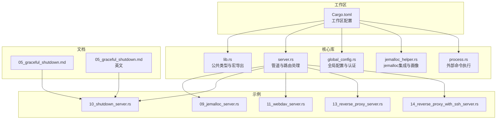
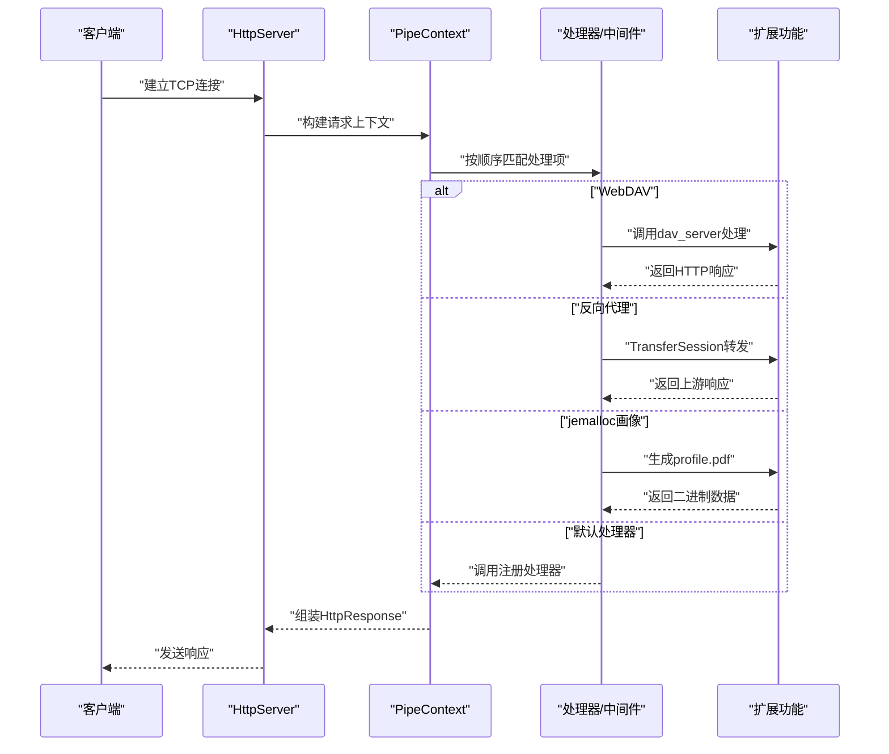
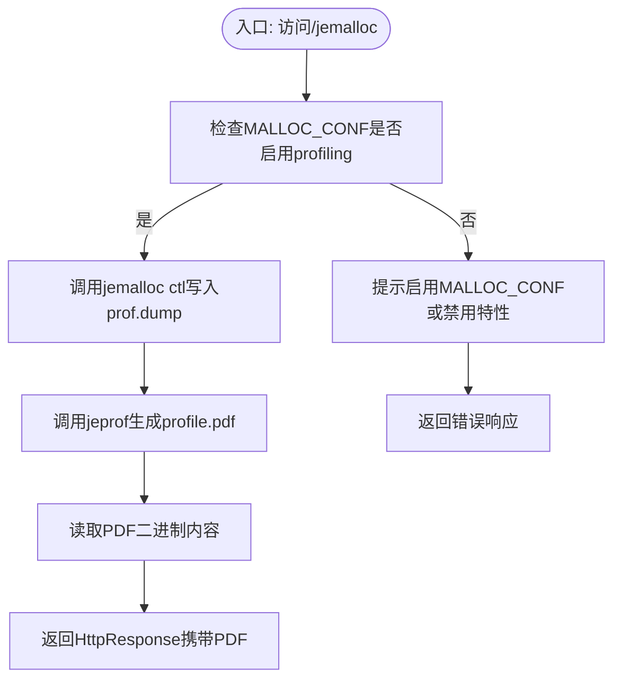
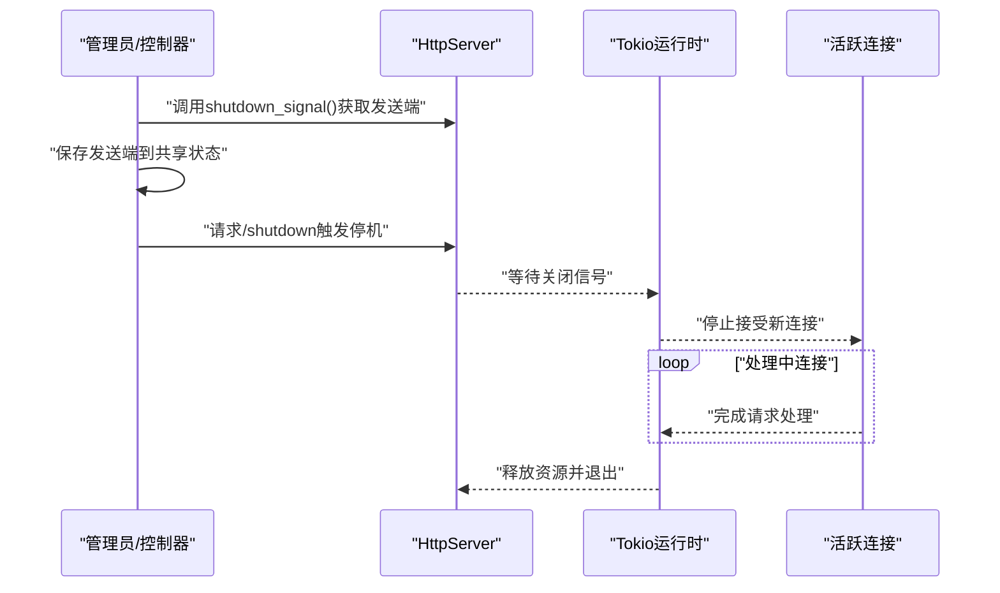
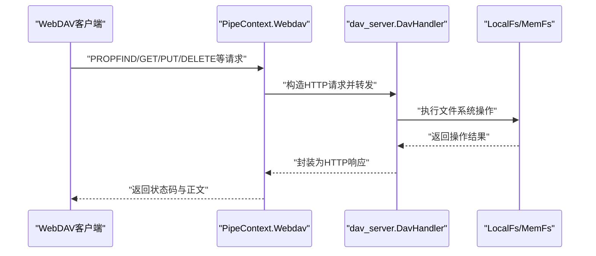
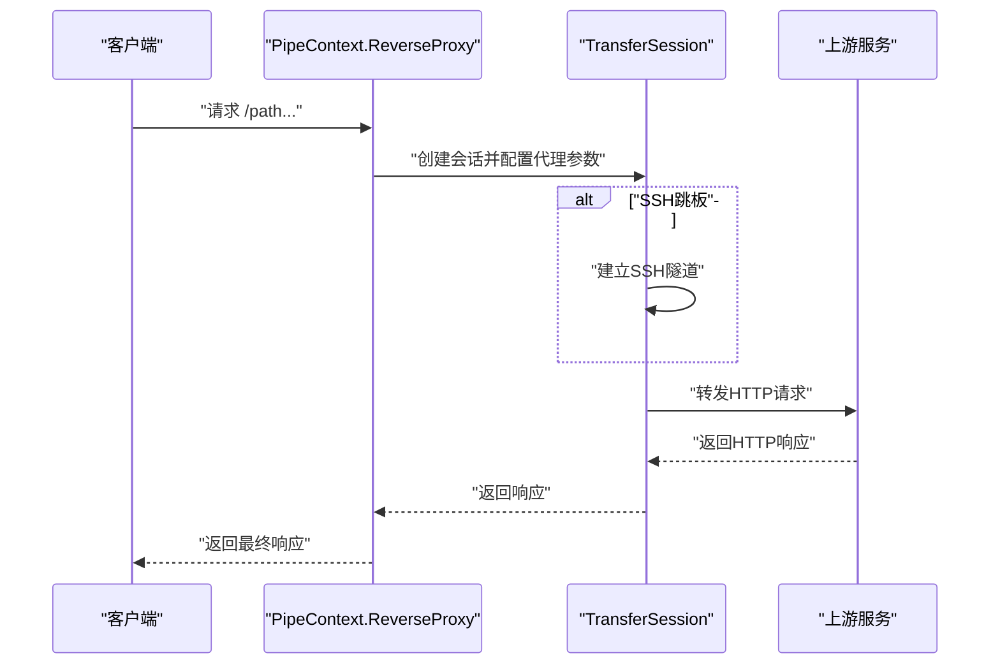
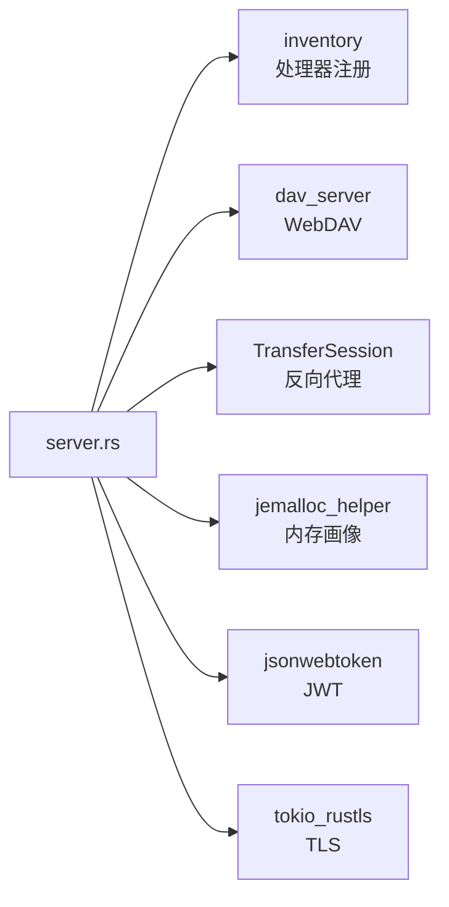

# 高级功能

<cite>
**本文引用的文件**
- [lib.rs](file://potato/src/lib.rs)
- [server.rs](file://potato/src/server.rs)
- [global_config.rs](file://potato/src/global_config.rs)
- [jemalloc_helper.rs](file://potato/src/utils/jemalloc_helper.rs)
- [process.rs](file://potato/src/utils/process.rs)
- [09_jemalloc_server.rs](file://examples/server/09_jemalloc_server.rs)
- [10_shutdown_server.rs](file://examples/server/10_shutdown_server.rs)
- [11_webdav_server.rs](file://examples/server/11_webdav_server.rs)
- [13_reverse_proxy_server.rs](file://examples/server/13_reverse_proxy_server.rs)
- [14_reverse_proxy_with_ssh_server.rs](file://examples/server/14_reverse_proxy_with_ssh_server.rs)
- [Cargo.toml](file://Cargo.toml)
- [05_graceful_shutdown.md](file://docs/guide/05_graceful_shutdown.md)
- [05_graceful_shutdown.md（英文）](file://docs/en/guide/05_graceful_shutdown.md)
</cite>

## 目录
1. [简介](#简介)
2. [项目结构](#项目结构)
3. [核心组件](#核心组件)
4. [架构总览](#架构总览)
5. [详细组件分析](#详细组件分析)
6. [依赖关系分析](#依赖关系分析)
7. [性能考量](#性能考量)
8. [故障排查指南](#故障排查指南)
9. [结论](#结论)
10. [附录](#附录)

## 简介
本文件聚焦于Potato框架的高级功能与专业应用场景，围绕以下主题展开：内存管理优化（jemalloc集成与内存泄漏画像导出）、优雅关闭机制（信号处理、连接清理与资源释放）、WebDAV协议支持（文件操作、权限与同步）、反向代理能力（负载均衡、健康检查与故障转移）、SSH跳板代理的实现原理与配置、安全加固（CORS、CSRF与输入验证）、性能监控与日志最佳实践，以及企业级部署与运维建议。文档在技术深度与可读性之间寻求平衡，既适合有一定基础的工程师，也便于初学者循序渐进理解。

## 项目结构
仓库采用多包工作区组织，核心库位于potato目录，宏包位于potato-macro目录；examples提供多种场景示例；docs包含中英双语指南。关键模块划分如下：
- 框架核心：lib.rs、server.rs、global_config.rs
- 工具与辅助：jemalloc_helper.rs、process.rs
- 示例：各类示例服务器与客户端
- 文档：中英双语指南

**图示来源**
- [Cargo.toml](file://Cargo.toml#L1-L4)
- [lib.rs](file://potato/src/lib.rs#L1-L50)
- [server.rs](file://potato/src/server.rs#L1-L60)
- [global_config.rs](file://potato/src/global_config.rs#L1-L35)
- [jemalloc_helper.rs](file://potato/src/utils/jemalloc_helper.rs#L1-L35)
- [process.rs](file://potato/src/utils/process.rs#L1-L27)
- [09_jemalloc_server.rs](file://examples/server/09_jemalloc_server.rs#L1-L16)
- [10_shutdown_server.rs](file://examples/server/10_shutdown_server.rs#L1-L22)
- [11_webdav_server.rs](file://examples/server/11_webdav_server.rs#L1-L17)
- [13_reverse_proxy_server.rs](file://examples/server/13_reverse_proxy_server.rs#L1-L10)
- [14_reverse_proxy_with_ssh_server.rs](file://examples/server/14_reverse_proxy_with_ssh_server.rs#L1-L25)
- [05_graceful_shutdown.md](file://docs/guide/05_graceful_shutdown.md#L1-L29)
- [05_graceful_shutdown.md（英文）](file://docs/en/guide/05_graceful_shutdown.md#L1-L29)

**章节来源**
- [Cargo.toml](file://Cargo.toml#L1-L4)
- [lib.rs](file://potato/src/lib.rs#L1-L50)
- [server.rs](file://potato/src/server.rs#L1-L60)

## 核心组件
- 请求/响应模型与HTTP方法枚举：定义了统一的HttpRequest、HttpResponse及HttpMethod集合，覆盖标准与WebDAV扩展方法。
- 管道式路由与中间件：通过PipeContext与PipeContextItem实现链式处理，支持处理器、静态路由、嵌入资源、自定义回调、反向代理、jemalloc画像与WebDAV。
- 全局配置与认证：提供JWT密钥与WebSocket心跳周期等全局配置项。
- jemalloc集成：在启用特性时使用全局分配器，并提供内存画像导出能力。
- 优雅关闭：通过oneshot通道接收关闭信号，配合服务循环实现平滑停机。

**章节来源**
- [lib.rs](file://potato/src/lib.rs#L175-L196)
- [server.rs](file://potato/src/server.rs#L40-L767)
- [global_config.rs](file://potato/src/global_config.rs#L12-L35)
- [jemalloc_helper.rs](file://potato/src/utils/jemalloc_helper.rs#L8-L34)

## 架构总览
下图展示从请求进入至响应返回的关键路径，以及各高级功能的接入点。

**图示来源**
- [server.rs](file://potato/src/server.rs#L362-L767)
- [jemalloc_helper.rs](file://potato/src/utils/jemalloc_helper.rs#L36-L70)

## 详细组件分析

### 内存管理优化：jemalloc集成与内存画像
- 分配器初始化：在启用jemalloc特性时设置全局分配器；可通过环境变量MALLOC_CONF控制profiling开关。
- 画像导出：通过jemalloc ctl写入prof.dump并调用系统工具生成PDF，返回二进制结果供下载或进一步分析。
- 使用方式：示例服务器通过管道挂载/jemalloc端点，访问后触发画像生成与下载。

**图示来源**
- [jemalloc_helper.rs](file://potato/src/utils/jemalloc_helper.rs#L14-L70)
- [09_jemalloc_server.rs](file://examples/server/09_jemalloc_server.rs#L7-L15)

**章节来源**
- [jemalloc_helper.rs](file://potato/src/utils/jemalloc_helper.rs#L8-L70)
- [09_jemalloc_server.rs](file://examples/server/09_jemalloc_server.rs#L1-L16)

### 优雅关闭机制：信号处理、连接清理与资源释放
- 关闭信号：服务提供shutdown_signal方法，返回oneshot发送端；业务可将发送端保存以便触发停机。
- 服务循环：内部监听关闭信号，收到后停止接受新连接并完成当前处理，随后释放资源。
- 示例：示例服务器暴露/shutdown接口，调用后向信号通道发送消息，触发优雅停机。

**图示来源**
- [server.rs](file://potato/src/server.rs#L769-L800)
- [10_shutdown_server.rs](file://examples/server/10_shutdown_server.rs#L7-L21)
- [05_graceful_shutdown.md](file://docs/guide/05_graceful_shutdown.md#L1-L29)

**章节来源**
- [server.rs](file://potato/src/server.rs#L769-L800)
- [10_shutdown_server.rs](file://examples/server/10_shutdown_server.rs#L1-L22)
- [05_graceful_shutdown.md](file://docs/guide/05_graceful_shutdown.md#L1-L29)
- [05_graceful_shutdown.md（英文）](file://docs/en/guide/05_graceful_shutdown.md#L1-L29)

### WebDAV协议支持：文件操作、权限管理与同步
- 路由挂载：通过use_webdav_localfs/use_webdav_memfs将指定URL前缀映射到本地文件系统或内存文件系统。
- 协议适配：将Potato请求转换为dav_server可识别的HTTP请求，再将响应转回Potato格式。
- 同步与条件请求：内置ETag生成与条件预检（If-None-Match/If-Match/If-Modified-Since/If-Unmodified-Since），支持304与412响应。
- 权限与锁定：示例使用FakeLs作为锁系统，实际生产可根据需要替换为更严格的实现。

**图示来源**
- [server.rs](file://potato/src/server.rs#L333-L360)
- [server.rs](file://potato/src/server.rs#L668-L761)
- [lib.rs](file://potato/src/lib.rs#L777-L800)
- [11_webdav_server.rs](file://examples/server/11_webdav_server.rs#L8-L16)

**章节来源**
- [server.rs](file://potato/src/server.rs#L333-L360)
- [server.rs](file://potato/src/server.rs#L668-L761)
- [lib.rs](file://potato/src/lib.rs#L777-L800)
- [11_webdav_server.rs](file://examples/server/11_webdav_server.rs#L1-L17)

### 反向代理：负载均衡、健康检查与故障转移
- 基础代理：use_reverse_proxy支持将指定URL前缀转发到目标地址，可选择是否修改内容。
- SSH跳板代理：通过自定义回调创建TransferSession并配置SshJumpboxInfo，实现跨网络访问目标服务。
- 负载均衡与健康检查：框架未内置LB/健康检查逻辑，可在自定义回调中结合外部服务实现；故障转移可基于返回状态码与重试策略实现。

**图示来源**
- [server.rs](file://potato/src/server.rs#L115-L126)
- [server.rs](file://potato/src/server.rs#L615-L627)
- [13_reverse_proxy_server.rs](file://examples/server/13_reverse_proxy_server.rs#L1-L10)
- [14_reverse_proxy_with_ssh_server.rs](file://examples/server/14_reverse_proxy_with_ssh_server.rs#L4-L22)

**章节来源**
- [server.rs](file://potato/src/server.rs#L115-L126)
- [server.rs](file://potato/src/server.rs#L615-L627)
- [13_reverse_proxy_server.rs](file://examples/server/13_reverse_proxy_server.rs#L1-L10)
- [14_reverse_proxy_with_ssh_server.rs](file://examples/server/14_reverse_proxy_with_ssh_server.rs#L1-L25)

### 安全加固：CORS、CSRF防护与输入验证
- CORS：在use_handlers中可开启跨域支持，自动注入允许源、方法与头信息。
- CSRF：框架未直接提供CSRF令牌机制，建议结合JWT与SameSite Cookie策略，或在自定义中间件中实现令牌校验。
- 输入验证：建议在处理器层对查询参数、表单字段与JSON进行显式校验；对上传文件限制大小与类型。

**章节来源**
- [server.rs](file://potato/src/server.rs#L370-L407)

### 性能监控与日志记录最佳实践
- 指标采集：结合jemalloc画像导出与系统指标（CPU、内存、连接数）进行综合评估。
- 日志：建议使用结构化日志记录请求ID、路径、状态码、耗时与异常堆栈；对敏感信息脱敏。
- 调优：根据流量特征调整缓冲区大小、并发限制与超时策略；对静态资源启用ETag与缓存头。

**章节来源**
- [jemalloc_helper.rs](file://potato/src/utils/jemalloc_helper.rs#L36-L70)

### 企业级部署与运维指南
- 运行时：在Linux发行版安装jemalloc开发包与图形工具以支持画像导出。
- 配置：通过环境变量MALLOC_CONF启用jemalloc profiling；在容器中挂载持久卷用于WebDAV存储。
- 监控：结合Prometheus/Grafana采集运行时指标；对反向代理与WebDAV接口设置告警阈值。
- 备份与恢复：定期备份WebDAV数据与配置；对SSH跳板信息进行密文管理。

**章节来源**
- [09_jemalloc_server.rs](file://examples/server/09_jemalloc_server.rs#L1-L6)

## 依赖关系分析
- 组件耦合：server.rs通过inventory收集处理器注册，形成松耦合路由分发；PipeContext将不同功能以插件形式串联。
- 外部依赖：dav_server用于WebDAV；jsonwebtoken用于JWT；tokio与tokio_rustls用于异步与TLS；jemalloc相关依赖用于内存管理。
- 特性开关：jemalloc、webdav、openapi等通过Cargo特性启用，避免不必要的编译与运行时开销。

**图示来源**
- [server.rs](file://potato/src/server.rs#L28-L38)
- [server.rs](file://potato/src/server.rs#L333-L360)
- [server.rs](file://potato/src/server.rs#L615-L627)
- [jemalloc_helper.rs](file://potato/src/utils/jemalloc_helper.rs#L1-L10)

**章节来源**
- [server.rs](file://potato/src/server.rs#L28-L38)
- [jemalloc_helper.rs](file://potato/src/utils/jemalloc_helper.rs#L1-L10)

## 性能考量
- 内存分配：jemalloc在高并发场景下减少碎片与提升吞吐；需结合profiling定位热点。
- I/O模型：基于Tokio的异步I/O，注意避免阻塞操作；对大文件传输与WebDAV操作应采用流式处理。
- 缓存与压缩：利用ETag与条件请求减少带宽；根据客户端Accept-Encoding选择合适的压缩策略。
- 并发与资源：合理设置连接池与超时，防止资源泄露；优雅关闭确保在停机前完成未决任务。

**章节来源**
- [lib.rs](file://potato/src/lib.rs#L197-L201)
- [server.rs](file://potato/src/server.rs#L370-L407)

## 故障排查指南
- jemalloc画像失败：确认MALLOC_CONF包含prof:true；检查jeprof可用性与权限；查看命令输出定位问题。
- 优雅关闭无效：确认/shutdown接口已正确保存并发送关闭信号；检查运行时是否被其他阻塞任务占用。
- WebDAV异常：核对URL前缀与挂载路径；检查ETag生成与条件请求头；验证文件系统权限与磁盘空间。
- 反向代理失败：检查目标地址可达性；若使用SSH跳板，验证凭据与隧道连通性；关注超时与重试策略。

**章节来源**
- [jemalloc_helper.rs](file://potato/src/utils/jemalloc_helper.rs#L36-L70)
- [10_shutdown_server.rs](file://examples/server/10_shutdown_server.rs#L1-L22)
- [11_webdav_server.rs](file://examples/server/11_webdav_server.rs#L1-L17)
- [14_reverse_proxy_with_ssh_server.rs](file://examples/server/14_reverse_proxy_with_ssh_server.rs#L1-L25)

## 结论
Potato框架通过管道化中间件与特性化扩展，提供了从内存管理、优雅停机到WebDAV与反向代理的完整能力集。结合本文的安全加固、性能监控与运维建议，可在企业环境中实现稳定、可观测且可扩展的应用交付。

## 附录
- 示例参考：各示例文件展示了典型用法，建议结合对应功能逐步验证。
- 文档参考：中英双语指南便于国际化团队协作与知识沉淀。

**章节来源**
- [09_jemalloc_server.rs](file://examples/server/09_jemalloc_server.rs#L1-L16)
- [10_shutdown_server.rs](file://examples/server/10_shutdown_server.rs#L1-L22)
- [11_webdav_server.rs](file://examples/server/11_webdav_server.rs#L1-L17)
- [13_reverse_proxy_server.rs](file://examples/server/13_reverse_proxy_server.rs#L1-L10)
- [14_reverse_proxy_with_ssh_server.rs](file://examples/server/14_reverse_proxy_with_ssh_server.rs#L1-L25)
- [05_graceful_shutdown.md](file://docs/guide/05_graceful_shutdown.md#L1-L29)
- [05_graceful_shutdown.md（英文）](file://docs/en/guide/05_graceful_shutdown.md#L1-L29)